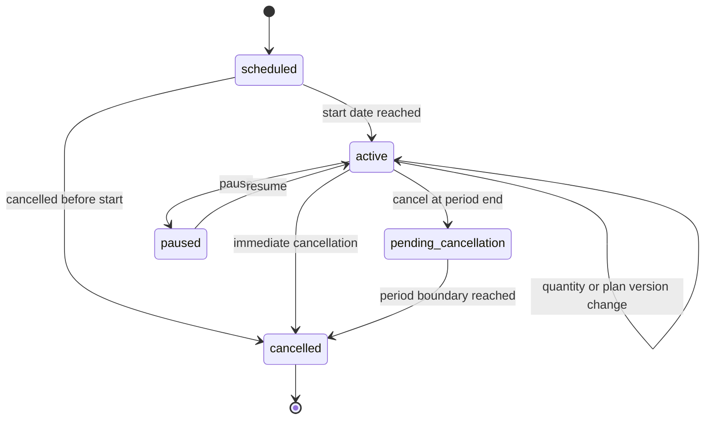
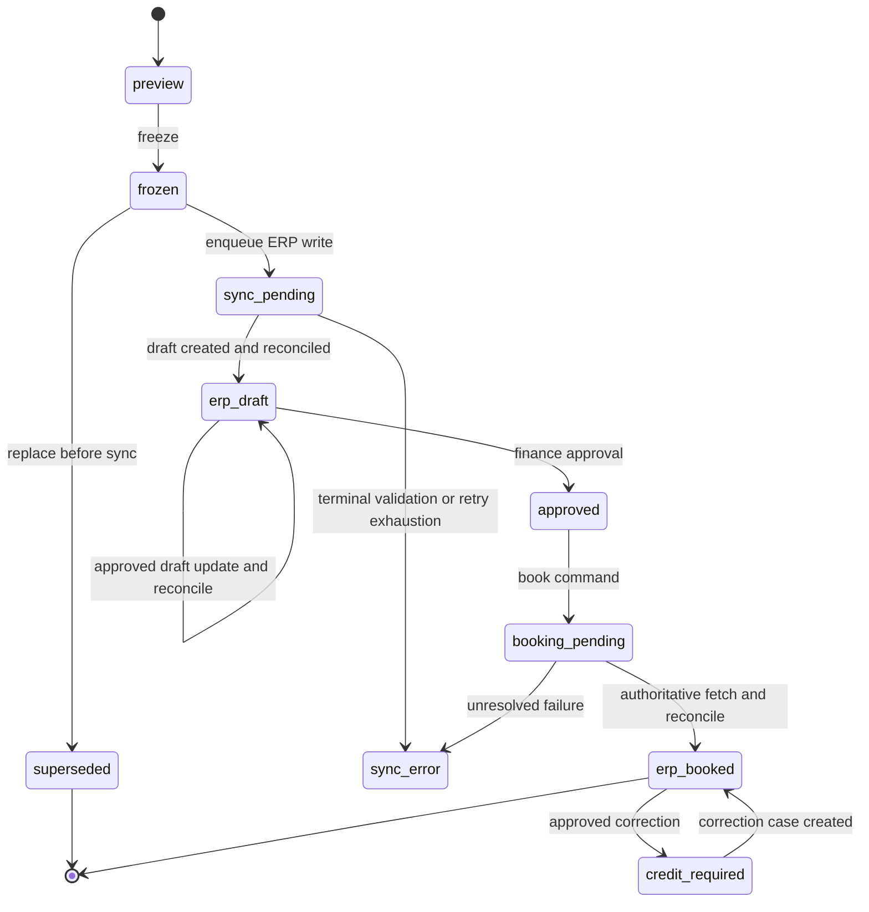
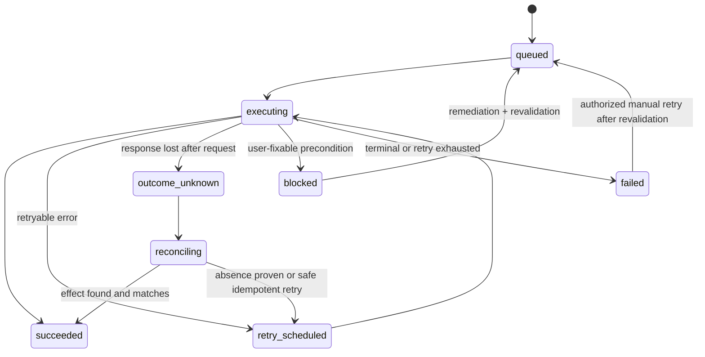
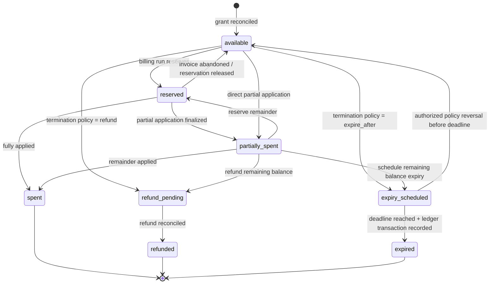
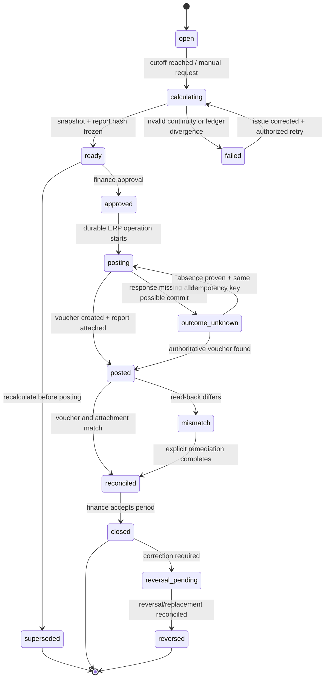
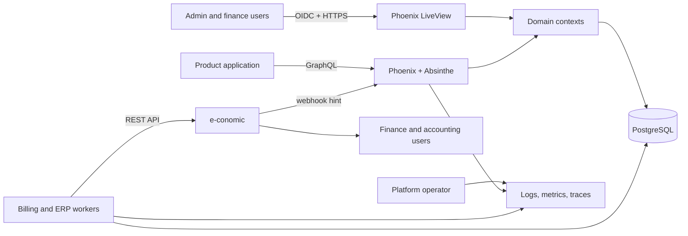
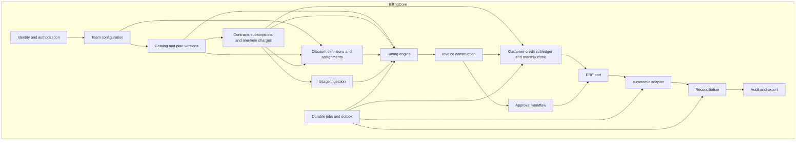
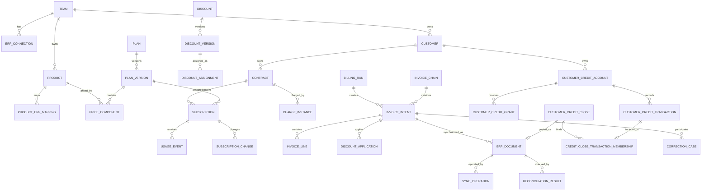
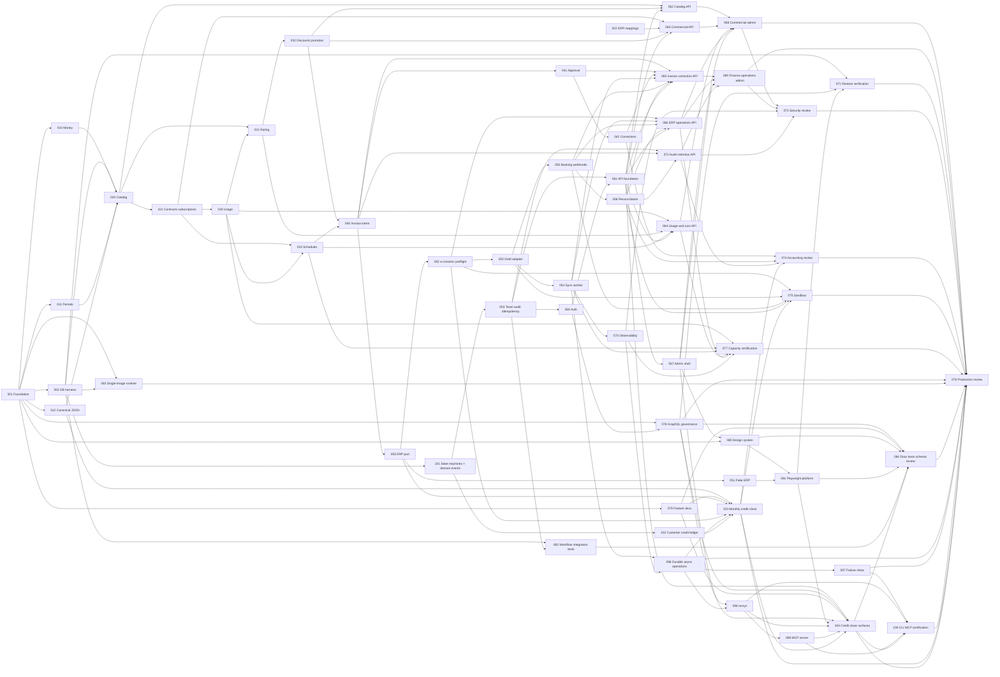

---
document:
  id: accrual-billing-core-build-spec
  title: Accrual-Aware Billing Core — Production Build Specification
  version: 1.8.0
  status: ready-for-build
  prepared_on: 2026-08-21
  intended_audience:
    - product owners
    - principal engineers
    - finance operators
    - implementation agents
    - review agents
product:
  working_name: Billing Core
  codename: Revryn
  repository_name: accrual-billing-core
  delivery_model: open-source, self-hosted, GraphQL-first, SSR-first, multi-organization
  license: Apache-2.0
  initial_erp_adapter: e-conomic
  accounting_system_of_record: e-conomic
  general_ledger_system_of_record: e-conomic
  customer_credit_subledger_system_of_record: Billing Core
  payment_processing: out-of-scope
architecture:
  style: modular-monolith-with-workers
  reference_runtime: Elixir 1.20 on Erlang/OTP 29 with Phoenix 1.8 and LiveView 1.2
  primary_database: PostgreSQL
  integration_pattern: ports-and-adapters-with-transactional-state-machines-and-domain-events
  delivery_guarantee: at-least-once-with-idempotent-effects
release:
  target: production-ready-v1
  booking_default: manual-approval
  supported_legal_entities_per_team: 1
  supported_erp_connections_per_team: 1
  supported_teams_per_organization: many
  minimum_active_teams_per_organization: 1
  user_membership_model: global-identity-with-organization-and-team-specific-roles
release_gates:
  - e-conomic production application credentials and sandbox agreement
  - accountant sign-off on recognition policies, product mappings, VAT configuration, customer-credit liability close mappings, and credit/refund handling
  - security review and automated backup-restore-smoke validation completed
  - capacity and data-lifecycle certification accepted
---

# Accrual-Aware Billing Core — Production Build Specification

> **Build decision:** implement a deliberately small billing system rather than embedding or forking Lago. The service owns commercial billing logic and produces immutable, line-level invoice intent. For customer credits, Billing Core is the detailed subledger and e-conomic receives a reconciled monthly aggregate liability voucher plus close report. e-conomic owns booked invoices, VAT/account coding, accrual postings, payments, and the general ledger.

## 1. Executive decision

Build an open-source, GraphQL-first billing core with five responsibilities:

1. Model customers, contracts, subscriptions, products, prices, discounts, service periods, and usage.
2. Calculate deterministic invoice lines, including proration and tiered pricing.
3. Synchronize those lines to e-conomic as draft invoices, preserving the service period on every over-time revenue line.
4. Reconcile the generated invoice against the booked e-conomic invoice and create compensating credit documents when correction is required.
5. Maintain an append-only, per-customer credit subledger and close its total outstanding liability monthly into e-conomic at aggregate level, with no customer-level credit rows posted to the ERP.

The service **must not** become a payment processor, general ledger, tax engine, or revenue-recognition engine. Its only direct general-ledger write in v1 is the narrowly defined monthly customer-credit liability close. It sends invoice facts and credit-close evidence needed by e-conomic to perform the accounting treatment.

### 1.1 What “ready for build” means

This specification resolves the product boundary, domain semantics, architecture, data model, API behavior, synchronization rules, failure handling, testing strategy, work breakdown, and release criteria. Implementation may begin without further architecture discovery.

Four execution-time validations remain release gates rather than design gaps:

- an accountant must approve recognition policies and e-conomic configuration;
- the e-conomic sandbox must confirm the exact behavior of accruals, credits, and webhooks for the target agreement;
- the production security and disaster-recovery controls must be verified;
- the capacity and data-lifecycle baseline must be certified in a production-like environment.

### 1.2 Recommended implementation order

This document is organized as a **normative product and architecture reference**, not as a literal top-to-bottom implementation script. Implementation agents must use the phase order below. Later sections may be read early for context, but code belonging to a later phase must not be pulled forward unless its dependency contract has been explicitly accepted.

The machine-readable task DAG in section 28 remains authoritative for exact task dependencies. This roadmap is the human-readable execution sequence.

| Phase | Goal | Build/read focus | Exit gate |
|---|---|---|---|
| **Phase 0 — decisions and executable skeleton** | Establish the repository, native Phoenix conventions, architecture gates, CI, database, tenancy/security skeleton, observability baseline, and single-image runtime. | Read sections **1–7**, **12**, **19**, **22–24**, **26–28**. Implement M0 foundation tasks, state-machine tooling spike, organization/team/user skeleton, passkey/SMTP test harnesses, design-system skeleton, Oban/Telemetry/OpenTelemetry/Prometheus baseline, fake external dependencies, and Playwright harness. | **M0 — executable skeleton** |
| **Phase 1 — deterministic domain kernel** | Make all billing mathematics and persisted lifecycle semantics deterministic before external side effects exist. | Sections **5**, **8–11**, **13**, **15**. Build money/period primitives, products/prices, subscriptions, state machines, usage canonicalization, pricing, tiers, discounts, proration, customer-credit ledger semantics, domain events, and property/golden tests. | **M1 — deterministic domain kernel** |
| **Phase 2 — invoice intent** | Produce immutable, reproducible invoice intent and previews without depending on e-conomic. | Sections **7–10**, **13**, **15**, **18**, **23**. Build billing runs, line generation, customer-credit grants/application/disposition plus credit-note/correction semantics, durable operations, scheduler/concurrency rules, preview workflows, workflow integration tests, and Playwright user journeys. | **M2 — invoice-intent ready** |
| **Phase 3 — ERP adapter and reconciliation** | Prove the complete draft synchronization boundary against fake ERP first, then e-conomic sandbox. | Sections **16–18**, **21–23**, **25**. Implement ERP port, e-conomic adapter, idempotency, line-level accruals, read-back, webhook/poll reconciliation, unknown-outcome handling, failure inbox, and operator remediation. | **M3 — e-conomic draft ready** |
| **Phase 4 — booking, corrections, and credit close** | Complete irreversible accounting workflows safely. | Sections **4**, **11**, **16–18**, **25**. Add approval, booking, reconciliation of booked invoices, partial/full credits, replacement documents, the monthly aggregate customer-credit liability close, closed-period behavior, and accountant-facing workflows. | **M4 — booking, correction, and credit-close ready** |
| **Phase 5 — product surfaces and automation interfaces** | Finish the supported human and machine interfaces over stable domain behavior. | Sections **14**, **19**, **22–23**, plus CLI/MCP requirements in sections **8**, **12**, and **28**. Complete LiveView operations/admin UX, GraphQL, `revryn`, MCP semantic tools, authorization, design-system stories, docs, and end-to-end interface tests. | Interface certification within M5 |
| **Phase 6 — operability and production hardening** | Prove the system is boring to run, recover, diagnose, upgrade, and support. | Sections **19–27**, **29–30**. Exercise backup→clean restore→smoke validation, doctor command, metrics/traces/log correlation, queue failure recovery, security review, performance/capacity, data retention, deployment, migrations, and runbooks. | **M5 — production ready** |
| **Phase 7 — showcase SaaS certification** | Prove adoption using three independently useful B2B SaaS products and different billing models. | Showcase requirements in section **8**, architecture constraints in **12**, testing in **23**, and agent tasks in **28**. Build each showcase **standalone first**, certify with Playwright, then add its Billing Core GraphQL integration only at the end. | **M6 — showcase certification** |

#### Phase rules

1. **Documentation leads code.** A new supported behavior starts in `docs/features/*.md`; implementation and tests follow the accepted behavior contract.
2. **Tests are built with the feature, not after the phase.** Workflow integration tests and applicable Playwright paths are part of each phase's Definition of Done.
3. **Observability is built with the workflow.** Every command, state transition, durable operation, worker, external call, retry, reconciliation, and terminal failure gets logs/metrics/traces when first implemented.
4. **Do not integrate a real ERP before the fake ERP contract is strong.** Deterministic fake-adapter integration tests must exist before sandbox-specific behavior is introduced.
5. **Do not make UI/API concerns own domain behavior.** LiveView, GraphQL, CLI, and MCP are adapters over the same contexts/commands and state machines.
6. **Do not postpone failure semantics.** Every asynchronous workflow defines persistence, retry, reconciliation, user-visible failure state, and remediation before it is considered implemented.
7. **Do not introduce infrastructure speculatively.** PostgreSQL, OTP/PubSub, Oban, Telemetry, OpenTelemetry, and Prometheus are the default toolbox; Redis, Kafka, Broadway, a service mesh, event sourcing, or a separate workflow engine require an ADR backed by a demonstrated need.
8. **The task DAG wins over the table above.** If an individual task has a stricter dependency in section 28, that dependency must be satisfied even if two tasks appear in the same human-readable phase.

#### Minimal vertical slice to prove first

Within Phases 0–3, prioritize one narrow end-to-end slice before broadening the pricing surface:

```text
organization + Default team
  → user signs in with passkey
  → customer
  → annual prepaid fixed subscription
  → deterministic preview
  → immutable invoice intent with 12-month service period
  → durable sync operation
  → fake ERP draft + read-back
  → e-conomic sandbox draft + accrual dates
  → reconciliation
  → LiveView status + logs + metrics + trace
  → Playwright workflow passes
```

Once this slice is reliable, add tiering, metered usage, discounts, proration, the customer-credit subledger and monthly liability close, booking, CLI/MCP, and showcase complexity in the phase order above. This deliberately proves the accounting and operational spine before increasing pricing breadth.

### 1.3 Primary design constraint

For every revenue-bearing invoice line, the system must know whether the obligation is satisfied:

- **at a point in time**, in which case no accrual period is sent; or
- **over time**, in which case an explicit service start and exclusive service end are mandatory.

The e-conomic adapter converts the canonical half-open period `[start, end)` into the inclusive dates required by the ERP:

```text
canonical service period:  [2026-09-15, 2027-09-15)
e-conomic accrual period:   2026-09-15 through 2027-09-14
```

Customer-credit accounting follows a different granularity rule. Billing Core retains every customer-level credit transaction, while e-conomic receives a monthly close per team and currency. The report carries both the economic movement and the signed amount sent to the liability-account line so debit/credit direction is never inferred from prose:

```text
opening outstanding credit = prior accepted month's closing balance
closing outstanding credit = current month's closing balance
liability change           = closing - opening       # positive means the company owes customers more
e-conomic liability amount = opening - closing       # canonical debit-positive signed line
```

The last expression is the requested `last_month_balance - current_balance` amount. The adapter must sandbox-certify how that canonical debit-positive sign maps to e-conomic's finance-voucher payload. The balancing side is aggregate and accounting-policy driven; it may be one configured clearing-account line or a small set of movement-class lines, but never one line per customer or credit grant.

### 1.4 Why this is not “rebuilding Lago”

The product intentionally excludes broad billing-platform features such as payment orchestration, dunning, entitlement management, tax calculation, marketplace settlement, revenue analytics, and a generic no-code pricing studio. It implements only the subset required to own pricing calculations and produce accounting-safe invoice lines.

## 2. Goals, non-goals, and fixed assumptions

### 2.1 Goals

- Support fixed recurring, one-time, seat-based, metered, volume-tiered, graduated-tiered, package, and minimum-commit pricing.
- Support prepaid and postpaid charges.
- Support deterministic proration for starts, cancellations, quantity changes, and plan changes.
- Support percentage and fixed discounts with explicit allocation.
- Produce invoice previews before any external side effect.
- Preserve service periods at line level.
- Create and update e-conomic draft invoices idempotently.
- Optionally book and send invoices through e-conomic after policy checks.
- Reconcile both draft and booked invoices against the original invoice intent.
- Correct booked documents only through compensating credit documents.
- Maintain customer-level credit balances through an append-only, currency-scoped subledger.
- Produce, approve, post, attach, and reconcile a monthly aggregate customer-credit liability close in e-conomic.
- Maintain an immutable operational audit trail and a narrowly scoped customer-credit accounting subledger without becoming the general ledger.
- Make the ERP integration replaceable through a stable adapter contract.
- Be deployable as a small, self-hosted open-source system.
- Support organizations containing multiple teams, and shared commercial accounts.
- Support one global user identity belonging to multiple organizations and teams with different roles in each scope.
- Support passkey-first local authentication, TOTP-based MFA/step-up authentication, recovery codes, and optional OIDC federation.
- Send transactional email through any standards-compliant SMTP server without a mandatory email-vendor dependency.
- Ship three production-quality showcase B2B SaaS applications that prove materially different billing models and integrate with Billing Core only after each application is independently complete.
- Make asynchronous work failure-tolerant, durable, diagnosable, and safely remediable by end users and operators.
- Ship a first-class cross-platform CLI for humans and automation.
- Ship a first-class MCP server so agentic consumers can use semantically safe billing tools without constructing GraphQL operations directly.

### 2.2 Non-goals for v1

- Card, bank, or direct-debit collection.
- Payment method storage.
- Payment retries or dunning.
- General-ledger journal creation other than the narrowly defined monthly customer-credit liability close.
- Monthly revenue schedule calculation.
- Tax determination or VAT legal advice.
- Entitlements or feature gating.
- Quote-to-cash CRM workflows.
- Multi-entity consolidation.
- Marketplace split payments.
- Payroll, expenses, procurement, inventory, or project accounting.
- Editing booked e-conomic invoices.
- Supporting multiple ERP connections for one team.
- Supporting multiple legal entities inside one team. An organization may contain multiple teams when multiple legal entities or ERP agreements are required.
- A visual arbitrary-formula language.

### 2.3 Fixed v1 assumptions

- An organization is the top-level administrative boundary and may contain many teams and shared commercial accounts.
- Every active organization has at least one active team. Organization creation atomically creates its first team, named `Default` unless another name is supplied.
- A team belongs to exactly one organization and is the v1 billing/accounting/authorization isolation boundary; it represents one legal entity and one e-conomic agreement.
- A commercial account is an organization-scoped B2B customer identity that may be projected into one or more team-specific billing customers.
- A global user identity may belong to multiple organizations and to multiple teams in each organization. Organization roles and team roles are explicit and independent.
- The team has an accountant-approved chart of accounts, product groups, VAT zones, payment terms, layouts, and accrual configuration in e-conomic.
- e-conomic products are created and maintained outside Billing Core in v1; Billing Core stores validated mappings.
- Customer creation in e-conomic is optional and policy-controlled; product creation is not automated.
- Billing dates and service periods are date-based, not timestamp-based.
- Usage events use UTC timestamps and are assigned to billing periods in the team’s configured IANA time zone.
- One subscription has one currency. One invoice contains one customer, currency, ERP connection, and invoice date.
- The default team time zone is `Europe/Copenhagen`.
- All mutating public API calls require an idempotency key.
- All money calculations use integers for currency minor units plus arbitrary-precision decimals for intermediate quantities and rates.
- Draft-first synchronization is the default. Auto-booking is disabled unless explicitly enabled by policy.
- Customer-credit balances close monthly per team and currency. e-conomic receives aggregate finance-voucher entries and an attached close report, never customer-level credit-ledger rows.

## 3. Source-of-truth matrix

| Data or decision | Authoritative system | Billing Core responsibility |
|---|---|---|
| Product identity and commercial description | Billing Core | Own and version |
| Pricing rules and tiers | Billing Core | Own and version |
| Contracts and subscriptions | Billing Core | Own lifecycle |
| Usage events | Product system, persisted by Billing Core | Deduplicate, aggregate, rate |
| Discounts and proration | Billing Core | Calculate deterministically |
| Invoice intent before ERP synchronization | Billing Core | Own immutable snapshot |
| e-conomic customer number | e-conomic | Store mapping and validate |
| e-conomic product number and account coding | e-conomic | Store mapping and validate |
| Draft invoice after successful synchronization | e-conomic | Mirror identifiers and checksum |
| Booked invoice number and booked lines | e-conomic | Read, reconcile, never overwrite |
| VAT calculation and VAT posting | e-conomic | Supply customer/product facts only |
| Accrual/deferred-revenue postings | e-conomic | Supply service dates and mapped product |
| Customer-credit grants, applications, expiries, refunds, and per-customer balances | Billing Core | Act as the authoritative detailed credit subledger and retain immutable transaction evidence |
| Customer-credit liability balance in the general ledger | e-conomic | Calculate the monthly close, post/reconcile an aggregate voucher, and attach the immutable close report |
| Payment and outstanding balance | e-conomic or payment system | Out of scope; may be read later |
| Invoice PDF, email, EAN/e-invoice delivery | e-conomic | Request only when booking policy allows |
| Accounting periods and closed periods | e-conomic | Read before booking and reconciliation |
| Organization, team, and membership hierarchy | Billing Core | Own identity, scopes, and authorization grants |
| Human user identity, passkeys, TOTP factors, recovery codes | Billing Core or federated IdP | Own local credentials; map optional OIDC identities |
| Commercial account identity across teams | Billing Core | Own organization-scoped account and team customer projections |
| Transactional email delivery | Configured SMTP server | Render, queue, retry, and audit delivery intent; SMTP provider transports |

## 4. Accounting and legal boundary

Billing Core is designed as a commercial billing calculator, integration service, and narrowly scoped customer-credit subledger. It does not claim to be a complete or standalone statutory bookkeeping system and does not calculate recognized revenue by month. The only v1 general-ledger posting it originates is the monthly aggregate adjustment of the customer-credit liability balance.

The combined e-conomic + Billing Core setup must preserve a strong transaction and control trail:

- every calculation must be reproducible from a versioned input snapshot;
- every individual credit grant, reservation, application, release, refund, expiry, and adjustment is recorded separately in Billing Core;
- every monthly e-conomic credit-liability voucher links to an immutable close report, report hash, period, currency, policy version, and the exact underlying subledger transaction set;
- every external request and response must be attributable to a team, actor, operation, and idempotency key;
- corrections must create a new version, reversal, or compensating document rather than erase history;
- invoice intent, line derivations, credit transactions, close reports, mappings, and synchronization evidence must be retained under an accounting-approved financial retention policy;
- e-conomic is authoritative for the general ledger and posted voucher; Billing Core is authoritative for customer-level credit detail and the close calculation.

The monthly liability voucher is aggregate, normally one close per team and currency. The attached report provides opening balance, movement bridge, closing balance, liability change, signed e-conomic liability-account amount, counts, hashes, and drill-down references. No customer-level rows are posted as part of this liability close. Any customer-specific credit note or receivable settlement required to correct VAT/revenue or clear an open invoice is a separate document/workflow and must reconcile through the configured clearing policy. The release gate requires a Danish accountant to approve the actual chart of accounts, debit/credit sign mapping, VAT/correction, settlement, refund, expiry, and close procedure.

The product must not encode statements such as “all annual subscriptions must always use rule X.” Recognition and accounting policy is configured and versioned, then approved by the team’s accountant.

## 5. Product principles and invariants

The following are non-negotiable implementation invariants.

1. **INV-001 — Booked means immutable.** A booked ERP invoice is never updated or deleted by Billing Core.
2. **INV-002 — Corrections are compensating.** A correction after booking produces a credit document and, when required, a replacement invoice.
3. **INV-003 — Every amount is explainable.** Each invoice line links to a price component, service period, quantity source, rate version, discount allocation, and calculation trace.
4. **INV-004 — Every over-time line has a period.** Missing service dates block synchronization.
5. **INV-005 — Point-in-time and over-time are explicit.** Neither is inferred from a textual description.
6. **INV-006 — No floating-point money.** Binary floating-point types are prohibited in the domain and persistence layers.
7. **INV-007 — Date intervals are half-open.** Canonical periods use `[start, end)`; adapters perform inclusive-date conversion.
8. **INV-008 — No duplicate side effects.** Retries must not create duplicate customers, drafts, bookings, or credits.
9. **INV-009 — Read after write.** An ERP write is not considered verified until the ERP resource is fetched and reconciled.
10. **INV-010 — ERP webhooks are hints.** A webhook triggers a read; it is never the sole evidence for an accounting state transition.
11. **INV-011 — No silent mapping fallback.** Missing or invalid customer, product, VAT, layout, or payment-term configuration blocks the operation.
12. **INV-012 — No silent rounding drift.** Any residual rounding amount is explicitly assigned and recorded.
13. **INV-013 — Version before effect.** Pricing, contract, and invoice inputs are snapshotted before a billing run can create external effects.
14. **INV-014 — Team isolation everywhere.** Every mutable domain row includes `team_id`; all unique constraints are team-scoped unless explicitly global.
15. **INV-015 — At-least-once internally, exactly-once in effect.** Workers may retry, but external effects are idempotent and reconciled.
16. **INV-016 — SSR first, no SPA shell.** Human product surfaces are rendered by Phoenix LiveView/HEEx. A client-side SPA framework is prohibited unless a future ADR proves a bounded use case that LiveView cannot reasonably satisfy.
17. **INV-017 — GraphQL is the general-purpose public application API.** Conventional product/system integrations use a typed GraphQL schema. MCP is the supported task-oriented agent interface. REST-style application-resource endpoints are prohibited except protocol-required callbacks, health/readiness, metrics, OAuth/OIDC callbacks, provider webhooks, and protocol-specific MCP transport.
18. **INV-018 — Workflows are executable documentation.** Every user-visible feature and every financially significant workflow has Playwright end-to-end coverage plus integration tests that read as workflow documentation.
19. **INV-019 — A backup is untrusted until restored.** Backup success alone is never accepted as recoverability evidence. Every certified backup path must be restored into an isolated environment and pass smoke, schema, integrity, and no-blind-write checks.
20. **INV-020 — One-image deployment is always supported.** Every release ships one official OCI image capable of running the complete platform in an all-in-one profile with one persistent data volume and no separately built application images.
21. **INV-021 — Feature documentation is normative.** Markdown feature documents are the product source of truth. Behavior-changing pull requests update the relevant feature document before or in the same change as implementation.
22. **INV-022 — One design system.** All product UI uses the repository design system and documented component primitives; feature-local copies of generic UI patterns are prohibited.
23. **INV-023 — GraphQL evolves additively.** Public schema changes are additive by default; removals require deprecation, usage evidence, migration documentation, and a documented sunset process.

24. **INV-024 — Organization and team scopes are explicit.** Every team belongs to exactly one organization; cross-team access is granted only through explicit team membership, never by identifier possession or implicit organization membership.
25. **INV-025 — Roles are membership-local.** A user may hold different roles in different organizations and teams. Authorization always resolves the target scope before evaluating grants.
26. **INV-026 — Credentials are global, authorization is scoped.** Passkeys, TOTP factors, recovery codes, and federated identities authenticate one global user; they do not encode team roles.
27. **INV-027 — Passkeys are first-class.** Local human authentication is passkey-first and passwordless. TOTP is a second factor or step-up factor, not a replacement password.
28. **INV-028 — Recovery is auditable and revocable.** Credential enrollment, factor removal, recovery-code use, session revocation, and account recovery are security events with immutable audit evidence.
29. **INV-029 — SMTP is a transport boundary.** Product behavior cannot depend on Mailgun, SendGrid, Resend, or another vendor-specific API; the required baseline is standards-compliant SMTP.
30. **INV-030 — Showcase applications prove the external contract.** Showcase applications are independently functional SaaS products before Billing Core integration and may integrate only through the public GraphQL contract in their final integration milestone.
31. **INV-031 — Standalone showcase mode remains testable.** Each showcase app retains a complete standalone test mode after Billing Core integration so application defects and billing-contract defects can be isolated.
32. **INV-032 — Cross-scope isolation is continuously tested.** Organization, team, account, customer, and membership boundaries have negative integration and Playwright tests, including users who legitimately belong to multiple organizations and multiple teams with different roles.
33. **INV-033 — An organization always has a team.** Organization creation atomically creates the first team; no committed active organization may contain zero active teams, and the final active team cannot be independently removed.
34. **INV-034 — Team is the tenancy boundary.** Team-owned business data carries `team_id`; there is no separate domain `tenant` entity, identifier, membership, or role scope.
35. **INV-035 — Membership is many-to-many and local.** A global user may belong to many organizations and many teams. Organization and team role grants are explicit, independent, and never inherited across peer teams or organizations.
36. **INV-036 — Observability is part of the product contract.** Every externally initiated command, durable job, billing run, ERP operation, email delivery, backup, restore, and reconciliation can be followed through structured logs, metrics, and traces using stable correlation identifiers without requiring a vendor-specific agent.
37. **INV-037 — Operators get safe self-diagnostics by default.** A stock deployment exposes authenticated Phoenix-native operational diagnostics, actionable health checks, queue state, dependency status, build/runtime identity, and redacted configuration validation. An operator must not need to attach a debugger or query application tables for routine diagnosis.
38. **INV-038 — OTP supervision before bespoke orchestration.** Long-lived application processes, caches, schedulers, adapters, and internal services run under explicit OTP supervision trees with documented restart semantics. Ad-hoc unmanaged processes and in-application process managers are prohibited.
39. **INV-039 — Telemetry is vendor-neutral at the boundary.** Application instrumentation emits Phoenix/Elixir `:telemetry` events and OpenTelemetry-compatible traces/metrics. OTLP, structured stdout logs, and Prometheus-compatible metrics are supported without requiring Datadog, New Relic, Honeycomb, Grafana Cloud, or another proprietary backend.
40. **INV-040 — Durable async state lives in the domain, not only in the queue.** Any asynchronous operation whose failure matters to a user, finance workflow, external side effect, or audit trail has a durable domain operation record independent of Oban job retention. Oban is execution machinery, not the sole history of work.
41. **INV-041 — Retries are policy, not reflex.** Every asynchronous operation classifies failures as transient, throttled, dependency-unavailable, validation, authorization, conflict, outcome-unknown, or terminal. Retry policy, maximum attempts, backoff, jitter, reconciliation requirements, and final remediation are explicit per class.
42. **INV-042 — Significant async failures are actionable in-product.** Terminal, exhausted, blocked, and outcome-unknown operations that affect customer-visible or accounting workflows are surfaced in the web UI with safe context, correlation ID, impact, retry safety, and supported remediation. Users never need direct Oban/database access to understand or recover routine failures.
43. **INV-043 — CLI is a supported product interface.** The official CLI is versioned, documented, tested, distributed for major platforms, emits stable machine-readable output, follows the same authorization/audit rules as other clients, and is not a thin collection of undocumented admin shortcuts.
44. **INV-044 — MCP is a supported agent interface.** The MCP server exposes bounded, typed, documented billing tools/resources with the same authorization, organization/team scoping, idempotency, audit, confirmation, and safety semantics as the web UI and GraphQL API. It never exposes arbitrary SQL, arbitrary GraphQL execution, shell execution, or secret retrieval.
45. **INV-045 — Automation surfaces share one domain contract.** LiveView, GraphQL, CLI, and MCP may differ in interaction style, but all mutations converge on the same domain commands, validation, idempotency, authorization, durable-operation model, and audit trail. No interface gets privileged bypass behavior.
46. **INV-046 — Stateful lifecycles are explicit state machines.** Any domain object with more than trivial lifecycle rules models allowed states, events, guards, terminal states, and side-effect boundaries explicitly; scattered conditional transition logic is prohibited.
47. **INV-047 — PostgreSQL is authoritative for durable state-machine state.** Runtime processes, caches, and FSM libraries may assist execution and validation but cannot be the sole authority for financially or user-significant state. State transitions that matter must commit atomically with their durable audit/event evidence.
48. **INV-048 — Domain events describe facts, not hidden control flow.** Successful domain transitions emit versioned past-tense domain events through the transactional outbox when downstream work or integration is required. Domain invariants are enforced synchronously in the owning transaction and must not depend on eventually delivered events.
49. **INV-049 — Event driven does not imply event sourced.** PostgreSQL row state remains the v1 system of record. Event sourcing/CQRS frameworks are not introduced unless a future ADR demonstrates replay, temporal reconstruction, or independent projection requirements that materially outweigh operational complexity.
50. **INV-050 — Customer credit is money-like settlement value, not a discount or negative invoice.** A customer credit balance is represented by an immutable credit ledger with explicit origin, currency, remaining amount, expiry/refund policy, and accounting references. Applying credit does not silently reduce revenue, taxable consideration, or VAT-bearing charge lines. Credit notes and customer-receivable settlements may fund or consume the ledger, but the ledger and those ERP documents are distinct concepts.
51. **INV-051 — Credits never silently disappear.** Every grant, reservation, application, release, refund, expiry, write-off, or manual adjustment is append-only, auditable, idempotent, and traceable to the originating commercial event and resulting accounting action.
52. **INV-052 — Credit consumption is deterministic.** Credits are currency-scoped and applied according to an explicit allocation policy (default: earliest-expiring eligible credit first), never below zero, and never across currencies without an explicit future FX policy.
53. **INV-053 — Subscription termination executes an explicit credit disposition policy.** Remaining customer credit is never implicitly refunded or forfeited. The configured policy determines whether it remains available, is refunded, or expires/writes off after a defined interval; execution is durable, observable, and reconcilable.
54. **INV-054 — Customer-credit liability posting is monthly and aggregate.** Billing Core posts no customer-level credit grants, applications, or balances as lines in the e-conomic liability-close voucher. Each team and currency closes to at most one authoritative monthly credit-liability voucher, except explicit reversal/replacement vouchers. This does not suppress a legally or operationally required customer credit note or receivable-settlement document.
55. **INV-055 — Credit-close continuity and sign semantics are exact.** For every team and currency, a period's opening balance equals the prior accepted period's closing balance, `liability_change = closing_balance - opening_balance`, and the canonical debit-positive e-conomic liability line is `opening_balance - closing_balance`. Closing outstanding credit includes both available and reserved credit; reserve/release movements have zero liability effect. Cross-currency netting is prohibited.
56. **INV-056 — The close report is accounting evidence.** Every posted credit close has an immutable human-readable report and machine-readable detail whose hashes bind the ERP voucher to the exact ledger transactions and accounting-policy version used.
57. **INV-057 — Posted credit closes are corrected, never rewritten.** After posting, a close cannot be recalculated in place, backdated transactions cannot be inserted into it, and corrections use an explicit reversal/replacement or current-period prior-period adjustment. The credit-liability close is VAT-neutral and never substitutes for a legally required invoice or credit note.

## 6. Actors and roles

### 6.1 Human actors

| Actor | Responsibility |
|---|---|
| Product administrator | Defines products, plan versions, prices, and discounts |
| Customer operations | Creates customers, contracts, subscriptions, and approved adjustments |
| Finance operator | Owns ERP mappings, previews invoices, resolves exceptions, approves booking |
| Accountant | Approves recognition policies, product/account mappings, VAT setup, and close procedures |
| Platform operator | Operates deployments, credentials, queues, backups, and incidents |
| Auditor/reviewer | Reads immutable calculation and synchronization evidence |

### 6.2 Machine actors

| Actor | Responsibility |
|---|---|
| Product application | Sends customers, subscription commands, and usage events |
| Billing scheduler | Creates billing runs at deterministic cutoffs |
| Rating worker | Calculates fees and adjustments |
| ERP synchronization worker | Creates, updates, books, and reconciles ERP documents |
| e-conomic | Performs accounting, accruals, VAT, invoice numbering, delivery, and payment tracking |
| e-conomic webhook service | Notifies Billing Core of external state changes |

### 6.3 Identity hierarchy and RBAC roles

A human has one global `user` identity. Authorization is represented by explicit organization and team memberships rather than roles embedded in the user record.

Scopes:

- **organization membership** — organization lifecycle, settings, account directory, invitations, team creation/discovery, and security policy according to the organization role;
- **team membership** — access to the billing, catalog, customer, subscription, usage, ERP, and finance resources owned by exactly that team according to the team role;
- **platform role** — deployment administration only and never an implicit business-data grant.

Canonical organization roles:

- `organization_owner`: ownership transfer, organization lifecycle, membership policy, teams, and security policy; does **not** imply team financial access.
- `organization_admin`: organization administration except ownership transfer and destructive security operations; does **not** imply team financial access.
- `organization_member`: baseline organization membership and team discovery, with no implicit access to team-owned billing data.

Canonical team roles:

- `team_admin`: team configuration, memberships, and team-owned catalog administration except secret retrieval.
- `billing_admin`: products, plans, subscriptions, discounts, and billing runs.
- `finance_operator`: ERP mappings, synchronization, approval, credits, and reconciliation.
- `auditor`: read-only access to that team.
- `integration_client`: scoped machine access to customer, subscription, and usage GraphQL operations for that team.

Deployment role:

- `platform_admin`: deployment-level operations; must not automatically receive organization or team business-data access.

One user may be `organization_admin` in Organization A and `organization_member` in Organization B while simultaneously being `finance_operator` in Team A1, `auditor` in Team A2, `team_admin` in Team B1, and absent from Team B2. Every authorization decision resolves the organization, verifies team ownership by that organization, evaluates the relevant membership, and checks resource ownership server-side.

## 7. End-to-end operating model

### 7.1 Normal prepaid annual subscription

1. A product administrator creates an immutable plan version with an annual fixed price and `recognition_mode=over_time`.
2. Finance maps the product to an e-conomic product number whose product group is configured for accruals.
3. Customer operations creates a subscription with a date-based service period.
4. The scheduler opens a billing run.
5. The rating engine produces a line with the full annual amount and the full service period.
6. A finance operator reviews the preview.
7. Billing Core freezes an invoice intent and creates an e-conomic draft invoice.
8. Billing Core reads the draft back and reconciles header, lines, amounts, product mappings, and accrual dates.
9. Finance approves booking in Billing Core or directly in e-conomic, depending team policy.
10. Billing Core observes the booking webhook or poll result, fetches the booked invoice, and performs final reconciliation.
11. e-conomic remains authoritative for the booked invoice and accrual postings.

### 7.2 Post-booking correction

1. An operator records the reason and effective date of the correction.
2. Billing Core calculates the delta against the immutable original line set.
3. Billing Core generates a credit invoice intent with negative lines and matching service periods.
4. The credit is synchronized as a new e-conomic draft and follows the normal approval flow.
5. If replacement billing is required, a separate replacement invoice intent is generated.
6. All documents cross-reference the original invoice intent and e-conomic invoice number.

## 8. Functional scope and release priorities

Priority meanings:

- **P0:** required before first production invoice.
- **P1:** required before broad external adoption.
- **P2:** planned extension, not a v1 release blocker.

### 8.1 Epic A — Team and ERP configuration

#### BC-US-001 — Create a team (`P0`)

As a platform administrator, I can create a team representing one legal entity so that all billing data is isolated.

Acceptance criteria:

- A team has a stable UUID, slug, legal name, base currency, time zone, locale, and status.
- Slugs are globally unique and immutable after external use.
- A disabled team cannot execute billing runs or ERP writes.
- All creation and status changes are audited.

#### BC-US-002 — Configure billing defaults (`P0`)

As a team administrator, I can configure invoice timing and consolidation defaults.

Acceptance criteria:

- Configuration includes billing time zone, default invoice date rule, default due-date policy reference, consolidation policy, late-usage cutoff, and booking mode.
- Changes are versioned and apply only to future billing runs unless explicitly scheduled.
- Invalid combinations are rejected before persistence.

#### BC-US-003 — Connect e-conomic (`P0`)

As a finance operator, I can authorize one e-conomic agreement.

Acceptance criteria:

- Application and agreement credentials are stored only in the secret store.
- The database stores a secret reference, agreement number, connection status, capability snapshot, and last validation time.
- Credential values are never returned by an API after creation.
- A revoked or invalid grant moves the connection to `action_required` and stops writes.

#### BC-US-004 — Validate e-conomic capabilities (`P0`)

As a finance operator, I can run a connection preflight before billing.

Acceptance criteria:

- Preflight validates authentication, required API roles, agreement identity, base currency, Accruals module availability, configured layout, payment terms, customer groups, accounting years, and webhook support.
- Each check returns `pass`, `warn`, or `fail` with remediation text.
- Any failed required check blocks invoice synchronization.
- The result is timestamped and retained.

#### BC-US-005 — Configure booking policy (`P0`)

As a finance operator, I can choose manual draft review or automatic booking.

Acceptance criteria:

- The default is `manual`.
- `auto_book` cannot be enabled until a successful preflight, accountant approval flag, sandbox certification flag, and finance-admin authorization exist.
- Auto-booking is suspended automatically after any reconciliation mismatch or repeated ERP error.

#### BC-US-006 — Configure e-conomic webhooks (`P0`)

As a platform operator, I can register supported e-conomic webhook event types.

Acceptance criteria:

- Registration is idempotent and records the event type and callback identifier.
- Existing provider registrations are read and updated or adopted; the adapter never assumes it can create a second webhook for the same event type.
- At minimum, invoice-booked notifications are supported when available.
- Webhook delivery never directly marks an invoice booked; it schedules an authoritative read.
- A polling fallback is active when webhook registration is unavailable or unhealthy.

### 8.2 Epic B — Products, plans, and recognition policy

#### BC-US-010 — Create a product (`P0`)

As a product administrator, I can create a stable commercial product.

Acceptance criteria:

- A product has code, name, description, active status, and default recognition policy.
- Product code is unique per team and immutable after first invoice use.
- Deactivation prevents new subscriptions but does not invalidate historical versions.

#### BC-US-011 — Configure recognition policy (`P0`)

As a finance operator, I can set an accountant-approved recognition policy on a product or price component.

Acceptance criteria:

- Supported values are `point_in_time` and `over_time`.
- `over_time` requires a service-period derivation rule.
- A policy has approver, approval timestamp, and optional evidence reference.
- Changing policy creates a new version; it never rewrites historical invoice intent.

#### BC-US-012 — Map a product to e-conomic (`P0`)

As a finance operator, I can map a Billing Core product to an existing e-conomic product number.

Acceptance criteria:

- Mapping validation fetches the e-conomic product and associated product-group configuration.
- The mapping records the external product number, validation checksum, accessibility, and last validation time.
- An over-time product mapping fails validation when the required accrual configuration is absent.
- Billing cannot silently substitute another product.

#### BC-US-013 — Create a draft plan (`P0`)

As a product administrator, I can assemble a plan from versioned price components.

Acceptance criteria:

- Draft plans may be edited and deleted before publication.
- A plan has code, display name, currency, billing interval, billing timing, and one or more price components.
- All price components reference a product and recognition policy.

#### BC-US-014 — Publish an immutable plan version (`P0`)

As a product administrator, I can publish a plan version that can be used by subscriptions.

Acceptance criteria:

- Publication validates all component rules, tiers, currencies, and mappings.
- Published versions are immutable.
- Later changes create a new version with an effective date.
- Existing subscriptions remain pinned to their assigned version until changed.

#### BC-US-015 — Define fixed recurring pricing (`P0`)

As a product administrator, I can price a recurring charge by billing interval and quantity.

Acceptance criteria:

- Supports monthly, quarterly, annual, and custom whole-month intervals.
- Supports `in_advance` and `in_arrears` timing.
- Supports a fixed amount multiplied by subscription quantity.
- Service periods are generated deterministically from the billing anchor.

#### BC-US-016 — Define one-time pricing (`P0`)

As a product administrator, I can define a one-time charge.

Acceptance criteria:

- A one-time charge has an effective date and explicit recognition policy.
- Over-time one-time charges require a service period.
- The same logical charge cannot be invoiced twice unless a new charge instance is created.

#### BC-US-017 — Define standard metered pricing (`P0`)

As a product administrator, I can price measured usage at a per-unit rate.

Acceptance criteria:

- The metric code, aggregation method, unit precision, and rate are versioned.
- Supported aggregation methods are `sum`, `count`, `max`, and `unique_count`.
- The rating engine emits the measured quantity, rate, unrounded amount, rounded amount, and source event range.

#### BC-US-018 — Define volume-tier pricing (`P0`)

As a product administrator, I can apply one rate to the entire quantity based on the final volume band.

Acceptance criteria:

- Tiers are contiguous, non-overlapping, and have exactly one open-ended final tier.
- Boundary behavior is tested at every tier edge.
- An optional fixed fee per selected tier is supported.
- The calculation trace records the selected tier.

#### BC-US-019 — Define graduated-tier pricing (`P0`)

As a product administrator, I can apply each tier’s rate only to units falling inside that tier.

Acceptance criteria:

- Tiers are contiguous, non-overlapping, start at zero, and have exactly one open-ended final tier represented by `upper_bound = null`.
- A tier's billable quantity is `max(0, min(total_quantity, upper_bound_or_infinity) - lower_bound)` using half-open boundaries `[lower_bound, upper_bound)`.
- A per-unit rate applies only to the billable quantity inside that tier.
- An optional tier flat fee is charged once when that tier has positive billable quantity; a separate component-level recurring fee must be modeled as its own price component.
- Zero usage produces zero graduated-tier charges unless a minimum commit or separate recurring component applies.
- The calculation trace lists lower bound, upper bound, billable quantity, unit rate, flat fee, unrounded amount, and rounded amount per tier.
- The invoice rendering policy may output one line per tier or one summarized line with a retained detailed trace.
- Boundary, open-ended-tier, zero-usage, and flat-fee behavior are covered by golden and property tests.

#### BC-US-020 — Define package pricing (`P1`)

As a product administrator, I can charge in whole packages or blocks.

Acceptance criteria:

- Package size and package price are positive.
- Rounding mode is explicitly `ceiling` unless another approved policy is configured.
- Zero usage produces zero packages unless a minimum commit applies.

#### BC-US-021 — Define a minimum commit (`P1`)

As a product administrator, I can set a minimum amount or minimum quantity per billing period.

Acceptance criteria:

- The minimum is applied after normal usage calculation and before discounts unless policy states otherwise.
- The trace shows measured amount, minimum, and uplift.
- The uplift receives the same service period as the underlying period.

### 8.3 Epic C — Customers, contracts, and subscriptions

#### BC-US-030 — Create or update a billing customer (`P0`)

As customer operations, I can maintain the customer facts required for invoicing.

Acceptance criteria:

- Customer includes external ID, legal name, billing address, country, email, CVR/VAT identifier where applicable, currency preference, and active status.
- Updates are versioned.
- Historical invoice intent retains the original customer snapshot.
- Sensitive fields are redacted from logs.

#### BC-US-031 — Map a customer to e-conomic (`P0`)

As a finance operator, I can connect a customer to an existing e-conomic customer number.

Acceptance criteria:

- The adapter verifies that the external customer exists and is usable.
- The mapping records external number, validation checksum, and last validation time.
- Currency, VAT zone, payment terms, and customer group differences are shown as warnings or failures according to policy.

#### BC-US-032 — Optionally provision an e-conomic customer (`P1`)

As a finance operator, I can create an e-conomic customer using accountant-approved defaults.

Acceptance criteria:

- Auto-provisioning is disabled by default.
- Required customer group, VAT zone, payment terms, and currency are explicit.
- Creation uses a stable idempotency key.
- A read-after-create verifies the resulting customer before mapping.

#### BC-US-033 — Create a contract (`P0`)

As customer operations, I can record commercial terms that govern one or more subscriptions.

Acceptance criteria:

- A contract has external reference, customer, currency, effective dates, and status.
- Contract dates use half-open semantics.
- A contract may contain multiple subscriptions but only one customer and currency.
- Contract changes are append-only versions.

#### BC-US-034 — Start a subscription (`P0`)

As customer operations, I can start a subscription on a published plan version.

Acceptance criteria:

- Start date, billing anchor, quantity, and billing timing are explicit.
- The command is idempotent by external subscription ID.
- The first billable period is deterministic and previewable.
- A subscription cannot start outside its contract dates.

#### BC-US-035 — Schedule a future subscription (`P0`)

As customer operations, I can create a subscription that activates later.

Acceptance criteria:

- Future subscriptions do not generate invoices before the configured advance-billing window.
- Scheduled changes can be cancelled before activation.
- Activation is auditable and idempotent.

#### BC-US-036 — Change subscription quantity (`P0`)

As customer operations, I can change seats or quantity immediately or at the next period boundary.

Acceptance criteria:

- Immediate changes generate a deterministic prorated delta when the component is proratable.
- Next-period changes do not affect the current invoice.
- The effective date cannot precede the last booked billing boundary without a correction workflow.

#### BC-US-037 — Change plan version (`P0`)

As customer operations, I can move a subscription to another published plan version.

Acceptance criteria:

- Supports `immediate` and `next_period` effective modes.
- Currency changes require ending the old subscription and creating a new one.
- Immediate changes produce credit and charge deltas for remaining service.
- The trace references both old and new plan versions.

#### BC-US-038 — Cancel a subscription (`P0`)

As customer operations, I can cancel immediately or at period end.

Acceptance criteria:

- Period-end cancellation stops renewal without changing the current service period.
- Immediate cancellation calculates a credit only when the configured cancellation policy allows it.
- A booked invoice is corrected through a credit document, never mutation.
- Cancellation reason and actor are retained.

#### BC-US-039 — Pause and resume a subscription (`P1`)

As customer operations, I can pause and resume service under an explicit billing policy.

Acceptance criteria:

- Policies are `continue_billing`, `stop_future_billing`, or `prorate_inactive_days`.
- Pause and resume timestamps resolve to team-local dates.
- A policy change is not retroactive.

#### BC-US-040 — Apply a contract-specific price override (`P1`)

As a billing administrator, I can override a price component for one subscription.

Acceptance criteria:

- Overrides are versioned, dated, and approved.
- Overrides cannot alter the meaning of an already booked period.
- The calculation trace shows base price and override.

#### BC-US-041 — Create a one-time charge instance (`P0`)

As customer operations, I can create an idempotent one-time charge against a contract or subscription.

Acceptance criteria:

- The command requires an external charge ID, product or one-time plan component, quantity or explicit net amount, invoice eligibility date, and recognition policy.
- An over-time charge requires an explicit half-open service period; a point-in-time charge is recognized on its resulting e-conomic invoice date.
- Reusing the same external charge ID with an identical canonical payload returns the original charge; a different payload returns `409 Conflict`.
- A charge instance can be cancelled only before it is frozen into invoice intent.
- The same logical charge instance can appear in at most one active invoice chain; post-booking changes use the correction workflow.

### 8.4 Epic D — Usage ingestion and rating

#### BC-US-050 — Ingest a usage event (`P0`)

As a product application, I can submit a usage event for a subscription.

Acceptance criteria:

- Required fields are team-scoped external event ID, external subscription ID, metric code, occurred-at timestamp, and metric properties.
- Duplicate event IDs with identical payloads return the original result.
- Duplicate event IDs with different payloads return a conflict.
- Events outside configurable age limits are quarantined rather than silently discarded.

#### BC-US-051 — Ingest usage in batches (`P0`)

As a product application, I can submit usage efficiently in batches.

Acceptance criteria:

- The batch result reports accepted, duplicate, rejected, and quarantined items independently.
- Partial failure does not roll back valid independent events.
- Each event preserves its own idempotency semantics.
- Batch size and payload limits are configurable.

#### BC-US-052 — Correct usage (`P0`)

As customer operations, I can correct an erroneous usage event without deleting history.

Acceptance criteria:

- v1 correction semantics are explicit: submit one immutable `void` event referencing the original measurement and, when needed, submit a new replacement measurement with its own external event ID.
- The original event and its payload remain immutable and queryable.
- At most one effective void exists for a measurement; replaying the same void is idempotent and a conflicting second void is rejected.
- Aggregation at a frozen cutoff excludes a measurement only when its void was received on or before that cutoff.
- Corrections affecting an open, unbooked period trigger recalculation.
- Corrections affecting a booked period enter the credit/rebill workflow.

#### BC-US-053 — Preview usage aggregation (`P0`)

As a billing administrator, I can inspect how usage will aggregate for a period.

Acceptance criteria:

- The result shows event count, event time range, aggregation function, quantity, excluded events, and late-event status.
- Preview is read-only and has no billing side effects.
- Results are reproducible for a fixed cutoff.

#### BC-US-054 — Freeze a usage cutoff (`P0`)

As the billing scheduler, I can establish the exact event cutoff used by a billing run.

Acceptance criteria:

- The cutoff is an immutable timestamp recorded on the billing run.
- Events received after the cutoff are excluded from that run even when their occurrence timestamp is earlier.
- Late events follow the configured carry-forward or correction policy.

#### BC-US-055 — Rate usage deterministically (`P0`)

As the rating worker, I can calculate charges from frozen inputs.

Acceptance criteria:

- The same snapshot and engine version always produce byte-equivalent normalized output.
- Calculation uses arbitrary-precision decimal arithmetic.
- The trace includes metric version, tier boundaries, quantities, rates, discount order, and rounding.
- Rating has no network side effects.

### 8.5 Epic E — Discounts, proration, and invoice construction

#### BC-US-060 — Apply a percentage discount (`P0`)

As a billing administrator, I can apply a percentage discount to eligible price components.

Acceptance criteria:

- Discount percentage is greater than zero and no more than 100.
- Scope is explicit: product, component, subscription, or invoice.
- Effective dates and maximum billing periods are supported.
- The normalized invoice represents the discount as one or more negative adjustment lines allocated to the affected components.

#### BC-US-061 — Apply a fixed discount (`P0`)

As a billing administrator, I can apply a fixed amount discount.

Acceptance criteria:

- The discount currency matches the subscription currency.
- Allocation across eligible lines is proportional by pre-discount net amount unless an explicit allocation is supplied.
- The largest-remainder method assigns residual minor units deterministically.
- A discount alone cannot reduce an invoice below zero. Any excess commercial value is rejected or becomes an explicit customer-credit grant under a separately approved policy; it is never created implicitly by discount arithmetic.

#### BC-US-062 — Limit discount duration (`P0`)

As a billing administrator, I can limit a discount by date or number of billing periods.

Acceptance criteria:

- Expiration is evaluated from immutable application data.
- A period-count discount is reserved only by successfully frozen invoice intent, never by a failed preview.
- The reservation is committed when the active invoice chain first reaches a successfully reconciled ERP draft; abandoning an unsynchronized chain releases it.
- Superseding an intent inside the same chain and creating credits do not consume a new discount period.

#### BC-US-063 — Prorate a fixed recurring charge (`P0`)

As the rating engine, I can calculate a partial-period amount.

Acceptance criteria:

- Canonical day-count formula is `active_days / period_days` over half-open date intervals.
- The default policy is actual calendar days in the billing period.
- Unrounded and rounded values are retained.
- Proration may be disabled per component, in which case the full amount is charged according to policy.

#### BC-US-064 — Prorate immediate plan changes (`P0`)

As the rating engine, I can credit unused old-plan service and charge remaining new-plan service.

Acceptance criteria:

- Both deltas use the same effective date and remaining service period.
- The old-plan delta is negative; the new-plan delta is positive.
- Discounts are recalculated according to their versioned eligibility rules.
- The net amount reconciles to the sum of materialized lines.

#### BC-US-065 — Handle leap years and month ends (`P0`)

As the rating engine, I produce consistent periods around irregular calendar boundaries.

Acceptance criteria:

- Tests cover February 28, February 29, months with 30/31 days, and anchors on days 29–31.
- Month-anchor policy is “last valid day of target month” when the original day does not exist.
- Annual anniversary periods remain stable after a leap day according to the configured anchor policy.

#### BC-US-066 — Consolidate charges into invoices (`P0`)

As the billing scheduler, I can consolidate eligible charges for one customer.

Acceptance criteria:

- Consolidation key is team, ERP connection, customer, currency, invoice date, and billing-run policy.
- Charges with incompatible payment terms or delivery modes do not consolidate.
- Every output line retains its source subscription and price component.

#### BC-US-067 — Render tier details (`P0`)

As a finance operator, I can choose how tier calculations appear on invoice lines.

Acceptance criteria:

- Supported modes are `per_tier` and `summarized`.
- Summarization never discards the detailed calculation trace.
- Line descriptions remain within adapter limits and use deterministic truncation.

#### BC-US-068 — Preview an invoice (`P0`)

As a finance operator, I can preview an invoice before freezing or synchronizing it.

Acceptance criteria:

- Preview shows customer snapshot, invoice date, due-date rule, currency, lines, service periods, discounts, net total, and estimated VAT if available.
- Estimated VAT is clearly non-authoritative.
- Preview includes blockers and warnings from mapping and accounting preflight.
- Preview has a deterministic fingerprint but may change when source data changes.

#### BC-US-069 — Freeze invoice intent (`P0`)

As a finance operator or approved automation policy, I can freeze a preview into immutable invoice intent.

Acceptance criteria:

- The frozen intent contains complete customer, contract, plan, price, usage-cutoff, mapping, and calculation snapshots.
- A SHA-256 content hash is stored over canonical JSON.
- Frozen intent cannot be edited.
- A change requires superseding the intent before ERP booking or creating a credit after booking.

### 8.6 Epic F — e-conomic synchronization

#### BC-US-080 — Validate an invoice before synchronization (`P0`)

As the ERP worker, I can block unsafe invoice writes.

Acceptance criteria:

- Validation checks connection health, customer mapping, product mappings, line amount precision, recognition policy, service dates, accounting years, closed periods, layout, and payment terms.
- All P0 blockers are returned in one validation result.
- Validation has no external write side effects.

#### BC-US-081 — Create an e-conomic draft invoice (`P0`)

As a finance operator, I can synchronize frozen invoice intent as an e-conomic draft.

Acceptance criteria:

- Creation uses a stable external reference and idempotency key derived from team, invoice intent, version, and operation.
- Each normalized line maps to an e-conomic product, quantity, net unit price, description, and optional accrual dates.
- The external draft number and resource reference are persisted.
- A response timeout is treated as unknown outcome and resolved by idempotent retry and external lookup, never blind duplication.

#### BC-US-082 — Update an unbooked e-conomic draft (`P0`)

As a finance operator, I can supersede an unbooked draft after an approved change.

Acceptance criteria:

- Billing Core first fetches the draft and proves it is still unbooked.
- Update uses optimistic concurrency where supported and a new operation idempotency key.
- The resulting draft is read back and reconciled.
- The previous invoice-intent version remains retained.

#### BC-US-083 — Reconcile an e-conomic draft (`P0`)

As the ERP worker, I verify that the external draft matches invoice intent.

Acceptance criteria:

- Comparison covers customer, currency, date, references, line count, product number, net amount, description fingerprint, and accrual dates.
- Totals are compared in minor units after adapter normalization.
- Any mismatch marks the document `reconciliation_failed` and blocks auto-booking.
- Human-visible differences identify the exact field and line.

#### BC-US-084 — Approve a draft for booking (`P0`)

As a finance operator, I can approve a reconciled draft.

Acceptance criteria:

- Approval requires `finance_operator` permission and a current successful reconciliation.
- Approval records actor, timestamp, intent hash, and ERP draft identifier.
- Any subsequent draft change invalidates approval.

#### BC-US-085 — Book an e-conomic invoice (`P0`)

As a finance operator or approved auto-book policy, I can book a reconciled draft.

Acceptance criteria:

- Booking uses the e-conomic draft reference and a stable idempotency key.
- Delivery mode is explicitly `none`, `Email`, or `ean` according to team/customer policy.
- A booking response is followed by an authoritative fetch.
- The booked invoice number is immutable in Billing Core.

#### BC-US-086 — Observe external booking (`P0`)

As Billing Core, I can detect when a draft is booked directly inside e-conomic.

Acceptance criteria:

- Supported e-conomic webhook events trigger a fetch and reconciliation.
- A periodic poller detects missed webhook events.
- The internal state becomes `erp_booked` only after the booked invoice is fetched.

#### BC-US-087 — Reconcile a booked invoice (`P0`)

As the ERP worker, I verify the authoritative booked document.

Acceptance criteria:

- Reconciliation compares the normalized booked lines to frozen invoice intent.
- Over-time lines must report accrual enabled with matching start and end dates.
- The result records the e-conomic invoice number, external totals, line identifiers, and reconciliation hash.
- Mismatch opens a finance incident and disables auto-booking for the team.

#### BC-US-088 — Handle e-conomic rate limits and outages (`P0`)

As the platform operator, I can rely on safe automatic retry.

Acceptance criteria:

- `429` and retryable `5xx` responses use exponential backoff with jitter and honor server retry metadata when present.
- Authentication and validation failures do not retry indefinitely.
- Retries preserve idempotency keys.
- Exhausted operations enter a dead-letter state with a clear remediation path.

#### BC-US-089 — Detect closed or missing accounting periods (`P0`)

As a finance operator, I am warned before an invoice would conflict with accounting-period configuration.

Acceptance criteria:

- Preflight checks all accounting years and periods needed by invoice and service dates according to team policy.
- A missing year or disallowed closed period blocks automatic booking.
- Manual override requires an accountant-approved reason and never bypasses e-conomic’s own validation.

#### BC-US-090 — Validate line precision for e-conomic (`P0`)

As the adapter, I can represent calculated amounts without precision drift.

Acceptance criteria:

- Canonical calculation keeps full internal precision.
- The default e-conomic rendering uses `quantity=1` and `unitNetPrice=<final line amount>` in major currency units, avoiding loss from high-precision usage rates.
- Quantity and effective rate are included in the description and calculation trace.
- The read-back total must equal the intended minor-unit amount exactly.

### 8.7 Epic G — Credits, rebilling, and exception handling

#### BC-US-100 — Supersede an unsynchronized invoice intent (`P0`)

As a finance operator, I can replace a frozen intent that has not created an ERP draft.

Acceptance criteria:

- The old intent becomes `superseded` and remains immutable.
- The replacement links to the prior intent and reason.
- Only the active replacement may synchronize.

#### BC-US-101 — Replace an unbooked ERP draft (`P0`)

As a finance operator, I can correct a synchronized but unbooked draft.

Acceptance criteria:

- The operation proves the external document is still a draft.
- The draft is updated or deleted/recreated according to adapter capability.
- The final external document is reconciled before approval.

#### BC-US-102 — Credit a booked invoice in full (`P0`)

As a finance operator, I can create a full credit document.

Acceptance criteria:

- Credit lines are exact negatives of the original normalized lines.
- Product mapping, service period, and recognition mode are preserved.
- The credit references the original internal intent and booked e-conomic invoice number.
- The credit follows normal draft, approval, booking, and reconciliation states.

#### BC-US-103 — Credit a booked invoice partially (`P0`)

As a finance operator, I can credit selected quantities, periods, or amounts.

Acceptance criteria:

- The system validates that cumulative credits do not exceed the original line amount unless explicitly performing a separate goodwill credit policy.
- Allocation is deterministic and traceable to original lines.
- Service periods reflect the obligation being reversed.

#### BC-US-104 — Credit and rebill (`P0`)

As a finance operator, I can correct a booked invoice by crediting it and issuing a replacement.

Acceptance criteria:

- Credit and replacement are separate invoice intents with a common correction case.
- The replacement cannot book before the credit draft exists unless an explicit finance policy allows it.
- Net impact and document chain are shown to the operator.

#### BC-US-105 — Resolve an unknown external outcome (`P0`)

As a platform operator, I can recover when a network failure occurs after an ERP request may have succeeded.

Acceptance criteria:

- The operation state becomes `outcome_unknown`, not `failed`.
- Recovery first queries by stored external ID, stable reference, or idempotency key evidence.
- A new write is attempted only after absence is established or the same idempotency key can safely be reused.

#### BC-US-106 — Resolve a mapping failure (`P0`)

As a finance operator, I can fix a missing or invalid mapping and retry.

Acceptance criteria:

- The failed operation retains its original payload and reason.
- Retry reruns full validation against the current mapping.
- A changed mapping creates a new operation attempt linked to the original.

#### BC-US-107 — Convert unused prepaid service into customer credit (`P0`)

As a billing operator, I can turn the unused value of a prepaid downgrade or cancellation into a customer credit balance rather than automatically refunding cash.

Acceptance criteria:

- Example: 10 users prepaid for 12 months, reduced to 8 after 2 months, creates credit for exactly 2 users × the unused 10-month service period according to the original price, discounts, tax/accounting policy, and deterministic proration rules.
- If the original invoice is already booked, any required ERP credit note is created through the normal correction workflow; once authoritative, its eligible net value funds the customer credit ledger exactly once.
- The credit grant records origin invoice/line, service period being reversed, currency, amount granted, amount remaining, grant time, optional expiry time, and accounting references.
- Creating a customer credit never mutates the original booked invoice or historical pricing.

#### BC-US-108 — Automatically spend customer credit on future charges (`P0`)

As a customer with available credit, I have eligible credit applied automatically before new money is due.

Acceptance criteria:

- Credit application is enabled by default and may be configured per account/contract where policy allows.
- Credits are currency-scoped and allocated deterministically; default ordering is earliest expiry first, then oldest grant.
- A billing run reserves credit transactionally before external side effects and finalizes the debit only when the invoice intent is frozen according to the documented workflow. Failed/superseded workflows release reservations idempotently.
- An invoice cannot consume more credit than its eligible payable amount, and a credit balance cannot become negative under concurrent billing runs.
- Invoice previews show gross charges, credits applied, and remaining amount due separately.
- Applying customer credit is a settlement event, not a discount: gross charge lines, recognition periods, revenue classification, and VAT basis remain unchanged unless a separate correction/credit-note workflow explicitly changes them.
- The accounting policy declares which system owns open receivables. When e-conomic owns them, credit consumption must create or reference an idempotent customer settlement against the configured clearing account; when another payment/receivables system owns them, Billing Core stores and reconciles that external settlement reference. The monthly aggregate liability close alone never marks an invoice paid.

#### BC-US-109 — Configure remaining-credit disposition when a subscription/customer relationship ends (`P0`)

As a finance operator, I can configure what happens to unused customer credit when the relevant subscription or commercial relationship terminates.

Acceptance criteria:

- Supported policies include `retain`, `refund`, and `expire_after`.
- `refund` creates a durable refund obligation/operation and accounting evidence; the payment/refund rail itself remains adapter-driven and outside Billing Core's payment-processing responsibility.
- `expire_after` requires an explicit duration (for example three months), exposes the scheduled expiry to operators/customers, and posts an auditable expiry/write-off transaction only after the deadline.
- `retain` leaves the balance eligible for later invoices according to contract/account policy.
- Policy changes are versioned and do not retroactively change already-created credit grants unless an authorized explicit migration/adjustment is performed.
- The UI, GraphQL, CLI, and MCP expose the current balance, pending reservations, expiries, disposition policy, and transaction history subject to authorization.
- Accounting treatment of refunds, expiry/write-off, VAT, and recognized income is adapter/policy driven and requires accountant sign-off; the billing engine must not hard-code a jurisdictional accounting conclusion.

#### BC-US-163 — Generate a monthly customer-credit close (`P0`)

As a finance operator, I can generate a deterministic monthly close of outstanding customer credits without posting customer-level rows to the ERP.

Acceptance criteria:

- The close is scoped to one team, accounting month, and currency; currencies are never netted together.
- Opening balance equals the previous accepted close's closing balance, or an explicitly imported opening balance for the first close.
- The report shows grants, applications, releases, refunds, expiries, positive/negative adjustments, opening balance, closing balance, transaction counts, and `net_change = closing - opening`.
- The close binds the exact included credit transactions through immutable membership rows and a deterministic ledger snapshot hash.
- Concurrent close attempts for the same team, month, and currency cannot produce two accepted closes.
- A zero-change month still produces a close report; whether a zero-value ERP voucher is posted is policy controlled.

#### BC-US-164 — Post the aggregate customer-credit liability to e-conomic (`P0`)

As a finance operator, I can post the approved monthly credit close to e-conomic as aggregate finance-voucher entries with the report attached.

Acceptance criteria:

- The voucher contains one net adjustment to the configured customer-credit liability account for the currency and period; its canonical debit-positive signed amount is exactly `opening_balance - closing_balance`.
- The balancing side is aggregate and follows the accepted accounting-policy version; it may be a single configured offset or movement-class summary lines, never customer-level lines.
- Positive net change increases the liability; negative net change reduces it, using an explicit tested sign convention.
- The voucher text contains a stable close reference, and a PDF close report is attached to the e-conomic voucher.
- The write uses a durable operation and stable idempotency key. A timeout after possible commit enters `outcome_unknown` and reconciles before retrying.
- The journal number, liability account, contra-account policy, posting date, VAT-neutral treatment, and zero-delta behavior are validated during preflight.

#### BC-US-165 — Reconcile and correct a monthly customer-credit close (`P0`)

As a finance operator, I can prove that the e-conomic voucher matches the Billing Core close and correct discrepancies without rewriting history.

Acceptance criteria:

- Reconciliation reads the authoritative e-conomic voucher and compares period, currency, accounts, sign, amounts, stable reference, and attachment metadata against the frozen close.
- The close's economic movement is `closing - opening`, while the canonical debit-positive liability-account line sent to e-conomic is exactly `opening - closing`; direction, magnitude, report hash, and subledger closing balance remain reproducible.
- A posted close is immutable. Corrections create a reversal/replacement voucher or an explicitly approved current-period prior-period adjustment.
- Transactions recorded after a closed cutoff cannot be backdated silently into the closed period.
- LiveView, GraphQL, `revryn`, and MCP expose close status, report download, reconciliation result, and safe remediation according to role.
- Playwright covers generate → approve → post → attach → reconcile and at least one timeout/unknown-outcome recovery path.

#### BC-US-166 — Reach a trustworthy first-run proof with a demo ERP (`P0`)

As a prospective operator, I can explore a realistic, isolated Revryn workspace and understand how commercial billing, customer credit, and aggregate ERP accounting reconcile before I provide real ERP credentials.

Acceptance criteria:

- A purposeful first-run empty state offers a guided demo workspace and a clearly distinct real-ERP setup path.
- The demo uses visibly synthetic data but executes the ordinary scoped domain commands, adapter port, durable operations, idempotency, attachments, and authoritative read-after-write reconciliation.
- The guided story covers product/customer/subscription setup, invoice preview/freeze, ERP draft and booking, customer-credit application, monthly aggregate credit close, voucher attachment, and reconciliation.
- Cause and effect remain inspectable through linked source inputs, calculation trace, invoice, credit movements, close bridge, voucher, attachment, hashes, and reconciliation evidence.
- Demo state is isolated per team and connection, survives interruption, resumes deterministically, and resets by creating a new generation rather than deleting immutable financial history.
- Playwright covers clean-install happy path and a recoverable provider failure; activation evidence tracks time to first reconciled invoice and customer-credit close.
- Product copy, visual hierarchy, empty states, feedback, and sample data pass qualitative review for clarity and specificity and do not resemble generic generated dashboard filler.

### 8.8 Epic H — Operations, audit, and reporting

#### BC-US-110 — View a calculation trace (`P0`)

As a finance operator or auditor, I can explain every invoice amount.

Acceptance criteria:

- Trace includes source component, plan version, quantity, period, proration fraction, tiers, discounts, rounding, and resulting line.
- Trace is renderable as JSON and human-readable text.
- Historical traces do not depend on mutable catalog rows.

#### BC-US-111 — Search invoice and synchronization history (`P0`)

As an operator, I can find records by internal ID, customer, subscription, external reference, e-conomic draft number, or booked invoice number.

Acceptance criteria:

- Search is team-scoped.
- Results expose state, blockers, last operation, and reconciliation result.
- Auditor role cannot mutate results.

#### BC-US-112 — Review an immutable audit log (`P0`)

As an auditor, I can see who or what changed business state.

Acceptance criteria:

- Audit entries include actor, team, action, target, before/after hashes, request correlation ID, timestamp, and reason where required.
- Audit records are append-only to application roles.
- Secret values and excessive personal data are never stored.

#### BC-US-113 — Run daily reconciliation (`P0`)

As the platform, I compare Billing Core and e-conomic regularly.

Acceptance criteria:

- The job covers active drafts, recently booked invoices, stale pending operations, and recent webhooks.
- Differences produce structured incidents.
- A successful run records counts and hashes, not just a boolean.

#### BC-US-114 — Export an audit package (`P1`)

As a finance operator, I can export evidence for a billing run or invoice chain.

Acceptance criteria:

- Export contains immutable invoice intent, calculation trace, source references, ERP request/response metadata, reconciliation result, and document chain.
- Credentials and unrelated personal data are excluded.
- Export has a manifest with per-file checksums.

#### BC-US-115 — Operate a billing-run dashboard (`P0`)

As a finance operator, I can see runs requiring action.

Acceptance criteria:

- Dashboard groups runs and invoices by `ready`, `blocked`, `syncing`, `awaiting_approval`, `booked`, and `failed`.
- Every blocked item shows a next action.
- Bulk approval is unavailable until individual validation and reconciliation are complete.

#### BC-US-116 — Protect closed billing runs (`P0`)

As a finance operator, I can close a billing run after all intended documents are resolved.

Acceptance criteria:

- Closing requires no unresolved invoice intents except explicitly waived cases.
- Closed runs cannot accept new invoice intent.
- Late usage is routed according to policy rather than inserted into the closed run.


### 8.9 Epic I — Platform, API, documentation, and operability

#### BC-US-120 — Use Phoenix LiveView for the product UI (`P0`)

As an operator, I use a server-rendered application so that the platform has one application architecture rather than a separate SPA and API frontend stack.

Acceptance criteria:

- All authenticated product screens are Phoenix LiveView or server-rendered Phoenix controllers/HEEx where LiveView is unnecessary.
- Business logic remains in domain contexts, not LiveViews, components, or JavaScript hooks.
- JavaScript is limited to progressive enhancement, browser APIs, and bounded LiveView hooks.
- No React, Vue, Angular, Svelte, or equivalent SPA runtime is required to operate the product.
- LiveView reconnect, stale-form, optimistic-concurrency, and long-running-operation states are covered by Playwright.

#### BC-US-121 — Consume a public GraphQL API (`P0`)

As an integrating team, I can operate Billing Core through a strongly typed GraphQL schema.

Acceptance criteria:

- The general-purpose public application API is exposed at `/graphql` using Absinthe; MCP is the separate first-class agent interface.
- Queries are side-effect free; mutations represent commands and return typed payloads with stable identifiers and operation state.
- Collections use cursor-based pagination with explicit upper bounds; offset pagination is not exposed as the default public contract.
- N+1 access is prevented through batch loading/DataLoader patterns and query-plan tests.
- Schema descriptions, nullability, enums, custom scalars, deprecations, and error extensions are deliberately specified rather than generator defaults.
- GraphQL schema SDL is exported in CI and treated as a reviewed artifact.

#### BC-US-122 — Protect and evolve GraphQL safely (`P0`)

As a platform operator, I can expose GraphQL without allowing unbounded or silently breaking requests.

Acceptance criteria:

- Request document size, token count, depth, complexity, execution time, page size, and resolver fan-out have enforced limits.
- Authentication occurs before privileged execution; field/domain authorization is enforced server-side and team-scoped.
- Error payloads expose stable machine-readable codes without secrets, stack traces, SQL, or provider credentials.
- Production supports an allowlist/persisted-operation mode for trusted machine clients without making it mandatory for development.
- Schema breaking-change CI detects field/type removal, required input additions, incompatible type changes, and enum hazards.
- Deprecations include rationale, replacement, first-deprecated release, telemetry where practical, and removal criteria.
- GraphQL-over-HTTP media types and request semantics follow the current GraphQL-over-HTTP specification supported by the chosen server stack.

#### BC-US-123 — End-to-end test every feature with Playwright (`P0`)

As a maintainer, I can trust a feature because its complete browser workflow is executable in CI.

Acceptance criteria:

- Every feature document declares at least one Playwright scenario, or explicitly states why no browser workflow exists.
- Playwright runs against the built production release, not a mocked frontend development server.
- P0 workflows run on every pull request; the complete suite runs before release.
- Tests exercise real Phoenix LiveView rendering, PostgreSQL persistence, workers, authorization, and the stateful fake ERP by default.
- Browser assertions prefer user-visible semantics and accessibility roles over implementation-specific selectors.
- Trace, screenshot, console, server-log, and network artifacts are retained for failed CI runs.
- Flaky tests are defects; retries may collect diagnostics but may not convert a failing test into a green required check.

#### BC-US-124 — Document workflows with integration tests (`P0`)

As a contributor, I can understand business behavior from integration tests that describe complete domain workflows.

Acceptance criteria:

- Financially significant workflows have named integration tests organized around behavior rather than module internals.
- Integration tests use real PostgreSQL transactions and domain/application boundaries; mocks are reserved for true external boundaries.
- Tests cover command-to-event/job-to-state transitions, idempotency, authorization, reconciliation, and correction flows.
- Feature documentation links to its canonical integration and Playwright scenarios.
- Test names and fixtures use business vocabulary from the feature documentation.

#### BC-US-125 — Deploy the full platform from one OCI image (`P0`)

As a self-hosting operator, I can start Billing Core from one published image without assembling an application stack from several images.

Acceptance criteria:

- One signed OCI image contains the Phoenix release, assets, worker runtime, migration tooling, backup/restore tooling, and all-in-one process supervision.
- `docker run` plus a persistent volume and required secrets is sufficient for the supported all-in-one profile.
- The all-in-one profile includes a bundled PostgreSQL instance in the same container and stores database/application state beneath one documented persistent volume root.
- The same image also supports `web`, `worker`, `migrate`, `backup`, `restore`, `smoke-test`, and `all-in-one` roles for operators who use external managed PostgreSQL or split processes.
- No feature is available only in a Kubernetes deployment.
- The all-in-one profile is production-supported for a documented scale envelope; HA deployments use the same image with external PostgreSQL rather than a different product distribution.

#### BC-US-126 — Create complete backups by default (`P0`)

As a platform operator, I can create a consistent, encrypted backup containing everything required to recover a deployment.

Acceptance criteria:

- Backups include PostgreSQL data, required application state, configuration metadata, schema/version manifest, and any locally stored audit artifacts needed for recovery.
- Secrets are handled according to the documented secret-backup policy and are never accidentally written in plaintext to a backup archive.
- Backup creation is available as an image role/command and can be scheduled without bespoke scripts.
- Every backup has a manifest, checksums, application/database versions, creation timestamp, and source deployment identifier.
- Backup retention and destination are configurable independently of application data storage.

#### BC-US-127 — Prove backups by restoring and smoke testing (`P0`)

As a platform operator, I know a backup is usable because the platform automatically proves recovery.

Acceptance criteria:

- CI and release certification restore a produced backup into a clean isolated environment.
- Scheduled production backup verification can restore a selected backup into an isolated disposable environment without touching the live ERP connection.
- Restore validation runs migrations only when explicitly compatible, verifies checksums and row/invariant counts, boots Phoenix and workers in no-external-write mode, and executes a Playwright smoke suite.
- The smoke suite signs in, reads representative domain data, opens an invoice/calculation trace, verifies background-job health, and exercises a local non-ERP mutation.
- ERP write capabilities are cryptographically/configurationally disabled in restore-validation environments; reconciliation may read only against a fake or isolated provider.
- A backup is marked `verified` only after restore and smoke validation succeed; otherwise an alert and retained failure evidence are produced.

#### BC-US-128 — Maintain feature documentation as the source of truth (`P0`)

As a contributor, I can understand what the product promises from version-controlled Markdown without reverse-engineering code.

Acceptance criteria:

- Every product feature has one canonical Markdown document under `docs/features/` with stable front matter.
- The document contains purpose, actors, terminology, workflows, invariants, permissions, states, failure modes, GraphQL surface, UI surface, accounting impact, tests, observability, and known limitations.
- Feature documents link to ADRs and tests but do not duplicate implementation details that belong only in code documentation.
- CI fails if a feature referenced by code/schema metadata has no canonical feature document.
- Documentation changes and implementation changes are reviewed together for semantic consistency.
- Historical behavior remains available through Git history; current docs describe current supported behavior only.

#### BC-US-129 — Use docs-first contribution for behavior changes (`P0`)

As an outside contributor, I can propose behavior in product language before investing in implementation.

Acceptance criteria:

- `CONTRIBUTING.md` asks behavior-changing contributions to begin with a feature-doc PR or feature-doc change unless maintainers explicitly waive it for trivial defects.
- Feature-doc PRs can be reviewed and merged independently as accepted design with status `planned` before code exists.
- Feature front matter tracks `status: planned|experimental|supported|deprecated` and links implementation issues/PRs.
- Implementation PR templates require links to the relevant feature document and executable workflow tests.
- CI checks that supported feature docs do not claim tests or GraphQL fields that are missing.

#### BC-US-130 — Build and enforce a Phoenix-native design system (`P0`)

As a product developer, I compose UI from a coherent design system rather than inventing feature-local controls.

Acceptance criteria:

- Reusable primitives and patterns are Phoenix function components or LiveComponents with documented attributes, slots, states, accessibility behavior, and responsive rules.
- Design tokens define typography, spacing, radii, elevation, motion, semantic colors, focus behavior, and density.
- Phoenix Storybook is the canonical interactive component catalog for reusable UI components.
- Each reusable component has Storybook variations for normal, empty, loading, error, disabled, permission-limited, and relevant financial-risk states.
- Playwright component/story smoke tests catch rendering and interaction regressions; accessibility checks run against representative stories and full workflows.
- Generic controls may not be implemented inside feature folders when an equivalent design-system primitive exists.

#### BC-US-131 — Publish marketing content from feature documentation (`P1`)

As a product maintainer, I can build the public Astro website from the same factual feature corpus used by engineering.

Acceptance criteria:

- An Astro documentation/marketing build consumes approved `docs/features/*.md` through a read-only content pipeline.
- Engineering feature docs remain canonical; marketing-specific copy is layered separately and may not silently change feature semantics.
- Front matter exposes safe public metadata such as title, summary, status, capability category, and public visibility.
- Internal-only details, security notes, and operator-only sections are excluded by explicit metadata, not fragile string filtering.
- CI validates that the Astro build can consume supported public feature documents without broken links or schema errors.


### 8.10 Epic J — Organizations, teams, identity, authentication, and email

#### BC-US-140 — Create an organization with a mandatory default team (`P0`)

As an organization owner, I can create an organization and immediately receive a usable team so that no organization can exist without a billing/authorization scope.

Acceptance criteria:

- Organization creation and creation of its first team occur in one database transaction.
- The initial team is named `Default` unless a different name is supplied during organization creation.
- The initial team receives a stable UUID and an organization-scoped unique slug.
- The creating user receives `organization_owner` membership and `team_admin` membership for the initial team.
- The organization is never externally observable in a state with zero teams.
- Deleting the final active team is rejected with a typed domain error.
- Renaming `Default` is allowed and does not change its stable identifier.

#### BC-US-141 — Manage teams (`P0`)

As an organization administrator, I can create, rename, archive, and manage teams and assign users to them.

Acceptance criteria:

- Every team belongs to exactly one organization.
- An organization may contain many teams.
- Users may belong to multiple teams in the same organization.
- A team membership contains explicit role grants and lifecycle state.
- Team membership changes are audited.
- Archiving or deleting a team follows retention/accounting rules and cannot remove the organization's final active team.

#### BC-US-142 — Share a commercial account across teams (`P0`)

As customer operations, I can represent one B2B account once at organization scope and create team-specific billing customer projections where that account buys products.

Acceptance criteria:

- An account has a stable organization-scoped identity and lifecycle.
- One account may map to zero or more team customers.
- A team customer belongs to exactly one team.
- Billing customer snapshots remain team-local and immutable where referenced by invoice intent.
- Team A cannot read Team B's customer projection merely because both reference the same organization account.

#### BC-US-143 — Hold different roles in different organizations and teams (`P0`)

As a global user, I can belong to multiple organizations and multiple teams with different roles in every scope.

Acceptance criteria:

- A user may have active memberships in multiple organizations simultaneously.
- A user may have zero, one, or many team memberships inside each organization.
- Organization roles and team roles are separate grants.
- A role in one team never leaks into another team.
- A role in one organization never leaks into another organization.
- Session navigation clearly indicates the current organization and current team.
- Switching organization or team causes authorization to be resolved again server-side.
- Negative integration and Playwright tests cover a user with conflicting roles across at least three teams in two organizations.

#### BC-US-144 — Invite an existing global user to another organization or team (`P0`)

As an organization administrator, I can invite an email address that already belongs to a global user without creating a duplicate identity.

Acceptance criteria:

- Accepting an invitation links the existing global user to the new organization/team memberships.
- Identity uniqueness is global; authorization remains membership-local.
- Invitation tokens are single-use, expiring, hashed at rest, and scoped to the intended organization/team memberships.
- An invite cannot silently escalate permissions in any existing organization or team.

#### BC-US-145 — Authenticate with passkeys (`P0`)

As a user, I can register and use WebAuthn passkeys as a first-class authentication method.

Acceptance criteria:

- Users may register multiple passkeys.
- Passkeys have human-readable labels, creation timestamps, last-used timestamps, and revocation state.
- WebAuthn challenges are short-lived, bound to the intended ceremony, and single-use.
- RP ID/origin validation, user verification policy, sign-counter handling, and credential uniqueness follow current WebAuthn guidance.
- Passkey registration/removal is covered by integration and Playwright tests.

#### BC-US-146 — Configure TOTP 2FA and recovery codes (`P0`)

As a user, I can protect my account with TOTP and recovery codes, and organizations can require MFA/step-up for sensitive actions.

Acceptance criteria:

- TOTP secrets are encrypted at rest and never logged.
- Recovery codes are single-use and stored as hashes.
- Enabling TOTP requires proof of a valid generated code.
- Sensitive actions can require a recent passkey assertion and/or TOTP according to organization policy.
- Factor reset/revocation invalidates affected sessions according to policy and is fully audited.

#### BC-US-147 — Send transactional email through arbitrary SMTP (`P0`)

As an operator, I can configure standards-compliant SMTP for invitations, authentication notifications, and billing-system messages without depending on a specific email vendor.

Acceptance criteria:

- SMTP host, port, TLS mode, username, password/secret, from-address, and optional reply-to are environment/configuration driven.
- Mailgun, SendGrid, Resend SMTP, Postmark SMTP, local development SMTP, and equivalent providers require no application code changes.
- Delivery failures use bounded retry and observability without leaking message secrets.
- Development/test environments provide a local capture strategy.

#### BC-US-148 — Operate a self-observable deployment (`P0`)

As a platform operator, I can understand the health and behavior of Billing Core from standard logs, metrics, traces, and a secured Phoenix-native diagnostics surface without installing a proprietary observability agent.

Acceptance criteria:

- Production logs are newline-delimited structured JSON on stdout/stderr with stable event names and correlation metadata.
- Phoenix, LiveView, Ecto, Oban, outbound HTTP, GraphQL, SMTP, ERP, backup/restore, and domain workflow telemetry are instrumented.
- OpenTelemetry export is optional and configured through standard OTLP environment settings; disabling export does not disable local metrics or structured logs.
- Prometheus-compatible metrics can be scraped through a separately authorized infrastructure endpoint.
- Phoenix LiveDashboard is available to authorized platform operators, includes VM/Phoenix/Ecto metrics, and is never anonymously internet-accessible.
- Queue depth, oldest-job age, discarded jobs, retry reasons, billing-run lag, ERP latency/error rate, reconciliation mismatch, email failures, backup age, restore-verification age, DB pool pressure, BEAM memory, scheduler utilization, process count, and LiveView disconnect/error signals have documented metrics or diagnostic views.
- Every alert links to a Markdown runbook and contains enough stable identifiers to find the relevant operation without exposing financial payloads or secrets.

#### BC-US-149 — Diagnose configuration and dependency failures safely (`P0`)

As a platform operator, I can determine why a deployment is unhealthy and what action is safe without reading source code or manually inspecting database tables.

Acceptance criteria:

- Startup validates required configuration and fails fast with redacted, actionable error messages.
- `/health/live` reports only process liveness; `/health/ready` checks the dependencies required to safely accept work and returns machine-readable component status without secrets.
- An authenticated operations page shows application version/image digest, OTP/Elixir/Phoenix versions, database migration state, Oban queue state, SMTP configuration presence, ERP connectivity state, last successful reconciliation, last successful backup, and last verified restore.
- The operations page provides read-only links from a correlation/operation ID to related jobs, invoice chain, audit events, provider attempts, and traces where permitted.
- A built-in `doctor` command runs the same redacted checks from the official image and exits non-zero when a required production capability is unhealthy.
- The operator surface never offers arbitrary SQL, arbitrary code execution, raw secret display, or unrestricted process inspection.

#### BC-US-154 — Track meaningful asynchronous work as durable operations (`P0`)

As a user or operator, I can see the lifecycle of asynchronous work that affects me even after queue jobs are retried, pruned, or replaced.

Acceptance criteria:

- User-significant async commands create a durable `Operation` record in the same transaction as the domain transition/outbox enqueue.
- Operation state includes `queued`, `running`, `waiting`, `retry_scheduled`, `blocked`, `outcome_unknown`, `succeeded`, `failed`, and `cancelled` where semantically valid.
- Operation records store operation type, target domain references, actor, scope, correlation/causation IDs, attempt summary, safe error classification, next action, timestamps, and final outcome; raw secrets/provider payloads are excluded.
- Oban job IDs may be linked but are not the authoritative lifecycle record.
- Pruning Oban job history cannot remove the product/audit evidence needed to explain a financially significant operation.
- LiveView, GraphQL, CLI, and MCP can all resolve an operation by stable ID.

#### BC-US-155 — Retry asynchronous failures safely and predictably (`P0`)

As an operator, I know which failures retry automatically, which require reconciliation, and which require human action.

Acceptance criteria:

- Every worker declares an error taxonomy and retry table in code and its feature documentation.
- Transient network/dependency failures use bounded exponential backoff with jitter and provider `Retry-After` when available.
- Validation, permission, malformed configuration, and deterministic business-rule failures do not retry automatically.
- `outcome_unknown` never blindly replays an external write; it enters reconciliation/read-before-retry logic.
- Retry exhaustion persists a durable failure state and remediation reason rather than only discarding an Oban job.
- Manual retry re-validates current authorization/configuration/preconditions and preserves idempotency; it cannot bypass a previously discovered blocker.
- Failure-injection integration tests cover crash-before-side-effect, crash-after-side-effect, timeout-after-commit, provider throttling, dependency outage, poison payload, DB restart, process kill, and retry exhaustion.

#### BC-US-156 — Resolve asynchronous failures from the web UI (`P0`)

As a finance/product/platform operator, I can understand and remediate routine failed work without shell or database access.

Acceptance criteria:

- The product contains a scoped operations/inbox view for unresolved and recently failed operations.
- Each item shows what failed, affected business object, impact, last attempt, next automatic attempt if any, safe human-readable cause, correlation ID, and whether retry is safe.
- Supported actions are explicit and permission-gated: retry, reconcile, refresh dependency state, replace invalid configuration, cancel where safe, or acknowledge/escalate.
- Error screens never expose stack traces, secrets, raw provider bodies, or customer data outside the viewer's scope.
- When self-service is not safe, the UI produces a copyable support bundle ID/correlation ID and precise next-step guidance.
- Playwright covers at least one self-healing retry, one user-fixable configuration failure, one operator-only failure, and one non-retryable failure.

#### BC-US-157 — Operate Billing Core with a first-class CLI (`P0`)

As an engineer or operator, I can administer and automate Billing Core from a stable cross-platform command-line client.

Acceptance criteria:

- The official command is `revryn`; it is implemented in Go using Cobra unless a future ADR demonstrates a materially better cross-platform option.
- Release artifacts include Linux amd64/arm64, macOS amd64/arm64, and Windows amd64 binaries plus checksums/signatures/SBOM metadata.
- Authentication supports explicit profile/config, environment variables, and non-interactive service credentials; secrets are never accepted in shell history when a safer input mechanism exists.
- Commands cover login/profile, organization/team selection, customers, products/plans, subscriptions, usage import, invoice preview/status, operations/failures, reconciliation, diagnostics, backup/restore orchestration, and schema/capability inspection as applicable.
- Every command has `--json`; structured output has versioned schemas and stable exit codes. Human output is optimized for terminals and never required for automation parsing.
- Mutating commands support idempotency keys, dry-run/preview where meaningful, explicit confirmation for destructive/accounting-sensitive actions, and non-interactive confirmation flags that are noisy and auditable.
- CLI end-to-end tests run against the built production release and exercise real auth, authorization, GraphQL, durable operations, and failure handling.

#### BC-US-158 — Expose a first-class MCP server for agentic consumers (`P0`)

As an AI agent or agent-enabled developer tool, I can use Billing Core through discoverable, bounded MCP capabilities instead of synthesizing raw GraphQL.

Acceptance criteria:

- The MCP implementation uses the official Tier-1 Go MCP SDK and tracks the current supported MCP specification; the reviewed baseline is MCP `2026-07-28`.
- The same Go codebase as `revryn` provides `revryn mcp serve` and a separately runnable `mcp` image role; stdio is supported for local tools and stateless Streamable HTTP for remote deployments.
- MCP tools are domain-semantic operations such as inspecting a customer/subscription, previewing billing impact, listing failed operations, retrying a safe operation, or preparing an invoice action; arbitrary GraphQL passthrough is prohibited.
- Tool schemas are strongly typed, descriptions state side effects and required scope, pagination is bounded, and returned data is minimized for agent use.
- Read-only and mutating tool capabilities can be independently granted to machine identities. Sensitive/accounting actions require explicit confirmation semantics and preserve idempotency/audit evidence.
- MCP resources expose safe product/feature documentation, capability metadata, and operation state where useful; secrets and unrestricted internal logs are never resources.
- MCP protocol conformance, authorization, cross-team isolation, prompt/tool-injection resistance, oversized input, cancellation, timeout, and retry behavior have automated tests.

#### BC-US-159 — Keep CLI and MCP behavior synchronized with product documentation (`P0`)

As a contributor, I can evolve automation interfaces without creating undocumented shadow APIs.

Acceptance criteria:

- Feature docs include `CLI surface` and `MCP surface` sections where applicable alongside GraphQL and UI behavior.
- CLI help/man pages and MCP tool metadata are generated from or validated against canonical command/tool metadata in the repository.
- CI detects undocumented commands/tools, stale examples, incompatible structured-output changes, and removed MCP capabilities.
- Release notes identify CLI/MCP additions, deprecations, and breaking changes independently from GraphQL schema changes.
- Example agent workflows and CLI scripts use only public supported surfaces.

#### BC-US-160 — Model complex domain lifecycles as executable state machines (`P0`)

As a contributor, I can understand and change a lifecycle from one explicit state-machine definition rather than reconstructing it from conditionals spread across contexts, workers, and UI code.

Acceptance criteria:

- Subscription, invoice intent, durable operation, ERP synchronization, credit/correction, and backup/restore verification lifecycles have explicit state/event/guard definitions.
- Each state machine has a generated Mermaid or equivalent diagram checked into or generated for the normative feature documentation.
- Invalid transitions fail deterministically before external side effects.
- Transition guards and terminal states have unit/property tests, while representative transitions have integration and Playwright coverage.
- Transition definitions are version-reviewed as product behavior; changing allowed transitions requires feature-doc updates.
- Persisted state in PostgreSQL is authoritative; BEAM process lifetime is never required to reconstruct current business state.

#### BC-US-161 — Emit durable domain events from committed transitions (`P0`)

As an integrator or subsystem author, I can react to meaningful billing facts without coupling domain correctness to asynchronous delivery.

Acceptance criteria:

- Meaningful committed transitions can emit versioned, past-tense domain events into the transactional outbox in the same database transaction as the state change.
- Event envelopes include event ID, version, occurred-at time, organization/team scope, aggregate/entity reference, correlation ID, causation ID, and safe actor identity/reference where applicable.
- Consumers are idempotent and may rebuild derived non-authoritative projections from retained events where documented.
- No core monetary, authorization, invoice-state, or ERP safety invariant relies on an asynchronously consumed event.
- Event contracts and lifecycle diagrams are linked from the same feature document so workflow and integration behavior evolve together.

#### BC-US-162 — Evaluate state-machine tooling before broad implementation (`P0`)

As an architecture lead, I can make an evidence-based choice between an existing Elixir state-machine library and a small internal transition abstraction before lifecycle code proliferates.

Acceptance criteria:

- An early spike evaluates current Finitomata against a minimal pure/internal state-machine implementation using subscription and durable-operation lifecycles.
- The evaluation covers Ecto transaction ownership, optimistic locking/concurrency, generated Mermaid/PlantUML documentation, guards, telemetry, test ergonomics, upgrade risk, process/runtime assumptions, and ability to keep PostgreSQL authoritative.
- Finitomata is preferred if it can serve as executable lifecycle definition without making a long-lived FSM process the correctness boundary; otherwise implement a small pure transition module/DSL and document why.
- `:gen_statem` is reserved for genuinely process-oriented protocol/runtime state machines, not as persistence for ordinary database-backed domain entities.
- The decision is captured in ADR-029 before M1 domain lifecycle implementation proceeds.

### 8.11 Epic K — Full-stack showcase SaaS applications

The repository ships three separate, realistic B2B SaaS applications. They are product examples, integration test consumers, and reference implementations—not toy CRUD screens. They are not part of the Billing Core production image.

A hard sequencing rule applies: **each showcase is built to functional completion and must pass its own standalone Playwright suite before any Billing Core GraphQL client is added.** Billing integration is the final milestone for each application.

#### BC-US-150 — Rails CRM showcase with per-seat and add-on billing (`P1`)

As an evaluator, I can run a complete Rails CRM demonstrating per-user billing, annual/monthly commitments, seat proration, and paid automation add-ons.

Acceptance criteria:

- The CRM implements organizations/workspaces, contacts, companies, deals, pipelines, activities, notes, invitations, role management, search, import/export, audit-friendly activity history, and responsive server-rendered UI.
- Billing model: base plan plus per active seat; optional automation add-on; annual prepaid and monthly variants; immediate seat increases and configurable decrease timing.
- Before Billing Core integration, plan/entitlement behavior is driven by local showcase fixtures behind an application-local billing seam.
- The standalone application has migrations, seed data, feature docs, integration tests, and a full Playwright workflow suite.
- The final integration uses only Billing Core public GraphQL operations and removes no standalone tests.

#### BC-US-151 — Django work-management showcase with metered usage (`P1`)

As an evaluator, I can run a complete Django work-management SaaS demonstrating tiered seats plus metered automation usage.

Acceptance criteria:

- The app implements organizations, projects, boards/lists, tasks, assignments, comments, due dates, labels, attachments metadata, invitations, permissions, saved filters, notifications, and activity history.
- Billing model: tiered active-member pricing plus metered automation runs, with a monthly included quantity and graduated overage tiers.
- Usage events are generated by real application workflows rather than a billing-demo-only screen.
- Standalone functionality and Playwright coverage are complete before any Billing Core client code exists.
- Final integration sends account/subscription changes and usage through GraphQL and visibly demonstrates invoice preview traceability.

#### BC-US-152 — Laravel employee-directory showcase with annual prepaid and add-ons (`P1`)

As an evaluator, I can run a complete Laravel employee-directory SaaS demonstrating annual prepaid per-employee billing, minimum commitments, and fixed add-ons.

Acceptance criteria:

- The app implements organizations, departments, employees, profiles, managers, locations, custom fields, onboarding checklists, directory search, CSV import/export, invitations, roles, and audit-friendly change history.
- Billing model: annual prepaid per active employee with a minimum seat commitment; optional onboarding-workflows and advanced-directory add-ons; mid-term employee growth prorates prospectively.
- The app is independently deployable and fully tested before Billing Core integration.
- Final integration uses the public GraphQL API only and demonstrates service-period propagation for annual prepaid lines.

#### BC-US-153 — Run all showcase applications in standalone and integrated certification modes (`P1`)

As a maintainer, I can certify each showcase independently and against Billing Core so examples remain trustworthy documentation of real integration behavior.

Acceptance criteria:

- `standalone` mode has no network dependency on Billing Core and runs the full product test suite.
- `integrated` mode boots Billing Core plus the showcase, configures an integration client, and executes cross-system Playwright scenarios.
- Contract failures clearly distinguish showcase defects, GraphQL incompatibility, authentication failures, and billing-domain rejections.
- CI retains browser traces and both application logs for failed integrated scenarios.
- At least one integrated scenario per showcase reaches e-conomic fake-adapter invoice intent/reconciliation without real external writes.

## 9. Domain terminology and semantics

### 9.1 Core terms

- **Product:** stable commercial identity mapped to an ERP product.
- **Plan:** named collection of price components.
- **Plan version:** immutable published pricing definition.
- **Price component:** one independently calculated charge.
- **Contract:** customer-level commercial agreement.
- **Subscription:** assignment of a plan version and quantity to a customer over time.
- **Usage event:** immutable measured occurrence with a unique external ID.
- **Billing period:** interval for which a recurring or metered component is evaluated.
- **Service period:** interval during which the billed obligation is satisfied.
- **Charge:** calculation result before invoice consolidation.
- **Invoice intent:** immutable, accounting-neutral representation of what should be invoiced.
- **Normalized invoice line:** adapter-independent line with final minor-unit amount and recognition metadata.
- **ERP document:** external draft, booked invoice, or credit document.
- **Correction case:** relationship among original invoice, credit, and optional replacement.
- **Customer credit account:** currency-scoped balance of money-like value available to offset future eligible charges for a commercial account; it is not itself an ERP credit note.
- **Credit grant:** immutable creation of spendable customer credit, usually originating from unused prepaid service, goodwill, or an externally reconciled correction.
- **Credit ledger transaction:** append-only grant, reservation, application, release, refund, expiry/write-off, or authorized adjustment affecting a customer credit account.
- **Credit disposition policy:** versioned rule describing what happens to remaining credit when the relevant subscription/commercial relationship ends: retain, refund, or expire after a configured interval.
- **Customer-credit close:** immutable monthly snapshot for one team and currency that binds opening balance, included ledger transactions, closing balance, net liability change, and accounting-policy version.
- **Credit close report:** human-readable accounting attachment plus machine-readable detail that explains the monthly movement and links the aggregate ERP voucher back to individual subledger transactions.
- **Credit-liability voucher:** aggregate e-conomic finance voucher that adjusts the configured customer-credit liability account to the monthly subledger closing balance; it contains no customer-level credit rows.

### 9.1.1 Organization, team, account, and identity hierarchy

```text
Global User
├── Organization A membership
│   ├── Team A1 membership
│   └── Team A2 membership
└── Organization B membership
    └── Team B1 membership

Organization
└── Team(s)  [minimum: 1 active team]
    └── Team memberships
```

- **User** — global authentication identity. It is not owned by an organization and stores no organization/team role directly.
- **Organization** — top-level administrative and commercial boundary. A user may belong to many organizations through explicit organization memberships.
- **Team** — child of exactly one organization and the hard billing/accounting/authorization isolation boundary in v1. An organization must always have at least one active team.
- **Organization membership** — explicit user-to-organization grant carrying organization-local roles.
- **Team membership** — explicit user-to-team grant carrying team-local roles. A user may belong to zero, one, or many teams in an organization and may have different roles in each.
- **Account** — organization-scoped commercial B2B customer identity shared across teams.
- **Customer** — team-scoped billing projection of an account containing the facts required by that team's ERP and invoices.

Organization creation atomically creates its first team, named `Default` by default. The name is merely a bootstrap convenience: the team may be renamed, and code must never branch on the string `Default`. The invariant is that an active organization cannot have zero active teams. The final active team cannot be archived or deleted independently of the organization.

The authorization context is never `current_user.organization_id` or a global `current_user.team_id`. Every request resolves the global user plus an explicit current organization/team, verifies that the team belongs to the organization, then evaluates memberships and resource ownership server-side.

There is intentionally no separate first-class `tenant` entity. **Team is the tenancy/isolation unit**, and persisted team-owned business rows carry `team_id`.

### 9.2 Date model

Domain dates use ISO calendar dates without time-of-day. Periods are half-open:

```text
[start_date, end_date_exclusive)
```

Properties:

- `start_date < end_date_exclusive`.
- Number of service days is `end_date_exclusive - start_date`.
- Adjacent periods do not overlap: `[A, B)` followed by `[B, C)`.
- The e-conomic adapter emits inclusive `endDate = end_date_exclusive - 1 day`.
- An event timestamp is an instant in UTC; period assignment converts the instant to the team billing time zone.

### 9.3 Money model

```ts
type CurrencyCode = string; // validated ISO 4217 code

type Money = {
  currency: CurrencyCode;
  minorUnits: bigint;
};

type DecimalString = string; // canonical decimal representation
```

Rules:

- Currency amounts persist as signed `BIGINT` minor units.
- Quantities, rates, fractions, and intermediate calculations use arbitrary-precision decimal values.
- Currency metadata defines minor-unit scale; DKK, EUR, and most supported currencies use two decimals, but the domain does not assume this globally.
- Rounding occurs only at documented boundaries.
- Default currency rounding is half-away-from-zero at the final normalized line amount.
- Allocation residuals use largest remainder, then stable line ID as tie-breaker.
- No API accepts JavaScript `number` for monetary amount; JSON uses integer minor units or decimal strings.

### 9.4 Recognition model

```ts
type RecognitionPolicy =
  | { mode: "point_in_time"; recognitionDateRule: "invoice_date" }
  | { mode: "over_time"; periodSource: "billing_period" | "subscription_period" | "explicit" };
```

Rules:

- `over_time` lines require service start and exclusive service end.
- In v1, `point_in_time` means recognition on the e-conomic invoice date. The core does not claim or transmit a different point-in-time recognition date that the ERP cannot honor.
- A commercial event that must be recognized on another date must be invoiced on that date or represented through an accountant-approved over-time policy; it is never silently approximated.
- Discount lines and correction credit-note lines inherit the recognition mode and service period of the revenue lines they adjust. Customer-credit application is settlement value and is not rendered as a revenue-adjusting invoice line by default.
- One invoice may contain both point-in-time and over-time lines.
- Billing Core does not create monthly revenue entries.

#### 9.4.1 Customer-credit settlement versus liability close

The customer-credit subledger, customer invoice, receivable settlement, and monthly liability close are four related but distinct records:

1. Charge/invoice lines describe the supplied service and preserve the full revenue/VAT facts.
2. A customer-credit application consumes money-like value and reduces new cash due; it is not a discount.
3. If the authoritative receivables system requires it, an idempotent customer settlement clears the relevant invoice through an accountant-approved clearing account or equivalent provider mechanism.
4. The month-end close posts only the aggregate movement of total outstanding customer-credit liability. It reconciles the clearing account and detailed subledger but does not itself settle individual invoices.

A deployment must select and certify one receivable-settlement mode before enabling automatic credit application. The system blocks rather than netting an invoice silently when the chosen mode cannot preserve revenue, VAT, customer balance, and liability reconciliation.

### 9.5 Billing interval model

```ts
type BillingInterval =
  | { unit: "month"; count: 1 | 2 | 3 | 4 | 6 | 12 }
  | { unit: "day"; count: number };
```

Whole-month intervals are preferred for recurring contracts. Day intervals are supported for explicit contracts but must not be used to approximate months.

### 9.6 Pricing models

```ts
type PricingModel =
  | FixedRecurringPrice
  | OneTimePrice
  | StandardMeteredPrice
  | VolumeTierPrice
  | GraduatedTierPrice
  | PackagePrice
  | MinimumCommitPrice;
```

Every pricing model is pure data and has a versioned schema. Published schema changes require an engine migration and golden test cases.

## 10. Pricing and calculation specification

### 10.1 Fixed recurring charge

For a full period:

```text
unrounded_amount = fixed_unit_price × subscription_quantity
```

For a prorated period:

```text
period_days   = days(period_start, period_end_exclusive)
active_days   = days(active_start, active_end_exclusive)
proration     = active_days / period_days
unrounded     = fixed_unit_price × quantity × proration
line_amount   = round_currency(unrounded)
```

The trace must retain `period_days`, `active_days`, the exact decimal fraction, and the rounding delta.

### 10.2 Standard metered charge

```text
unrounded_amount = aggregated_quantity × unit_rate
line_amount      = round_currency(unrounded_amount)
```

### 10.3 Volume tiers

Given total quantity `Q`, select the one tier containing `Q`:

```text
unrounded_amount = Q × selected_tier.unit_rate + selected_tier.flat_fee
```

### 10.4 Graduated tiers

For each tier `i`:

```text
quantity_i = max(0, min(Q, tier_i.to) - tier_i.from)
amount_i   = quantity_i × tier_i.unit_rate + applicable_flat_fee_i
```

The final amount is the sum of tier amounts. Tier boundaries use decimal quantities and explicit inclusive/exclusive semantics in the stored schema.

### 10.5 Package pricing

```text
packages = ceil(Q / package_size)
unrounded_amount = packages × package_price
```

### 10.6 Minimum commit

```text
rated_amount = normal_price(Q)
final_before_discounts = max(rated_amount, minimum_amount)
minimum_uplift = final_before_discounts - rated_amount
```

### 10.7 Discount ordering

Default ordering:

1. Calculate base charges and proration.
2. Apply price overrides.
3. Apply percentage discounts in stable priority order.
4. Apply fixed discounts in stable priority order.
5. Enforce the non-negative invoice floor.
6. Round and allocate residuals.

Teams cannot arbitrarily reorder rules in v1. A future rule engine may add this only with explicit versioning.

### 10.8 Discount materialization

Discounts are materialized as negative normalized lines rather than relying on an ERP-specific percentage field. This gives identical handling for fixed and percentage discounts and preserves exact amounts.

A discount line:

- references the adjusted source line;
- uses the same ERP product mapping unless an accountant-approved contra-revenue mapping is configured;
- carries the same service period and recognition mode;
- has `quantity=1` at the ERP boundary;
- has a deterministic description such as `10% contract discount — Annual platform subscription`.

### 10.9 Rounding example

A fixed discount of DKK 100.00 allocated across three eligible lines with pre-discount amounts DKK 500.00, DKK 300.00, and DKK 200.00 produces DKK 50.00, DKK 30.00, and DKK 20.00. When exact shares produce fractions of an øre, largest remainder allocates the final minor units using stable line ID order.

### 10.10 Annual prepaid example

```yaml
invoice_date: 2026-09-01
service_period:
  start: 2026-09-15
  end_exclusive: 2027-09-15
currency: DKK
amount_minor: 12000000
recognition_mode: over_time
```

Adapter output:

```yaml
product:
  productNumber: SAAS-ANNUAL
quantity: 1
unitNetPrice: 120000.00
accrual:
  startDate: 2026-09-15
  endDate: 2027-09-14
```

### 10.11 Mid-period upgrade example

A monthly subscription priced at DKK 3,100 changes to DKK 6,200 on a month with 31 days after 10 days of old-plan service.

```text
old unused service: 21 / 31 × 3,100 = -2,100.00
new remaining service: 21 / 31 × 6,200 =  4,200.00
net upgrade charge:                         2,100.00
```

Both adjustment lines use the remaining service period and keep their original product/version references.

## 11. Domain state machines

### 11.1 Subscription state



### 11.2 Invoice-intent state



### 11.3 Sync operation state



The durable `Operation` state is authoritative for user-visible lifecycle. Oban job state is linked execution detail and may be pruned independently. No financially significant workflow is allowed to terminate only as a discarded queue row.

### 11.4 Customer-credit lifecycle

A credit grant has immutable original value and a mutable projection derived from its append-only ledger. Reservations prevent concurrent invoice runs from double-spending the same credit.



The ledger, not this projection alone, is the audit evidence. No transition may reduce spendable credit without an append-only ledger transaction. Refund and expiry transitions are financially significant durable operations. Their customer-level detail remains in Billing Core and their liability effect is included in the next monthly credit close; actual cash refunds and any required invoice/credit-note corrections remain separate durable workflows.

### 11.5 Monthly customer-credit close lifecycle

The monthly close is a persisted accounting workflow, not an ad-hoc report query. One lifecycle exists per team, accounting month, and currency.



The close freezes a transaction cutoff, transaction membership set, policy version, opening/closing balances, movement totals, and hashes before any ERP write. Once posted, it is immutable. Late or backdated source events become current-period prior-period adjustments unless finance explicitly executes the reversal/replacement workflow.

### 11.6 State-machine implementation policy

State machines are a domain-design primitive, not merely diagrams. For any non-trivial lifecycle, the implementation must define a finite set of states, domain events/commands that request transitions, allowed transitions, guards, terminal states, and transition-produced effects. The same definition must be usable to produce or validate the lifecycle diagram in the feature documentation.

The default implementation model is **transactional and database-backed**:

1. load the current Ecto record using the appropriate lock/version check;
2. authorize and validate the requested domain command;
3. ask the state-machine definition whether the event is legal and evaluate guards;
4. calculate the new state and domain changes as pure data as far as practical;
5. atomically persist the new state, transition/audit evidence, durable `Operation` changes where relevant, and transactional-outbox events;
6. perform asynchronous/external effects only after commit through Oban/outbox consumers;
7. reconcile external effects before any transition that claims externally authoritative success.

A BEAM process may cache or coordinate work, but the application must recover the correct lifecycle from PostgreSQL after killing every application process. One-process-per-aggregate is not a v1 correctness assumption.

### 11.7 Tooling decision gate

Perform an early implementation spike before broad domain work. Evaluate **Finitomata** first because it is actively maintained, supports textual FSM definitions and generated diagrams, transition guards/callbacks, telemetry hooks, testing support, and a persistence behaviour. Do not adopt it merely for syntax: adoption requires proving that Ecto/PostgreSQL can remain the transaction and concurrency authority.

If Finitomata's process-oriented runtime or persistence hooks make atomic Ecto domain transactions awkward, build a deliberately small internal `BillingCore.StateMachine` abstraction instead. That abstraction should be pure/data-oriented: transition tables, guards, structured transition errors, introspection, Mermaid generation, and property-test helpers. It must not grow into a workflow engine.

Use OTP `:gen_statem` directly only when the thing being modeled is inherently a live process/protocol with timeouts/postponed events—for example a bounded connector session—not for ordinary subscriptions or invoices stored in PostgreSQL.

### 11.8 Event-driven architecture boundary

Billing Core is **event-driven at integration boundaries, not event-sourced internally**. A successful transaction may append one or more immutable domain-event envelopes to the transactional outbox. Events are named as facts (`subscription.activated.v1`, `invoice_intent.frozen.v1`, `operation.blocked.v1`) and carry correlation/causation metadata.

Use domain events for:

- enqueueing post-commit work;
- notifications and email;
- analytics/telemetry enrichment;
- external integrations and future webhooks;
- rebuilding explicitly non-authoritative projections;
- triggering reconciliations where a committed fact requires follow-up.

Do **not** use asynchronous events to decide whether a price calculation is valid, whether a user may access a team, whether an invoice can be booked, or whether an ERP write is safe. Those invariants stay in the synchronous domain transaction. This keeps failure semantics obvious and avoids introducing eventual consistency into accounting-critical decisions.

Full event sourcing with Commanded/EventStore is intentionally deferred. It becomes worth reconsidering only if the product later needs authoritative point-in-time aggregate reconstruction, multiple independently evolving projections from the complete fact history, or business-level event replay that cannot be satisfied by current-state tables plus immutable audit/domain events.

## 12. Architecture

### 12.1 Architecture decision

Use a modular monolith with a Phoenix web/API process and worker processes sharing one PostgreSQL database and one codebase. This keeps transaction boundaries simple, avoids distributed consensus across billing modules, and still allows independent scaling of HTTP and background work.

The domain is split into strict modules with explicit interfaces. Direct table access across modules is prohibited except through read models owned by the reporting module.

### 12.2 Reference technology stack

The normative v1 implementation is an Elixir/Phoenix modular monolith. The bootstrap task must pin the newest stable compatible patch releases available at implementation time; the reviewed baseline on 2026-08-21 is Elixir 1.20, Erlang/OTP 29, Phoenix 1.8, Phoenix LiveView 1.2, Absinthe 1.11, and Phoenix Storybook 1.3.

| Concern | Decision |
|---|---|
| Runtime | Elixir 1.20 on Erlang/OTP 29 |
| Web framework | Phoenix 1.8 using Bandit, the current Phoenix generator default HTTP server |
| Human UI | Phoenix LiveView 1.2 + HEEx; SSR-first, no SPA framework |
| Public application API | GraphQL with Absinthe 1.11 and `absinthe_plug`; `/graphql` remains the typed general-purpose machine API |
| CLI | Go + Cobra, shipped as `revryn`; standalone cross-platform binaries and included in the official OCI image |
| Agent interface | MCP using the official Tier-1 Go SDK; `revryn mcp serve` plus an `mcp` image role; stdio and stateless Streamable HTTP |
| Provider integration | Provider-native protocols; e-conomic remains a REST client behind the ERP adapter |
| Database | PostgreSQL; bundled in all-in-one image, external PostgreSQL supported for split/HA deployments |
| Persistence | Ecto with explicit context/repository boundaries; financial invariants are also enforced with database constraints where practical |
| Durable work | Oban OSS backed by PostgreSQL plus the transactional outbox; Oban is Apache-2.0 and is the normative queue/scheduler implementation for v1 |
| Decimal arithmetic | `Decimal`; binary floating point is forbidden for domain money and quantities |
| Business dates | Elixir `Date` with explicit team timezone conversion only at scheduling/input boundaries |
| Canonicalization | Deterministic canonical JSON/term encoding with explicit decimal-string normalization and SHA-256 hashes |
| Unit/property testing | ExUnit + StreamData or equivalent property testing |
| Integration testing | ExUnit against real disposable PostgreSQL and stateful external-boundary fakes; workflow-oriented tests are first-class documentation |
| Browser E2E | Playwright against the built Phoenix release; mandatory by default for user-visible features |
| Component catalog | Phoenix Storybook; use component stories instead of JavaScript Storybook |
| Design system | Phoenix function components/LiveComponents + design tokens; all product UI consumes it |
| GraphQL schema artifact | Absinthe schema export/SDL checked into or generated deterministically in CI and diffed for compatibility |
| Marketing site | Astro consumes explicitly public Markdown feature docs as content; it is not part of the product runtime |
| Telemetry | `:telemetry` as the internal instrumentation contract; OpenTelemetry/OTLP export, Prometheus-compatible metrics, LoggerJSON structured stdout logs, Phoenix LiveDashboard, and end-to-end operation correlation |
| Packaging | One signed OCI image supporting `all-in-one`, `web`, `worker`, `migrate`, `backup`, `restore`, `smoke-test`, and `mcp` roles; `revryn` is embedded and also released standalone |
| All-in-one runtime | Phoenix release + worker + supervised PostgreSQL in one container, one documented persistent volume root |
| Identity | Passkey-first WebAuthn + TOTP/recovery for local humans; optional OIDC federation; OAuth2/client credentials or signed service tokens for machine clients |

The public GraphQL contract and the internal LiveView architecture are deliberately separate. LiveViews call domain contexts directly in-process; they do **not** call the product's own GraphQL endpoint over HTTP. This avoids creating a network boundary inside the monolith while keeping a high-quality public integration surface.

### 12.2.1 Phoenix/Elixir ecosystem defaults

Prefer the ecosystem's boring, composable primitives over framework-neutral replacements when they satisfy the requirement:

| Concern | Default | Rule |
|---|---|---|
| HTTP server | Bandit | Keep the Phoenix-generated default unless a measured incompatibility requires an ADR. |
| Request/client HTTP | Req | ERP and other outbound HTTP adapters use a shared Req client boundary with explicit timeout/retry policy; provider idempotency remains application-controlled. |
| Background work | Oban OSS | Use Oban queues, uniqueness where appropriate, cron/scheduled jobs, pruning, and telemetry. Do not build a generic job framework. |
| Internal notifications | Phoenix.PubSub | Use for LiveView refresh and non-durable local/distributed notifications; never substitute PubSub for the durable outbox. |
| Operational UI | Phoenix LiveDashboard | Secure behind platform-operator authorization and expose VM/Phoenix/Ecto telemetry; do not build a second generic runtime dashboard. |
| Instrumentation | `:telemetry` | Domain and infrastructure events use stable telemetry event names and measurements. Exporters subscribe; domain code does not call monitoring vendors. |
| Distributed tracing | OpenTelemetry | Propagate W3C trace context through HTTP and explicitly persist correlation/causation IDs across durable job boundaries. |
| Structured logs | Elixir Logger + LoggerJSON | Emit generic JSON to stdout/stderr with redaction and bounded metadata; collector choice is deployment-specific. |
| Email | Swoosh + SMTP adapter | Preserve generic SMTP as the required transport and use Swoosh previews/test adapters in development/test. |
| Data access scope | Phoenix 1.8 scopes pattern + explicit domain authorization | Thread the current organization/team scope into context calls and PubSub topics; database constraints remain the final isolation backstop. |
| Property testing | StreamData | Financial arithmetic, proration, canonicalization, and idempotency invariants use generators rather than only examples. |
| LLM/dependency guidance | Phoenix-generated `AGENTS.md` + `usage_rules` | Preserve Phoenix/Elixir/OTP/package usage guidance for coding agents; CI verifies generated guidance is synchronized with dependencies. |
| Browser DB isolation | Phoenix.Ecto.SQL.Sandbox where compatible | Use the Phoenix/Ecto sandbox integration for fast local browser acceptance tests where it does not hide worker/process behavior; release E2E still uses a real disposable database without sandbox shortcuts. |
| Rate limiting | Hammer or a similarly small Telemetry-visible limiter | Use only at abuse boundaries. Multi-node correctness and storage semantics must be explicit; never use an in-memory limiter for accounting idempotency. |

Avoid adding Ash, Broadway, GenStage, Commanded/event sourcing, Redis, Kafka, or a separate service mesh merely because they are common Elixir tools. Introduce one only when a measured requirement cannot be met cleanly with Phoenix, Ecto, Oban, PostgreSQL, PubSub, and OTP. In particular, normal usage ingestion is PostgreSQL/Oban based for v1; Broadway becomes relevant only if a future high-throughput streaming transport is actually added.

Phoenix 1.8's scoped data-access pattern should be used deliberately for the organization/team model: generators and contexts receive a resolved scope, queries constrain by scope, and PubSub subscriptions derive from the same scope. This complements rather than replaces the explicit authorization and database invariants in this specification.

Because the implementation is intentionally agent-heavy, keep the `AGENTS.md` generated by the current Phoenix toolchain and extend it with repository-specific billing/accounting rules. Use the `usage_rules` development dependency to synchronize Elixir, OTP, Phoenix, Ecto, Req, Oban, and other dependency guidance where packages publish usage rules. CI runs the synchronization check so agents do not code against stale framework idioms. Generated agent guidance is development metadata, never runtime configuration.

### 12.2.2 BEAM/OTP operational posture

The application should feel like an OTP application rather than a collection of web-service patterns translated into Elixir:

- Each major subsystem owns a small supervision subtree with intentional restart strategy and child ordering.
- A process crash is allowed when state is reconstructable and supervision can recover safely; financial durability lives in PostgreSQL, not process memory.
- ETS is permitted only for reconstructable ephemeral state such as bounded caches or single-node rate-limit buckets. It is never an accounting store, idempotency ledger, or queue.
- Prefer message passing/PubSub for in-process UI notification, but keep durable state transitions transactional in Ecto/PostgreSQL.
- Avoid global GenServers as serialization locks. Use database constraints, advisory/row locks, Oban uniqueness, and immutable state transitions where correctness must survive node failure.
- Multi-node Phoenix releases are optional, not required for a small deployment. When enabled, node discovery is deployment-specific (for example DNS/libcluster), while correctness continues to rely on PostgreSQL and provider reconciliation rather than cluster membership.
- Release commands (`eval`, `migrate`, `doctor`, `backup`, `restore`, `restore-verify`) are first-class operations of the same release/image, not sidecar applications.

Patch/minor dependency updates are automated only when CI, GraphQL compatibility checks, Playwright workflows, integration workflows, restore verification, and supply-chain checks pass. Major changes to Phoenix, Elixir/OTP, Absinthe, PostgreSQL, or persistence/job semantics require an ADR and release certification.

### 12.2.3 CLI and MCP architecture

The first-class CLI and MCP server are intentionally implemented in **Go**, not Elixir. Elixir release commands and escripts remain useful for internal maintenance, but the external CLI must be easy to distribute as a single native binary across developer laptops, CI runners, containers, and air-gapped environments. Go also provides an official Tier-1 MCP SDK, allowing one small companion codebase to serve both human automation and agentic clients.

Repository layout (the companion is an isolated Go module so the Phoenix
application and Go sources are not interleaved at the repository root):

```text
clients/revryn/
  go.mod                 # independent Go module boundary
  cmd/revryn/        # Go CLI entry point
  internal/client/       # authenticated Revryn client, retry/idempotency/correlation
  internal/commands/     # Cobra commands and stable structured-output DTOs
  internal/mcp/          # MCP tools/resources/auth/transport
  contracts/cli/         # JSON schemas, exit-code registry, golden examples
  contracts/mcp/         # tool/resource metadata and compatibility fixtures
```

`revryn` uses the public GraphQL contract for general application operations. The MCP adapter uses the same authenticated client/domain capabilities but exposes **semantic MCP tools**, never an `execute_graphql` escape hatch. This preserves a single server-side domain model while allowing agent clients to interact at a safer abstraction level.

The MCP server supports:

- local stdio transport for IDE/desktop/agent clients;
- stateless Streamable HTTP for remote server deployment using the current MCP protocol baseline;
- standard authorization for remote deployments;
- explicit organization/team scope on every operation;
- bounded pagination/output and cancellation/timeouts;
- read-only versus mutating capability grants;
- confirmation/idempotency semantics for side-effecting tools;
- OpenTelemetry propagation and Prometheus metrics for tool executions.

The CLI and MCP server are **clients**, not privileged backdoors. They never connect directly to PostgreSQL, call internal Phoenix contexts, or bypass domain authorization. Operational commands that must run inside the image (for example local restore orchestration) invoke explicitly supported release/image commands with a documented separation from remote application commands.

### 12.3 System context



### 12.4 Component model



### 12.5 Module boundaries

| Module | Owns | May depend on |
|---|---|---|
| Identity | principals, role assignments, service credentials | Team |
| Team | team settings, feature flags, policies | none |
| Catalog | products, mappings, plans, price versions | Team |
| Contract | customers, contracts, subscriptions, changes, one-time charge instances | Team, Catalog |
| Discount | immutable definitions and versions, assignments, consumption reservations | Team, Catalog, Contract |
| Usage | immutable events and corrections | Team, Contract, Catalog metric definitions |
| Rating | pure pricing functions and calculation traces | Catalog, Contract, Discount, Usage snapshots |
| Invoicing | billing runs, rated charges, invoice intent, normalized lines | Rating, Contract snapshots |
| Credits | customer-credit accounts, grants, immutable transactions, reservations, disposition policies, monthly closes, reports | Contract, Invoicing, Team |
| Approval | validation, approval records, correction cases | Invoicing, Credits, Team |
| ERP | connections, invoice operations, aggregate credit-close vouchers, adapter implementation | Approval, Invoicing, Credits |
| Reconciliation | external snapshots, comparisons, incidents | ERP, Invoicing, Credits |
| Audit | audit records, exports, read models | event subscriptions only |
| Jobs | durable commands, retries, outbox | all modules through command handlers |

### 12.6 Runtime processes

#### Web/API process

Responsibilities:

- Phoenix endpoint, LiveView sessions, and server-rendered navigation;
- Absinthe GraphQL queries and mutations for machine clients;
- authentication and authorization;
- usage ingestion through GraphQL mutations or approved bulk-ingestion transport;
- protocol-required webhook and identity callback endpoints;
- validation without long-running external work;
- transactionally enqueueing jobs and outbox events.

The process does not call e-conomic synchronously from browser or GraphQL mutations. Mutations that initiate asynchronous work return a typed operation object. LiveView subscribes to internal state changes/PubSub rather than polling the application's own GraphQL API.

#### Worker process

Responsibilities:

- subscription activation;
- scheduled billing-run creation;
- rating and invoice generation;
- ERP writes and reads;
- credit expiry/refund state transitions and monthly customer-credit close calculation;
- aggregate credit-liability voucher creation, report attachment, and reconciliation;
- retries and dead-letter handling;
- webhook follow-up reads;
- daily reconciliation;
- audit-package generation.

Multiple worker replicas coordinate through PostgreSQL row locking. Every handler is idempotent.

#### LiveView admin surface

Responsibilities:

- catalog and mapping management;
- invoice preview and approval;
- operational dashboards;
- correction cases;
- read-only audit views;
- Phoenix Storybook access in development/review environments.

It is part of the Phoenix web process, not a separately built frontend application. It contains no financial/domain logic beyond presentation, UI state, and form projection. Generic UI behavior belongs to the design system.

### 12.7 Transaction and messaging pattern

Use a transactional outbox and durable job table in PostgreSQL.

For a domain command:

1. Begin database transaction.
2. Validate aggregate version and idempotency key.
3. Persist domain changes.
4. Insert audit record.
5. Insert outbox events and required jobs.
6. Commit.
7. Workers claim jobs using `FOR UPDATE SKIP LOCKED`.
8. Completed jobs record result and emit follow-up events in a new transaction.

No broker is required for v1. A later deployment may relay outbox events to Kafka, NATS, or another broker without changing domain semantics.

### 12.8 Consistency model

- Commands affecting one aggregate are strongly consistent within PostgreSQL.
- Billing-run construction uses frozen snapshots and is repeatable.
- ERP state is eventually consistent but explicitly reconciled.
- A customer-credit close is strongly consistent inside Billing Core before posting; its e-conomic voucher is eventually consistent until read-back reconciliation succeeds.
- Close continuity is serialized per team and currency, and cross-currency netting is prohibited.
- Read models may lag by seconds and expose their `as_of` timestamp.
- No user-facing status claims success before the corresponding authoritative transition is persisted.

### 12.9 Showcase application architecture and sequencing

Showcase applications live under `examples/` (or independent repositories split from that tree later) and deliberately use mainstream ecosystems rather than Phoenix:

| Showcase | Reference stack | Billing proof |
|---|---|---|
| CRM | Ruby on Rails, server-rendered Hotwire/Turbo acceptable | per-seat, monthly/annual, proration, fixed automation add-on |
| Work management | Django, server-rendered templates/HTMX acceptable | tiered active seats, included usage, graduated metered overage |
| Employee directory | Laravel, Blade/Livewire acceptable | annual prepaid per employee, minimum commitment, fixed add-ons |

Framework patch versions are pinned at implementation time. The examples should follow their framework's conventional architecture rather than imitate Phoenix internals.

Each example has two phases:

1. **Standalone product phase.** Build a credible SaaS application with authentication, organization/team membership, its actual business workflows, local plan fixtures, docs, integration tests, and Playwright. No Billing Core client library, schema generation, GraphQL request, or billing-specific remote dependency is permitted.
2. **Final integration phase.** After standalone certification and Billing Core GraphQL contract stability, implement a thin adapter that maps real product events to Billing Core accounts, customers, subscriptions, seat changes, add-ons, and usage. Billing Core remains the only billing calculator; showcase applications do not duplicate rating logic.

This sequencing prevents the examples from becoming artificial API demos and proves that Billing Core can be adopted by an already-existing SaaS product.

## 13. Persistence model

### 13.1 Database conventions

- PostgreSQL schema name: `billing`.
- Primary keys: application-generated UUIDs.
- Every team-owned table includes `team_id UUID NOT NULL`.
- Timestamps are `TIMESTAMPTZ` in UTC.
- Business dates are `DATE`.
- JSON snapshots use `JSONB` plus a canonical SHA-256 hash.
- Mutable aggregates include `version BIGINT NOT NULL` for optimistic concurrency.
- Soft deletion is not used for financial/domain history. Records are deactivated or superseded.
- Foreign keys are required unless an append-only external reference intentionally outlives the source row.
- Every table has `created_at`; mutable tables also have `updated_at`.
- Immutable financial tables use database permissions and/or triggers to reject `UPDATE` and `DELETE`; lifecycle projections are stored separately or restricted to non-financial state columns.
- High-volume usage and audit tables are partitioned and have explicit retention/archival jobs; partitions are never dropped while referenced by an open dispute, invoice chain, or legal hold.
- Monthly partitions are created at least two months ahead by an idempotent maintenance job; each partition receives the required team, cutoff, metric, correction, and time-range indexes before it becomes writable.
- Partition creation, index presence, archival eligibility, and blocked-drop reasons are observable and covered by integration tests.

### 13.2 Entity relationship overview



### 13.3 Required tables

#### `users`, `user_emails`, and credential tables

`users` is global and contains no team role. `user_emails` supports verified addresses with one primary address. Authentication material is split into dedicated tables:

- `webauthn_credentials`: credential ID, public key, sign counter/backup state as required by WebAuthn, transports, user-visible name, timestamps, and revocation state;
- `totp_factors`: encrypted secret envelope, activation timestamp, last accepted time-step/replay marker, and revocation state;
- `recovery_codes`: one-way hash, consumed timestamp, and generation batch;
- `federated_identities`: optional OIDC issuer/subject mapping;
- `sessions`: revocable session identifier, authentication strength/time, expiry, and security metadata.

Private keys/passwords are never stored because local password authentication is not implemented.

#### `organizations`

```sql
id uuid primary key,
slug text not null unique,
name text not null,
status text not null check (status in ('active', 'disabled')),
security_policy jsonb not null default '{}'::jsonb,
created_at timestamptz not null,
updated_at timestamptz not null
```


Every committed organization must have at least one active team; see INV-033 and the organization-creation transaction.

#### `organization_memberships`, `teams`, and `team_memberships`

`organization_memberships` and `team_memberships` use stable IDs and explicit role grants. A user can have at most one active membership row per scope, while a user may have memberships in arbitrarily many organizations and teams. Team roles never derive from organization roles. Membership creation, role changes, suspension, and removal are audited.

`team_memberships` references both `team_id` and `user_id`; the team determines the organization. Application code verifies that an active team membership's user also has an active membership in the owning organization. Removing the final organization membership for a user therefore requires first resolving or removing that user's team memberships in that organization.


#### `accounts` and `account_team_customers`

`accounts` is organization-scoped and stores durable commercial identity. `account_team_customers` maps an account to a team-specific `customer_id`; the mapping is many-to-many across teams but unique per `(account_id, team_id)` for the baseline model. Historical invoice customer snapshots remain independent of later account changes.

#### `teams`

```sql
id uuid primary key,
organization_id uuid not null references organizations(id),
name text not null,
slug text not null,
legal_name text not null,
base_currency char(3) not null,
time_zone text not null,
locale text not null,
status text not null check (status in ('active', 'disabled')),
settings_version bigint not null default 1,
created_at timestamptz not null,
updated_at timestamptz not null,
unique (organization_id, slug)
```

Rules:

- Creating an organization inserts the organization, initial team, creator organization membership, and creator team membership in one transaction.
- The initial team name defaults to `Default` and may be renamed later without changing its ID.
- The organization service rejects any transition that would leave an active organization with zero active teams.
- The final active team cannot be archived/deleted except as part of the organization lifecycle operation.
- All team-owned rows use the immutable team UUID, never the mutable name or slug, as their ownership key.

#### `team_settings_versions`

Stores immutable snapshots of billing defaults, booking policy, cutoffs, rendering policy, and feature flags.

Unique constraint:

```sql
unique (team_id, version)
```

#### `erp_connections`

```sql
id uuid primary key,
team_id uuid not null references teams(id),
provider text not null check (provider in ('economic')),
external_agreement_id text,
secret_reference text not null,
status text not null,
capabilities jsonb not null default '{}'::jsonb,
capabilities_hash text,
last_validated_at timestamptz,
version bigint not null default 1,
unique (team_id, provider)
```

#### `customers`

```sql
id uuid primary key,
team_id uuid not null references teams(id),
external_id text not null,
status text not null,
current_version bigint not null,
created_at timestamptz not null,
updated_at timestamptz not null,
unique (team_id, external_id)
```

#### `customer_versions`

Immutable customer snapshots with legal name, address, country, email, VAT identifier, currency preference, and content hash.

```sql
unique (team_id, customer_id, version)
```

#### `customer_erp_mappings`

```sql
id uuid primary key,
team_id uuid not null,
customer_id uuid not null references customers(id),
erp_connection_id uuid not null references erp_connections(id),
external_customer_number text not null,
validation_status text not null,
external_snapshot jsonb,
external_snapshot_hash text,
validated_at timestamptz,
unique (team_id, erp_connection_id, customer_id),
unique (team_id, erp_connection_id, external_customer_number)
```

#### `products`

```sql
id uuid primary key,
team_id uuid not null,
code text not null,
name text not null,
status text not null,
current_version bigint not null,
unique (team_id, code)
```

#### `product_versions`

Immutable product description and recognition policy snapshots.

#### `product_erp_mappings`

```sql
id uuid primary key,
team_id uuid not null,
product_id uuid not null references products(id),
erp_connection_id uuid not null references erp_connections(id),
external_product_number text not null,
validation_status text not null,
external_snapshot jsonb,
external_snapshot_hash text,
validated_at timestamptz,
unique (team_id, erp_connection_id, product_id),
unique (team_id, erp_connection_id, external_product_number)
```

#### `plans` and `plan_versions`

`plans` owns the stable code. `plan_versions` is immutable after publication and contains currency, interval, timing, effective date, schema version, serialized definition, and content hash.

```sql
unique (team_id, plan_id, version)
```

#### `price_components`

A component row belongs to one plan version and includes:

- stable component code;
- product version;
- pricing model discriminator;
- pricing definition JSON;
- recognition policy snapshot;
- proration policy;
- invoice rendering policy;
- ordinal.

The serialized definition is validated against a versioned JSON Schema before persistence.

#### `discounts`, `discount_versions`, and `discount_assignments`

`discounts` owns a stable team-scoped code. `discount_versions` is immutable and defines:

- `percentage` or `fixed_amount` type;
- percentage basis points or fixed minor-unit amount and currency;
- eligible products/components;
- stable priority;
- effective date interval;
- optional maximum number of billing periods;
- allocation policy and content hash.

`discount_assignments` attaches one immutable discount version to a contract or subscription for an effective interval. Assignments may be deactivated prospectively but are never rewritten retroactively.

#### `discount_consumptions` and `discount_applications`

A period-limited discount is reserved once per logical invoice chain and billing period. The mutable reservation state is `reserved`, `committed`, or `released`; transitions are audited. Superseding an intent inside the same invoice chain does not consume another period. Abandoning an unsynchronized chain releases the reservation explicitly.

`discount_applications` is immutable and records the discount version, assignment, source invoice line, allocated minor units, service period, allocation rank, and calculation trace. The sum of applications must equal the normalized discount line amount exactly.

#### `contracts` and `contract_versions`

Stable contract plus immutable versions. Contract version includes customer version, currency, effective dates, external reference, and approved metadata.

#### `subscriptions`

```sql
id uuid primary key,
team_id uuid not null,
external_id text not null,
contract_id uuid not null,
status text not null,
start_date date not null,
end_date_exclusive date,
billing_anchor_day smallint,
time_zone text not null,
current_version bigint not null,
version bigint not null default 1,
unique (team_id, external_id),
check (end_date_exclusive is null or start_date < end_date_exclusive)
```

#### `subscription_versions`

Immutable snapshot containing plan version, quantity, effective period, price overrides, cancellation policy, and status reason.

No two versions may overlap for the same subscription. Enforce with a PostgreSQL exclusion constraint over a daterange where practical.

#### `subscription_changes`

Append-only command record for start, quantity change, plan change, pause, resume, cancellation, and correction. Includes effective date, command idempotency key, actor, payload, and result.

#### `charge_instances`

```sql
id uuid primary key,
team_id uuid not null,
external_id text not null,
contract_id uuid not null,
subscription_id uuid,
product_id uuid not null,
product_version bigint not null,
price_component_id uuid,
status text not null check (status in ('pending', 'frozen', 'cancelled', 'credited')),
eligible_on date not null,
quantity numeric(38,18) not null,
amount_minor bigint,
currency char(3) not null,
recognition_mode text not null,
service_start date,
service_end_exclusive date,
canonical_payload jsonb not null,
payload_hash text not null,
created_at timestamptz not null,
unique (team_id, external_id),
check (
  (recognition_mode = 'point_in_time' and service_start is null and service_end_exclusive is null)
  or
  (recognition_mode = 'over_time' and service_start is not null and service_end_exclusive is not null and service_start < service_end_exclusive)
)
```

A unique active billable-occurrence relation prevents one charge instance from being frozen into more than one active invoice chain.

Creation rules are strict:

- `quantity` must be positive; explicit-amount charges use `quantity=1`;
- exactly one pricing source is authoritative: either a published one-time `price_component_id` or `amount_minor` supplied by an authorized caller;
- explicit amounts must be non-negative and use the contract currency; negative documents are created only through the correction workflow;
- `subscription_id`, when present, must belong to `contract_id` and the same team;
- point-in-time charges are recognized on the resulting e-conomic invoice date; over-time charges require the half-open service period shown in the row constraint;
- cancellation is permitted only while `status='pending'` and no active billable occurrence exists.

Use database constraints for local facts and a serializable aggregate transaction plus unique occurrence row for cross-table facts.

#### `usage_event_keys`

An unpartitioned idempotency table reserves `(team_id, external_event_id)` before the usage payload is inserted. It stores the canonical payload hash and resulting internal event ID. This preserves global team-scoped event uniqueness even when usage payload rows are time-partitioned.

#### `usage_events`

```sql
id uuid not null,
team_id uuid not null,
external_event_id text not null,
event_kind text not null check (event_kind in ('measurement', 'void')),
subscription_id uuid not null,
metric_code text not null,
occurred_at timestamptz not null,
received_at timestamptz not null default clock_timestamp(),
value numeric(38,18),
properties jsonb not null default '{}'::jsonb,
payload_hash text not null,
status text not null,
voids_event_id uuid,
replacement_for_event_id uuid,
primary key (occurred_at, id),
check (
  (event_kind = 'measurement' and value is not null and voids_event_id is null)
  or
  (event_kind = 'void' and value is null and voids_event_id is not null and replacement_for_event_id is null)
)
```

The payload table is range-partitioned by month on `occurred_at`; `usage_event_keys` provides cross-partition uniqueness. The API never accepts `received_at`: it is assigned by PostgreSQL so frozen cutoffs are based on trusted server time. A void or replacement copies the original measurement’s `occurred_at` for partition locality and records its own `received_at` for cutoff semantics.

Correction insertion runs in one serializable aggregate transaction. It resolves and locks the original through `usage_event_keys`, verifies that the target is an effective measurement in the same team, subscription, and metric, copies the original partition key, and then inserts the void and optional replacement. Database uniqueness is the final concurrency guard; cross-partition referential integrity is also checked by invariant tests because PostgreSQL cannot express every reference as a conventional foreign key on this partition shape.

Create a partial unique index that allows at most one void per original measurement:

```sql
create unique index usage_events_one_void_per_measurement_uq
  on usage_events (occurred_at, team_id, voids_event_id)
  where event_kind = 'void';

create unique index usage_events_one_replacement_per_measurement_uq
  on usage_events (occurred_at, team_id, replacement_for_event_id)
  where replacement_for_event_id is not null;
```

Usage events are immutable. Corrections are void-plus-optional-replacement rows, never in-place edits or deletes. Rating queries use `occurred_at` for service-period membership and `received_at <= billing_run.usage_cutoff` for the frozen evidence set.

#### `billing_runs`

```sql
id uuid primary key,
team_id uuid not null,
run_key text not null,
invoice_date date not null,
usage_cutoff timestamptz not null,
settings_version bigint not null,
engine_version text not null,
status text not null,
started_at timestamptz,
closed_at timestamptz,
unique (team_id, run_key)
```

#### `charges`

Immutable calculation result before consolidation. Includes subscription, price component, service period, full calculation trace, amount, currency, and source snapshot hashes.

#### `invoice_chains`

```sql
id uuid primary key,
team_id uuid not null,
current_intent_id uuid,
status text not null check (status in ('active', 'abandoned', 'booked', 'corrected')),
version bigint not null default 1,
created_at timestamptz not null,
updated_at timestamptz not null
```

The chain is the stable logical invoice identity. Replacing an unsynchronized intent creates a new immutable intent version and atomically advances `current_intent_id`; old intent rows and lines remain unchanged.

#### `invoice_intents`

```sql
id uuid primary key,
team_id uuid not null,
invoice_chain_id uuid not null references invoice_chains(id),
billing_run_id uuid,
customer_id uuid not null,
customer_version bigint not null,
contract_id uuid,
currency char(3) not null,
invoice_date date not null,
intent_version integer not null,
supersedes_invoice_intent_id uuid,
canonical_snapshot jsonb not null,
content_hash text not null,
net_amount_minor bigint not null,
created_at timestamptz not null,
frozen_at timestamptz not null,
unique (team_id, invoice_chain_id, intent_version),
check (intent_version > 0)
```

A deferred foreign key from `invoice_chains.current_intent_id` to `invoice_intents.id`, plus a same-team trigger, ensures the current pointer references exactly one version in its own chain. Financial snapshot columns and invoice lines are database-protected against `UPDATE` and `DELETE`.

#### `invoice_intent_lifecycle` and `invoice_intent_state_transitions`

`invoice_intent_lifecycle` is the mutable projection containing `current_state`, optimistic `version`, timestamps, and the latest operation reference. Every transition is first appended to `invoice_intent_state_transitions` with actor, reason, previous state, new state, and causation ID. The immutable intent snapshot never carries mutable workflow state.

#### `invoice_lines`

```sql
id uuid primary key,
team_id uuid not null,
invoice_intent_id uuid not null references invoice_intents(id),
line_key text not null,
source_charge_id uuid,
adjusts_line_id uuid,
product_id uuid not null,
product_version bigint not null,
description text not null,
quantity numeric(38,18) not null,
display_unit text,
amount_minor bigint not null,
currency char(3) not null,
recognition_mode text not null,
service_start date,
service_end_exclusive date,
calculation_trace jsonb not null,
ordinal integer not null,
unique (team_id, invoice_intent_id, line_key),
check (
  (recognition_mode = 'point_in_time' and service_start is null and service_end_exclusive is null)
  or
  (recognition_mode = 'over_time' and service_start is not null and service_end_exclusive is not null and service_start < service_end_exclusive)
)
```

#### `customer_credit_accounts`, `customer_credit_grants`, and `customer_credit_transactions`

Customer credit is modeled as an append-only subledger separate from invoice/credit-note documents. One account exists per commercial account and currency. The balance is a projection that must reconcile to ledger transactions.

```sql
create table customer_credit_accounts (
  id uuid primary key,
  team_id uuid not null,
  account_id uuid not null,
  currency char(3) not null,
  available_minor bigint not null default 0 check (available_minor >= 0),
  reserved_minor bigint not null default 0 check (reserved_minor >= 0),
  version bigint not null default 1,
  unique (team_id, account_id, currency)
);

create table customer_credit_grants (
  id uuid primary key,
  team_id uuid not null,
  credit_account_id uuid not null references customer_credit_accounts(id),
  origin_type text not null,
  origin_id uuid,
  origin_invoice_line_id uuid,
  granted_minor bigint not null check (granted_minor > 0),
  currency char(3) not null,
  granted_at timestamptz not null,
  expires_at timestamptz,
  disposition_policy_version_id uuid,
  metadata jsonb not null default '{}'::jsonb
);

create table customer_credit_transactions (
  id uuid primary key,
  team_id uuid not null,
  credit_account_id uuid not null references customer_credit_accounts(id),
  grant_id uuid references customer_credit_grants(id),
  transaction_type text not null check (transaction_type in ('grant','reserve','release','apply','refund','expire','adjust')),
  amount_minor bigint not null check (amount_minor > 0),
  currency char(3) not null,
  idempotency_key text not null,
  invoice_intent_id uuid,
  operation_id uuid,
  reason_code text,
  actor_reference text,
  accounting_effective_on date not null,
  occurred_at timestamptz not null,
  metadata jsonb not null default '{}'::jsonb,
  unique (team_id, idempotency_key)
);
```

Credit allocation locks/version-checks the credit account and eligible grants in one transaction. The projection is updated atomically with the ledger transaction. A reconciliation check must be able to recompute `available_minor` and `reserved_minor` from immutable transactions and fail loudly on divergence. Expiry is grant-aware so later grants cannot be accidentally forfeited because an older grant expires. `accounting_effective_on` is assigned under the team's accounting-time-zone policy and cannot be silently changed after insertion; corrections append a new transaction.

#### `credit_disposition_policy_versions`

Immutable policy versions scoped to the relevant account/contract define `retain`, `refund`, or `expire_after`, including duration and effective time. Existing grants retain the policy version assigned when created unless an explicit authorized adjustment migrates them.

#### `customer_credit_close_policy_versions`, `customer_credit_closes`, and close evidence

A versioned close policy defines the e-conomic journal number, customer-credit liability account, posting date rule, zero-delta behavior, report format, and balancing strategy. The liability side is always one aggregate net line per team/currency/period. The balancing side may be one configured offset line or aggregate movement-class lines according to accountant-approved policy; it never contains customer-level rows.

```sql
create table customer_credit_close_policy_versions (
  id uuid primary key,
  team_id uuid not null,
  version integer not null,
  effective_from date not null,
  journal_number integer not null,
  liability_account_number integer not null,
  posting_mode text not null check (posting_mode in ('single_offset','movement_class')),
  default_offset_account_number integer,
  movement_account_map jsonb not null default '{}'::jsonb,
  post_zero_delta boolean not null default false,
  vat_neutral boolean not null default true check (vat_neutral),
  created_at timestamptz not null,
  unique (team_id, version)
);

create table customer_credit_closes (
  id uuid primary key,
  team_id uuid not null,
  currency char(3) not null,
  period_start date not null,
  period_end_exclusive date not null,
  transaction_cutoff timestamptz not null,
  policy_version_id uuid not null references customer_credit_close_policy_versions(id),
  state text not null check (state in ('open','calculating','ready','approved','posting','outcome_unknown','posted','reconciled','closed','failed','mismatch','superseded','reversal_pending','reversed')),
  opening_minor bigint not null check (opening_minor >= 0),
  closing_minor bigint not null check (closing_minor >= 0),
  net_change_minor bigint not null,
  economic_liability_line_minor bigint not null,
  ledger_transaction_count bigint not null check (ledger_transaction_count >= 0),
  ledger_snapshot_hash text not null,
  report_sha256 text,
  report_storage_key text,
  operation_id uuid,
  erp_document_id uuid,
  previous_close_id uuid references customer_credit_closes(id),
  reversal_of_close_id uuid references customer_credit_closes(id),
  created_at timestamptz not null,
  closed_at timestamptz,
  unique (team_id, currency, period_start, period_end_exclusive),
  check (period_start < period_end_exclusive),
  check (net_change_minor = closing_minor - opening_minor),
  check (economic_liability_line_minor = opening_minor - closing_minor)
);

create table customer_credit_close_movements (
  id uuid primary key,
  team_id uuid not null,
  close_id uuid not null references customer_credit_closes(id),
  movement_type text not null check (movement_type in ('grant','reserve','release','apply','refund','expire','positive_adjustment','negative_adjustment','prior_period_adjustment')),
  amount_minor bigint not null check (amount_minor >= 0),
  liability_effect_minor bigint not null,
  transaction_count bigint not null check (transaction_count >= 0),
  contra_account_number integer,
  unique (close_id, movement_type, contra_account_number)
);

create table credit_close_transaction_memberships (
  close_id uuid not null references customer_credit_closes(id),
  transaction_id uuid not null references customer_credit_transactions(id),
  ledger_ordinal bigint not null,
  primary key (close_id, transaction_id),
  unique (transaction_id)
);
```

The first close uses an explicitly approved imported opening balance or zero. Every later close must reference the preceding accepted close and reuse its closing balance exactly. Movement rows retain gross operational volume and signed liability effect separately: grants increase liability; applications, refunds, expiries, and negative adjustments decrease it; reservations and releases have zero liability effect. Close calculation atomically freezes the included transaction memberships and report inputs. Once a voucher is posted, neither the close nor its membership set can be updated; corrections append reversal/replacement closes or current-period prior-period adjustments.

The report bundle contains at minimum:

- a PDF summary suitable for attachment to the e-conomic voucher;
- canonical JSON containing all totals, policy identifiers, hashes, and references;
- CSV detail of the included ledger transactions for audit/export;
- a SHA-256 manifest binding every file to the close and ERP voucher reference.

#### `approval_records`

Append-only approvals and revocations with actor, reason, intent hash, ERP draft snapshot hash, and timestamp.

#### `erp_documents`

```sql
id uuid primary key,
team_id uuid not null,
erp_connection_id uuid not null,
invoice_intent_id uuid,
customer_credit_close_id uuid references customer_credit_closes(id),
document_type text not null check (document_type in ('invoice', 'credit_note', 'finance_voucher')),
state text not null,
external_draft_number text,
external_booked_number text,
external_voucher_number text,
external_accounting_year text,
external_reference text not null,
last_external_snapshot jsonb,
last_external_hash text,
last_reconciled_at timestamptz,
unique (team_id, erp_connection_id, external_reference),
unique (team_id, erp_connection_id, external_booked_number),
unique (team_id, erp_connection_id, external_accounting_year, external_voucher_number),
check (
  (document_type in ('invoice', 'credit_note') and invoice_intent_id is not null and customer_credit_close_id is null)
  or
  (document_type = 'finance_voucher' and invoice_intent_id is null and customer_credit_close_id is not null)
)
```

Nullable provider-number constraints must permit multiple `NULL` values. A finance voucher is sourced from exactly one frozen customer-credit close and never from a customer-level invoice intent.

#### `sync_operations`

```sql
id uuid primary key,
team_id uuid not null,
erp_document_id uuid not null,
operation_type text not null,
operation_key text not null,
idempotency_key text not null,
request_hash text not null,
request_metadata jsonb not null,
response_metadata jsonb,
state text not null,
attempt_count integer not null default 0,
next_attempt_at timestamptz,
last_error jsonb,
created_at timestamptz not null,
completed_at timestamptz,
unique (team_id, operation_key),
unique (team_id, idempotency_key)
```

Request and response metadata must omit credentials and may store encrypted payload bodies only when required for audit.

#### `webhook_receipts`

```sql
id uuid primary key,
provider text not null,
team_id uuid not null,
erp_connection_id uuid not null,
provider_event_id text,
received_at timestamptz not null,
headers_redacted jsonb not null,
payload_redacted jsonb not null,
payload_hash text not null,
processing_state text not null
```

```sql
create unique index webhook_receipts_connection_event_id_uq
  on webhook_receipts (erp_connection_id, provider_event_id)
  where provider_event_id is not null;
```

The callback route identifies the ERP connection before durable receipt, using a platform-generated high-entropy route secret that is stored as a hash and can be rotated. Persist only fields needed to route and diagnose the notification plus a hash of the original body; raw payload retention is disabled by default because the authoritative provider read supplies the accounting evidence. When a provider event ID is absent, deduplicate by connection plus a time-bounded payload hash and always perform authoritative reads. Do not assume provider event IDs are globally unique across agreements.

#### `reconciliation_results`

Stores expected hash, actual hash, field-level differences, status, source ERP snapshot, and run time.

#### `correction_cases`

Links original invoice intent, original booked invoice, credit intent, replacement intent, reason code, human narrative, and approval state.

#### `audit_log`

Append-only business audit events. Database permissions deny `UPDATE` and `DELETE` to application roles.

#### `idempotency_records`

```sql
id uuid primary key,
team_id uuid not null,
command_family text not null,
original_principal_id text not null,
key text not null,
request_hash text not null,
response_status integer,
response_body jsonb,
resource_reference text,
expires_at timestamptz not null,
unique (team_id, command_family, key)
```

The authenticated principal is evidence, not part of the deduplication scope. A replay under a different principal still matches the original command, is re-authorized against the referenced resource, and is audited as a replay; it does not execute a second side effect.

#### `jobs` and `outbox_events`

Durable execution and publication records with locked-at, lease owner, attempt count, retry policy, and terminal state.

### 13.4 Team isolation

All team-owned repository methods require a `ScopeContext` containing authenticated user/service principal, organization ID, team ID, and resolved grants. SQL must include organization/team predicates even when joining through scoped foreign keys. Organization-only repositories use an explicit `OrganizationContext`; global identity repositories are never passed a team as an authorization shortcut.

Integration tests must attempt cross-organization and cross-team ID substitution for every resource family, including the important case where the attacker is legitimately a member of both teams but has different roles. Team grants and shared accounts must not weaken team-local invoice/customer isolation.

For high-assurance deployments, PostgreSQL row-level security may be enabled as defense in depth. Application-level scope checks remain mandatory even when RLS is used.

### 13.5 Canonical invoice snapshot

The frozen snapshot is canonical JSON with sorted object keys, normalized decimal strings, ISO dates, and stable array ordering.

Minimal shape:

```json
{
  "schemaVersion": 1,
  "invoiceIntentId": "uuid",
  "teamId": "uuid",
  "customer": {
    "internalId": "uuid",
    "version": 3,
    "externalId": "cust_123",
    "legalName": "Example ApS"
  },
  "invoiceDate": "2026-09-01",
  "currency": "DKK",
  "usageCutoff": "2026-09-01T00:00:00Z",
  "lines": [
    {
      "lineKey": "subscription:sub_1:component:annual:2026-09-15",
      "productCode": "PLATFORM",
      "productVersion": 2,
      "erpProductNumber": "SAAS-ANNUAL",
      "description": "Annual platform subscription",
      "amountMinor": 12000000,
      "recognition": {
        "mode": "over_time",
        "serviceStart": "2026-09-15",
        "serviceEndExclusive": "2027-09-15"
      },
      "source": {
        "subscriptionId": "uuid",
        "planVersion": 4,
        "priceComponentCode": "annual-platform"
      }
    }
  ],
  "netAmountMinor": 12000000
}
```

## 14. Public GraphQL contract

### 14.1 Transport and contract boundary

The supported general-purpose application API is GraphQL over HTTP at `/graphql`. Billing Core does **not** expose a parallel REST application-resource API. MCP is a separate first-class agent protocol surface and is intentionally task-oriented rather than a second generic resource API.

Non-GraphQL HTTP routes are limited to protocol/infrastructure boundaries and the explicitly supported MCP agent protocol; they are not parallel REST application resource APIs:

- `/health/live` and `/health/ready`;
- provider webhook/callback ingress endpoints required by external systems;
- authentication protocol callbacks where an external standard requires a browser redirect;
- `/mcp` when the remote MCP role/transport is enabled.

GraphQL follows the GraphQL-over-HTTP specification and these rules:

- queries and mutations use POST; GET may be enabled for read-only queries only when deployment policy explicitly permits it;
- media types and status behavior follow GraphQL-over-HTTP rather than REST problem-details conventions;
- mutation business failures are represented as typed payload data/errors, not ad-hoc HTTP endpoint status contracts;
- transport failures, malformed GraphQL documents, authentication failure before execution, and infrastructure failure use appropriate HTTP semantics;
- every production operation is named;
- schema SDL is exported deterministically and compatibility-checked in CI;
- schema evolution is additive by default; removals require deprecation, measured non-use, and a documented compatibility window.

LiveView does not call GraphQL through HTTP internally. It invokes the same domain contexts/application commands directly. This avoids a loopback network boundary while keeping GraphQL as the stable external integration contract.

### 14.2 Scope selection and authentication

Authentication resolves a global principal. Every organization/team-owned GraphQL operation takes or derives an explicit target scope that is validated server-side against memberships and grants.

Rules:

- IDs are opaque global IDs/UUIDs but possession of an ID never grants access.
- A team-scoped operation must resolve the team's organization and authorize both scope and requested action.
- A user legitimately belonging to multiple teams may receive different results/permissions for each team.
- Service credentials are restricted to explicit organization/team scopes and GraphQL operation capabilities.
- Authorization is enforced in domain command handlers as well as GraphQL resolver middleware.

### 14.3 Mutation idempotency and concurrency

Every externally callable financial or state-changing mutation accepts a required `clientMutationId` plus a required idempotency key for command families where replay could create duplicate effects. The canonical mutation input—not HTTP headers alone—is hashed and persisted so SDKs across stacks can implement the behavior consistently.

Representative input:

```graphql
input CreateSubscriptionInput {
  teamId: ID!
  accountId: ID
  customerId: ID!
  planVersionId: ID!
  startsOn: Date!
  quantity: Decimal!
  idempotencyKey: String!
  expectedVersion: Int
  clientMutationId: String!
}
```

Rules:

- Idempotency scope is target team plus command family plus key; the original principal is evidence, not part of deduplication.
- Replaying the same canonical command returns the existing mutation result after current authorization is re-evaluated.
- Reusing a key with materially different canonical input returns a typed `IDEMPOTENCY_KEY_REUSED` domain error.
- Mutable aggregates use an `expectedVersion`/optimistic-concurrency field rather than REST `If-Match` headers.
- Financial idempotency records are retained for at least 30 days and ERP operation keys for the required audit period.

### 14.4 Typed mutation result pattern

Business mutations return a union or payload with typed domain errors. Do not encode expected business validation as free-form strings.

```graphql
union CreateSubscriptionResult =
    CreateSubscriptionSuccess
  | ValidationProblem
  | AuthorizationProblem
  | VersionConflict
  | IdempotencyConflict

 type CreateSubscriptionSuccess {
   subscription: Subscription!
   clientMutationId: String!
 }

 type ValidationProblem {
   code: ValidationCode!
   message: String!
   fields: [FieldProblem!]!
   clientMutationId: String
 }
```

Unexpected server failures are reported through GraphQL errors with a stable correlation ID and sanitized extensions. Stack traces, SQL, secrets, and provider payloads are never exposed.

### 14.5 Core schema capabilities

The public schema must expose at least these capability groups:

| Capability | Representative queries | Representative mutations |
|---|---|---|
| Organizations and membership | `organization`, `organizations`, `organizationMemberships`, `team`, `teams`, `teamMemberships` | `createOrganization`, `createTeam`, `renameTeam`, `archiveTeam`, `inviteOrganizationMember`, `addTeamMember`, `changeOrganizationRoles`, `changeTeamRoles`, `removeTeamMember` |
| Accounts and customers | `account`, `accounts`, `customer` | `createAccount`, `updateAccount`, `projectAccountToTeam`, `upsertCustomer`, `mapCustomerToErp` |
| Catalog | `product`, `products`, `plan`, `planVersion` | `createProduct`, `createPlan`, `createPlanVersion`, `publishPlanVersion`, `mapProductToErp` |
| Discounts | `discount`, `discountAssignments` | `createDiscount`, `publishDiscountVersion`, `assignDiscount`, `deactivateDiscountAssignment` |
| Contracts/subscriptions | `contract`, `subscription`, `subscriptions` | `createContract`, `createSubscription`, `changeSubscription`, `cancelSubscription`, `pauseSubscription`, `resumeSubscription` |
| Usage | `usagePreview`, `usageEvents` | `ingestUsageEvent`, `ingestUsageBatch`, `voidUsageEvent` |
| Billing | `billingRun`, `invoicePreview`, `invoiceIntent`, `calculationTrace` | `createBillingRun`, `calculateBillingRun`, `closeBillingRun`, `freezeInvoiceIntent` |
| ERP operations | `erpConnection`, `erpDocument`, `operation`, `reconciliationIncidents` | `validateErpConnection`, `synchronizeInvoice`, `approveInvoice`, `bookInvoice`, `retryOperation`, `reconcileErpDocument` |
| Corrections | `correctionCase`, `invoiceChain` | `supersedeInvoiceIntent`, `createInvoiceCorrection`, `resolveCorrectionCase` |
| Customer credits | `customerCreditAccount`, `customerCreditTransactions`, `customerCreditClose`, `customerCreditCloses` | `grantCustomerCredit`, `scheduleCreditDisposition`, `calculateCustomerCreditClose`, `approveCustomerCreditClose`, `postCustomerCreditClose`, `reconcileCustomerCreditClose`, `reverseCustomerCreditClose` |
| Audit | `auditEvents`, `auditExport` | `requestAuditExport` |
| Security/self-service | `viewer`, `sessions`, `passkeys`, `totpFactors` | `beginPasskeyRegistration`, `finishPasskeyRegistration`, `revokePasskey`, `enrollTotp`, `confirmTotp`, `revokeSession` |

Exact field names may evolve additively, but capability ownership and semantics are normative.

### 14.6 Pagination

All unbounded collections use Relay-style cursor connections:

```graphql
query Accounts($teamId: ID!, $first: Int!, $after: String) {
  accounts(teamId: $teamId, first: $first, after: $after) {
    edges { cursor node { id externalId displayName } }
    pageInfo { hasNextPage endCursor }
  }
}
```

Requirements:

- default and maximum page sizes are enforced server-side;
- cursors are opaque and versionable;
- ordering is deterministic and has a unique tie-breaker;
- filtering cannot bypass team authorization;
- expensive nested connections participate in query-complexity accounting.

### 14.7 N+1 prevention and execution budgets

Resolvers must batch data access using Absinthe batching/DataLoader or equivalent context-level preloading. CI includes query-count assertions for representative graphs.

The server enforces:

- maximum document bytes;
- parser/validation timeout;
- maximum depth;
- weighted query complexity including connection cardinality multipliers;
- maximum aliases/repeated selections where abuse is possible;
- execution timeout;
- bounded list arguments;
- request body and variable size limits.

Limits are deployment-configurable within safe operator-defined bounds. Rejected queries produce stable GraphQL error codes suitable for client handling.

### 14.8 Nullability and schema design rules

- Use non-null fields only when the server can uphold them throughout object lifetime and authorization states.
- Prefer non-null list containers with explicit item nullability.
- Avoid exposing persistence implementation directly as schema shape.
- Use custom scalars for `Date`, `DateTime`, `Decimal`, `MoneyMinorUnits`, and opaque IDs with strict coercion.
- Monetary decimal/quantity values are serialized as strings/custom scalars, never IEEE-754 JSON numbers where precision can be lost.
- Mutations take a single versioned input object to allow additive evolution.
- Do not add generic JSON blobs when a stable typed structure is known.

### 14.9 Example: create subscription

```graphql
mutation CreateSubscription($input: CreateSubscriptionInput!) {
  createSubscription(input: $input) {
    ... on CreateSubscriptionSuccess {
      clientMutationId
      subscription {
        id
        version
        state
        startsOn
      }
    }
    ... on ValidationProblem {
      code
      message
      fields { path code message }
      clientMutationId
    }
    ... on VersionConflict {
      expectedVersion
      actualVersion
      clientMutationId
    }
  }
}
```

### 14.10 Example: ingest usage

```graphql
mutation RecordAutomationRun($input: IngestUsageEventInput!) {
  ingestUsageEvent(input: $input) {
    ... on IngestUsageEventSuccess {
      usageEvent { id externalId occurredAt }
      duplicate
      clientMutationId
    }
    ... on UsageEventConflict {
      code
      existingEventId
      clientMutationId
    }
  }
}
```

### 14.11 Example: request invoice synchronization

```graphql
mutation SynchronizeInvoice($input: SynchronizeInvoiceInput!) {
  synchronizeInvoice(input: $input) {
    ... on SynchronizeInvoiceAccepted {
      operation { id state }
      clientMutationId
    }
    ... on MappingProblem {
      code
      message
      fields { path code message }
      clientMutationId
    }
  }
}
```

Long-running work returns an `Operation` object in the GraphQL payload. The client follows that object through queries/subscriptions/polling policy rather than interpreting REST `202` semantics.

### 14.12 Operation documents, persisted queries, and observability

- Production clients use named operations checked into source control.
- Showcase applications check their operation documents against exported SDL in CI.
- Persisted-operation allowlisting is supported for hardened deployments but is not required for third-party integrations.
- Logs/metrics record operation name, normalized outcome code, principal class, target organization/team, duration, complexity score, resolver/batch timings, and correlation ID.
- Raw queries and variables are not logged by default because they may contain customer data.
- Schema introspection is configurable; disabling introspection is not treated as the primary security control.

### 14.13 GraphQL compatibility policy

CI compares the generated schema against `main` and fails on unapproved breaking changes, including field/type removal, narrowing input compatibility, incompatible nullability changes, enum removals, and semantic changes hidden behind unchanged types.

Every schema change must update:

1. canonical feature documentation;
2. schema compatibility fixtures;
3. relevant integration workflow tests;
4. Playwright workflows when user-visible;
5. at least one real external-consumer contract test once showcase integrations exist.

### 14.14 CLI and MCP compatibility contracts

GraphQL, CLI, and MCP are independently versioned public surfaces over the same server-side command model. Compatibility is therefore checked at all three layers.

For `revryn`:

- command/flag removal or semantic change is breaking unless covered by a documented deprecation window;
- `--json` schemas are versioned artifacts and are compatibility-checked;
- exit codes are registered centrally and cannot be casually reused;
- commands print operation/correlation IDs for asynchronous work;
- shell completion and generated reference docs ship with releases.

For MCP:

- tool/resource names, input/output JSON Schemas, annotations/side-effect descriptions, and capability requirements are reviewed artifacts;
- tool removal or incompatible schema narrowing requires deprecation/migration policy;
- remote MCP authorization maps to the same machine identity and organization/team grants used by GraphQL;
- every mutating tool accepts or derives an idempotency key and returns a durable operation where work is asynchronous;
- potentially consequential financial actions use explicit confirmation semantics rather than relying on free-form model intent;
- prompts/resources are informational and never grant permissions that the authenticated principal lacks.

The CLI/MCP Go client may internally consume GraphQL, but generated GraphQL documents are implementation detail. Users and agents depend on the CLI/MCP semantic contracts, which are tested directly.

## 15. Internal events and commands

### 15.1 Domain event envelope

```json
{
  "eventId": "uuid",
  "eventType": "invoice_intent.frozen.v1",
  "occurredAt": "2026-08-21T15:00:00Z",
  "teamId": "uuid",
  "aggregateType": "invoice_intent",
  "aggregateId": "uuid",
  "aggregateVersion": 2,
  "correlationId": "uuid",
  "causationId": "uuid",
  "payload": {}
}
```

### 15.2 Required event types

```text
team.settings_changed.v1
erp_connection.validated.v1
product.version_created.v1
product.erp_mapping_validated.v1
plan.version_published.v1
discount.version_published.v1
discount.assignment_changed.v1
customer.version_created.v1
customer.erp_mapping_validated.v1
subscription.started.v1
subscription.changed.v1
subscription.cancelled.v1
customer_credit.granted.v1
customer_credit.reserved.v1
customer_credit.applied.v1
customer_credit.released.v1
customer_credit.refund_requested.v1
customer_credit.refunded.v1
customer_credit.expiry_scheduled.v1
customer_credit.expired.v1
customer_credit_close.calculated.v1
customer_credit_close.approved.v1
customer_credit_close.post_requested.v1
customer_credit_close.posted.v1
customer_credit_close.reconciled.v1
customer_credit_close.mismatch_detected.v1
customer_credit_close.closed.v1
customer_credit_close.reversal_requested.v1
customer_credit_close.reversed.v1
charge_instance.created.v1
charge_instance.cancelled.v1
usage_batch.accepted.v1
usage_event.voided.v1
billing_run.opened.v1
billing_run.calculation_completed.v1
invoice_intent.frozen.v1
invoice_intent.superseded.v1
erp_document.draft_created.v1
erp_document.draft_reconciled.v1
erp_document.approved.v1
erp_document.booked.v1
erp_document.reconciliation_failed.v1
correction_case.opened.v1
correction_case.completed.v1
operation.dead_lettered.v1
```

Events are versioned contracts. Consumers must ignore unknown additive fields and reject incompatible major schema versions. High-volume ingestion emits one `usage_batch.accepted.v1` event per request or committed chunk, not one outbox event per measurement; the immutable usage rows remain the per-event evidence.

## 16. ERP adapter contract

### 16.1 Port definition

The domain depends on an adapter-neutral Elixir behaviour. The exact structs may evolve, but provider-specific fields are forbidden above the adapter boundary.

```elixir
defmodule BillingCore.ERP.Adapter do
  @type capabilities :: %{
          supports_draft_invoices: boolean(),
          supports_draft_updates: boolean(),
          supports_booking: boolean(),
          supports_invoice_webhooks: boolean(),
          supports_line_accrual_periods: boolean(),
          supports_customer_provisioning: boolean(),
          supports_customer_credit_settlements: boolean(),
          supports_finance_vouchers: boolean(),
          supports_voucher_attachments: boolean(),
          supported_delivery_modes: [:none | :email | :einvoice],
          amount_scale: non_neg_integer(),
          quantity_scale: non_neg_integer()
        }

  @callback capabilities(connection_context()) :: {:ok, capabilities()} | {:error, term()}
  @callback preflight(connection_context(), preflight_input()) :: {:ok, preflight_result()} | {:error, term()}
  @callback find_document(connection_context(), external_reference()) :: {:ok, document() | nil} | {:error, term()}
  @callback create_draft(connection_context(), canonical_invoice(), operation_key()) :: {:ok, document()} | {:unknown, recovery_hint()} | {:error, term()}
  @callback update_draft(connection_context(), document_ref(), canonical_invoice(), operation_key()) :: {:ok, document()} | {:unknown, recovery_hint()} | {:error, term()}
  @callback get_document(connection_context(), document_ref()) :: {:ok, document()} | {:error, term()}
  @callback book_document(connection_context(), document_ref(), booking_options(), operation_key()) :: {:ok, document()} | {:unknown, recovery_hint()} | {:error, term()}
  @callback apply_customer_credit_settlement(connection_context(), document_ref(), canonical_credit_settlement(), operation_key()) :: {:ok, settlement()} | {:unknown, recovery_hint()} | {:error, term()}
  @callback get_customer_credit_settlement(connection_context(), settlement_ref()) :: {:ok, settlement() | nil} | {:error, term()}
  @callback create_finance_voucher(connection_context(), canonical_voucher(), operation_key()) :: {:ok, voucher()} | {:unknown, recovery_hint()} | {:error, term()}
  @callback get_finance_voucher(connection_context(), voucher_ref()) :: {:ok, voucher() | nil} | {:error, term()}
  @callback attach_voucher_report(connection_context(), voucher_ref(), canonical_report_file(), operation_key()) :: :ok | {:unknown, recovery_hint()} | {:error, term()}
  @callback get_voucher_attachment(connection_context(), voucher_ref()) :: {:ok, attachment_metadata() | nil} | {:error, term()}
end
```

Canonical ERP invoice and line structs contain only domain-level values: stable operation/reference keys, document type, customer identity/snapshot, invoice date, currency, payment/layout references, delivery mode, normalized line amounts/quantities, product mapping, description, recognition mode, and optional canonical service period. The canonical finance-voucher model contains a stable close reference, accounting date/year, currency, aggregate account/contra-account lines, signed minor-unit amounts, VAT-neutral intent, and report attachment metadata. Monetary values use integer minor units plus explicit currency; quantities/rates use `Decimal`. Provider-specific JSON field names exist only inside the concrete adapter.

### 16.2 Adapter rules

- Adapters translate representation, not commercial meaning.
- Adapters may not recalculate price, discount, proration, or recognition policy.
- Adapter normalization is deterministic and versioned.
- Every external write receives an operation-specific idempotency key.
- Every external response is normalized before reconciliation.
- Provider-specific raw snapshots are retained in encrypted or access-controlled storage according to policy.
- An adapter may report unsupported capability; it must not emulate accounting behavior silently.

## 17. e-conomic adapter specification

### 17.1 API families and compatibility profile

The initial adapter uses these provider surfaces behind one internal client boundary:

| Surface | v1 compatibility profile | Purpose |
|---|---|---|
| e-conomic REST API | unversioned public REST schema, captured by schema digest in the certification report | agreement/module inspection, customer and product validation, accounting years and periods, whole-draft writes, invoice booking, journal finance-voucher creation/read-back, and voucher attachments |
| Q2C API | `v5.3.0` | authoritative draft-line and booked-line reads, including accrual flags and dates |
| Webhooks API | `v1.0.0` | event-type discovery and webhook registration |

The v1 write profile deliberately uses the REST draft/booking schemas and their nested `lines[].accrual` representation. Q2C's `accrue`, `accrueStartDate`, and `accrueEndDate` fields are normalized only at the adapter boundary. Domain and ERP-port types never expose either provider spelling.

The implementation must pin every versioned base URL, capture the tested GraphQL SDL/schema artifact and checksum, and run contract tests against the sandbox before release. An endpoint-family migration requires an ADR and must not be mixed into a pricing or accounting change.

### 17.2 Authentication

- Send the application secret and agreement grant token in the provider-required headers.
- Store both only in a managed secret store.
- Never persist or log header values.
- Rotate credentials without changing the logical ERP connection ID.
- Treat `401` as invalid credentials and `403` as insufficient agreement/application permissions; neither retries automatically until configuration changes.

### 17.3 Connection preflight

The preflight must fetch and persist evidence for:

1. agreement identity and base currency;
2. required Sales/Bookkeeping application roles;
3. available modules, including Accruals for over-time lines;
4. target layout;
5. target payment terms;
6. configured customer groups and VAT zones used by provisioning policy;
7. all mapped products and whether they are accessible;
8. mapped product groups and their accrual-account configuration where required;
9. accounting years and relevant periods, including whether the target close period is open;
10. supported webhook event types;
11. a no-write API health check;
12. the configured customer-credit close journal and its writable state;
13. the liability, clearing, and optional movement-class accounts, including whether direct entries are allowed;
14. the debit/credit sign mapping and accounting-period posting date used by the certified sandbox fixtures;
15. target currency availability and the accountant-approved no-cross-currency policy;
16. finance-voucher create/read capability;
17. voucher-attachment create/read capability and configured report-size limit;
18. customer-settlement prerequisites when e-conomic is configured as the authoritative open-receivables system.

A preflight result expires after a configurable duration, default 24 hours, and is invalidated immediately by mapping or credential changes.

### 17.4 Header mapping

| Canonical field | e-conomic field or behavior |
|---|---|
| `invoiceDate` | draft invoice `date` |
| `currency` | draft invoice `currency` |
| customer mapping | `customer.customerNumber` or resource reference |
| frozen recipient name/address | explicit `recipient` fields from the customer-version snapshot |
| validated VAT zone | `recipient.vatZone` from the mapped e-conomic customer snapshot |
| payment term mapping | `paymentTerms` reference |
| layout mapping | `layout` reference |
| `externalReference` | `references.other`, using a stable compact value |
| document type | positive invoice or negative credit-note amounts |
| delivery mode | booking `sendBy`: `none`, `Email`, or `ean` |

The adapter sends the frozen recipient snapshot rather than allowing a later customer-master edit to rewrite invoice identity. Before synchronization, it verifies that the mapped e-conomic customer still exists and that its VAT zone, currency policy, and payment terms remain compatible. Provider normalization of whitespace and empty address fields is handled deterministically during read-back.

The external reference format is:

```text
abc:<team-short-id>:<invoice-intent-id>:v<intent-version>
```

It must remain below the provider field limit and be unique per ERP connection.

### 17.5 Line mapping

| Canonical field | e-conomic line field |
|---|---|
| product mapping | `product.productNumber` |
| description | `description` |
| final amount | `quantity=1`, `unitNetPrice=<major-unit amount>` |
| point-in-time recognition | omit `accrual` |
| over-time service start | `accrual.startDate` |
| over-time exclusive service end | `accrual.endDate = endExclusive - 1 day` |
| display order | `sortKey` |

The provider supports limited decimal precision on quantity and unit net price. Therefore, the default adapter does **not** send raw high-precision usage quantity multiplied by a rounded unit rate. It sends the already calculated final line amount as a single unit, guaranteeing exact minor-unit reconciliation. The original quantity and effective rate remain visible in the description and calculation trace.

### 17.6 Description format

Default deterministic format:

```text
<product display name> — <service start> to <inclusive service end>
Usage: <quantity> <unit> @ <effective rate> <currency> | Ref: <line short id>
```

For fixed charges, omit the usage line. Prefix commercial discounts with `Discount:` and correction/credit-note lines with `Credit:`. A customer-credit settlement is not encoded as either kind of invoice line unless an accountant-approved adapter mode explicitly defines that representation. Descriptions are normalized to Unicode NFC, strip control characters, and are truncated safely below the provider maximum while retaining the short reference.

### 17.7 Provider and application idempotency

The provider accepts `Idempotency-Key` on non-GET writes, but its documented response cache is limited to approximately one hour. Treat that token as a short-window duplicate guard, not as the system's durable exactly-once mechanism.

Durable safety comes from all of the following together:

- a unique internal sync-operation key;
- one stable provider idempotency key retained for the operation lifetime;
- the compact external invoice reference;
- durable request and response evidence;
- read-after-write reconciliation;
- unknown-outcome recovery before any later write.

After the provider cache window may have expired, a retry must first search by known provider ID and stable external reference. It may issue a new create only after absence is established under the operation lock. Reusing the old key without that read is insufficient evidence.

### 17.8 Draft creation flow

1. Acquire the logical document lock.
2. Confirm invoice intent is frozen and active.
3. Run current validation and capability checks, including compatibility between the frozen customer/mapping snapshot and the current external customer.
4. Persist a `create_draft` sync operation with stable operation and idempotency keys.
5. Query by external reference when recovering from prior unknown outcome.
6. Create the draft invoice and lines.
7. Persist the returned draft identifier.
8. Fetch the complete draft.
9. Normalize and reconcile.
10. Mark `erp_draft` only when reconciliation passes.

If the draft API allows header and lines in one request, the adapter may use it. If multiple requests are required, the document remains internally `syncing` until all lines are present and reconciled. Partial external drafts are visible as failed/incomplete and must never auto-book.

### 17.9 Draft update flow

1. Fetch the existing draft.
2. If it no longer exists, search booked invoices by external reference before doing anything else.
3. If booked, transition to booking reconciliation and reject mutation.
4. If still a draft, compare its last-known hash to detect external human edits.
5. When external edits exist, require explicit finance resolution; do not overwrite automatically.
6. Apply a full replacement of mutable header and lines using optimistic provider semantics where available.
7. Read back and reconcile.

### 17.10 Booking flow

1. Require a fresh successful draft reconciliation.
2. Require a valid approval unless team auto-book policy is active.
3. Re-fetch the draft immediately before booking.
4. Verify the external hash still matches the approved snapshot.
5. Submit booking using the provider draft reference and stable idempotency key.
6. Fetch the booked invoice by returned number or external reference.
7. Normalize booked lines, including accrual flags and dates.
8. Perform final reconciliation.
9. Store the booked invoice number and immutable snapshot.

### 17.11 Webhook handling

The e-conomic webhook endpoint is treated as an untrusted notification channel:

- accept only HTTPS;
- resolve the ERP connection from a high-entropy opaque endpoint token before accepting the receipt; never derive team identity from the payload;
- store only an HMAC/hash lookup value for the endpoint token, support independent rotation, and redact the token from ingress, tracing, and application logs;
- rate limit by resolved connection and source behavior;
- cap body size;
- store redacted headers and payload hash;
- deduplicate when an event identifier exists;
- return promptly after durable receipt;
- enqueue an authoritative provider read;
- never trust webhook amounts, customer data, or final state without the read.

If provider-level signature verification becomes available for the target event type, implement it in addition to read-after-notify, not instead of it.

### 17.12 Polling fallback

A poller runs at least every 15 minutes for documents in `erp_draft`, `approved`, `booking_pending`, or `outcome_unknown`. It searches by known draft ID, known booked ID, or stable external reference. Poll frequency uses backoff for old inactive drafts.

### 17.13 Provider error classification

| Class | Example | Handling |
|---|---|---|
| Authentication | `401` | mark connection invalid; no retry until credentials change |
| Authorization/capability | `403` | block and require configuration remediation |
| Validation | `400` | terminal for operation; expose annotated field errors |
| Missing resource | `404` | reconcile/search; may indicate external deletion or booking transition |
| Conflict | `409` | refetch and compare object version/state |
| Rate limit | `429` | retry with jitter and provider guidance |
| Provider failure | `5xx` | bounded retry; then dead-letter |
| Network timeout after write | no response | mark outcome unknown and reconcile before retry |

### 17.14 e-conomic reconciliation normalization

Expected and actual documents normalize to:

```ts
type NormalizedExternalInvoice = {
  customerExternalId: string;
  customerSnapshotFingerprint: string;
  recipientFingerprint: string;
  invoiceDate: string;
  currency: string;
  paymentTermExternalId: string;
  layoutExternalId: string;
  externalReference: string;
  netAmountMinor: bigint;
  lines: Array<{
    order: number;
    productExternalId: string;
    amountMinor: bigint;
    descriptionFingerprint: string;
    recognition:
      | { mode: "point_in_time" }
      | { mode: "over_time"; startDate: string; endDateExclusive: string };
  }>;
};
```

Provider-generated VAT, gross totals, invoice number, and payment status are recorded but do not participate in matching the pre-VAT invoice intent unless a team policy explicitly checks them as additional assertions.

### 17.15 Reconciliation severity

- **Fatal:** customer, frozen recipient identity/address fingerprint, currency, payment terms, layout, product, net line amount, missing line, extra line, recognition mode, or accrual dates differ.
- **Warning:** provider-normalized whitespace, provider line numbering, or display-only formatting differs while normalized fingerprints remain equivalent.
- **Informational:** provider-calculated VAT, invoice number, PDF link, or payment state changed.

Fatal differences stop automation. Warnings require visibility but may not block according to team policy.

### 17.16 Monthly customer-credit close mapping and reconciliation

Billing Core is the detailed customer-credit subledger. e-conomic receives one aggregate general-ledger close per team, currency, and accounting month; it does not receive customer-level credit grants, applications, reservations, refunds, expiries, or balances.

The canonical close uses this exact arithmetic:

```text
opening_balance             = preceding accepted close's closing_balance
closing_balance             = sum(available_minor + reserved_minor) at the frozen cutoff
net_change                  = closing_balance - opening_balance
liability_change            = net_change  # positive means the company owes customers more
economic_liability_line     = opening_balance - closing_balance  # canonical debit-positive amount
```

Reservations and releases move value between available and reserved buckets but do not change total outstanding liability. The close report includes both `liability_change` and `economic_liability_line`; the latter is the exact `last_month_balance - current_balance` figure supplied to the liability-account mapping.

The voucher date follows the accepted close-policy version, normally the final calendar day of the accounting month in the team's accounting time zone. The stable voucher text/reference is:

```text
REVRYN:CREDIT-CLOSE:<close-id>:<YYYY-MM>:<currency>
```

Posting semantics are explicit and tested:

- `liability_change > 0` / `economic_liability_line < 0`: credit the configured customer-credit liability account by the increase; debit the configured aggregate balancing account(s);
- `liability_change < 0` / `economic_liability_line > 0`: debit the liability account by the decrease; credit the configured aggregate balancing account(s);
- both values equal zero: always freeze and retain a close report; create an ERP voucher only when `post_zero_delta` is enabled and the provider accepts the configured representation.

The liability side contains exactly one aggregate line. The balancing side may contain one aggregate offset line or a small set of aggregate movement-class lines when grants, applications, refunds, expiries, or corrections require different accountant-approved accounts. Neither side contains a customer/customer-number dimension, invoice-line detail, or VAT code. The close voucher is VAT-neutral and does not replace any invoice, credit note, refund document, or VAT treatment required by the underlying commercial event.

Posting flow:

1. Acquire the unique team/currency/period close lock.
2. Verify opening-to-prior-closing continuity, ledger projection integrity, frozen transaction membership, policy version, and report manifest.
3. Require finance approval of the exact close hash.
4. Persist a durable `post_customer_credit_close` operation and stable provider idempotency key.
5. Search by stored voucher reference before every recovery write.
6. Create the finance voucher in the configured journal and accounting year.
7. Read back the voucher and reconcile journal, date, currency, accounts, sign, amounts, and stable reference.
8. Attach the PDF summary to the voucher.
9. Read back attachment metadata and record its provider reference.
10. Mark the close `reconciled` only when both voucher and attachment checks pass.

A response timeout after possible commit enters `outcome_unknown`. Because the provider idempotency response cache is time-limited, recovery must search by known voucher ID and then by bounded journal/accounting-year/date/reference/account/amount criteria before issuing another write. Application-level uniqueness, the close lock, stable reference, frozen report hash, and authoritative read-back remain the durable duplicate controls.

A posted close and its transaction-membership set are immutable. A mismatch is corrected through an approved reversal/replacement close or a current-period prior-period adjustment; the system never silently edits a posted voucher or injects a late transaction into a closed membership set.

## 18. Billing scheduler and concurrency

### 18.1 Run creation

The scheduler creates one run per deterministic `run_key`, for example:

```text
2026-09-01:regular:Europe-Copenhagen
```

The database unique constraint prevents duplicate runs. Manual reruns create a new run key and must reference the original.

### 18.2 Subscription selection

A subscription is eligible when:

- it is active or scheduled within the advance-billing window;
- the billing boundary belongs to the run;
- the relevant period has not already been frozen into an active invoice intent;
- required source data is complete.

Selection uses a stable ordering by customer ID, subscription ID, and component code.

### 18.3 Calculation locking

The worker obtains a short database advisory or row lock per subscription-period-component key. It does not hold a database transaction while performing external I/O.

### 18.4 Double-billing prevention

Create a unique billable occurrence key:

```text
<subscription-id>:<component-code>:<service-start>:<service-end-exclusive>:<charge-kind>
```

A unique constraint prevents more than one active charge for the same occurrence. Corrections reference and supersede or compensate the original occurrence.

### 18.5 Late usage

Team policy is one of:

- `carry_forward`: include late events on the next invoice as a separately described prior-period adjustment;
- `credit_rebill`: open a correction case for the booked period;
- `manual_review`: quarantine until finance decision.

The default is `carry_forward` for immaterial usage and `manual_review` above a configurable threshold. The threshold is a business policy and must be approved before production.

### 18.6 Customer-credit close scheduling and cutoff

A customer-credit close is scheduled by the team's accounting time zone, not by server-local time. The default cutoff is the first safe execution window after the final instant of the calendar month, with a configurable finance review delay. Exactly one active calculation/posting workflow may exist for a team, currency, and accounting month.

Before freezing a close, the scheduler verifies that:

- all credit ledger transactions with `accounting_effective_on` inside the month and `occurred_at` at or before the cutoff are durably committed;
- no earlier close for the same currency is unresolved, except an explicitly approved bootstrap opening balance;
- account projections reconcile to the append-only ledger;
- no in-flight reservation can be misclassified as a final application or release;
- the target policy version and e-conomic preflight are valid.

Transactions discovered or created after the frozen cutoff are not inserted into the closed period. They appear in the next close as explicitly classified `prior_period_adjustment` movements with references to the affected economic date and reason. Reopening a month requires an authorized reversal/replacement workflow, not mutation of the accepted close.

The scheduler serializes close calculation and posting separately: local calculation may proceed while e-conomic is unavailable, but only one approved close operation for the key may attempt an external write. A closed accounting period blocks posting and surfaces an actionable finance operation rather than selecting another date automatically.

## 19. Security architecture

### 19.1 Data classification

| Data | Classification | Controls |
|---|---|---|
| e-conomic tokens | Secret | managed secret store, no DB value, rotation, access audit |
| Customer identity and address | Confidential personal/business data | encryption in transit/at rest, RBAC, minimization |
| Pricing and contracts | Confidential | team isolation, RBAC, audit |
| Invoice intent and traces | Financial confidential | immutable snapshots, restricted export |
| Usage events | Potentially confidential telemetry | schema allowlist, retention policy, no arbitrary secret payloads |
| Logs and metrics | Operational | redaction and cardinality controls |
| Open-source code | Public | no team data or credentials in repository |

### 19.2 Authentication

Human authentication is passwordless-first:

- Native local authentication uses WebAuthn/FIDO2 passkeys. A user may register multiple authenticators.
- TOTP is available as MFA/step-up and may be required by organization policy for finance/security-sensitive actions.
- One-time recovery codes are mandatory when local TOTP is enabled unless organization policy supplies an approved alternative recovery mechanism.
- OIDC federation remains supported for organizations that use an external identity provider; federation maps to the same global user/membership model rather than bypassing it.
- Local reusable passwords and SMS OTP are not implemented in v1.
- Authentication strength and authentication time are carried in the server-side session so sensitive operations can require recent step-up.
- Service clients use short-lived OAuth2 credentials or signed tokens with explicit organization/team scopes.
- Access tokens validate audience, issuer, principal, scopes, expiration, and authorized organization/team context.

WebAuthn challenges are single-use and short-lived. Origin and RP ID are deployment configuration and are validated exactly. Credential public keys and metadata are stored; private key material never exists server-side. TOTP seeds are envelope-encrypted and excluded from logs/exports.

### 19.3 Authorization

Authorization occurs in both HTTP handlers and domain command handlers. A compromised internal route must not bypass domain permissions.

High-risk actions require step-up or recent authentication where supported:

- changing ERP credentials;
- enabling auto-booking;
- approving or booking invoices;
- creating credits;
- exporting audit packages;
- disabling audit retention.

### 19.4 Team isolation controls

- team ID derived from authenticated context;
- repository APIs require team context;
- composite team-scoped unique constraints;
- cross-team negative integration tests;
- optional PostgreSQL RLS;
- no shared object-store path without team prefix and authorization check.

### 19.5 Secret management

- Secret values are injected at runtime from a managed secret service.
- Database rows store opaque secret references.
- Rotation supports overlap so in-flight requests complete safely.
- Secret scanning runs in CI and pre-commit hooks.
- Support bundles and audit exports explicitly exclude environment variables and headers.

### 19.6 Input and webhook hardening

- JSON schema validation at the edge;
- maximum request and batch sizes;
- allowlisted usage-event property names per metric;
- protection against decompression bombs and oversized strings;
- webhook body size limits and durable receipt;
- outbound requests restricted to configured provider hosts;
- no user-controlled arbitrary callback URLs except validated webhook configuration owned by platform administrators.

### 19.7 Transactional email and SMTP security

The baseline email implementation uses an application mail abstraction backed by standards-compliant SMTP (for Phoenix, Swoosh with an SMTP-capable adapter is the reference implementation). Provider-specific HTTP APIs may be optional plugins but cannot be required for any feature.

- STARTTLS or implicit TLS policy is explicit; insecure plaintext SMTP is rejected outside development/test.
- SMTP credentials come from secret references/environment injection and are redacted.
- Outgoing messages are durable jobs with stable application message IDs, bounded retries, and dead-letter visibility.
- Invitations and recovery links use single-use, short-lived, hashed tokens and do not reveal whether an unrelated address has an account.
- Security-sensitive email is informational or initiates a cryptographically protected flow; possession of email alone must not silently remove strong factors.
- Test suites use a local capture SMTP server and assert headers, bodies, token expiry behavior, and duplicate suppression without external network calls.

### 19.8 Supply-chain security

- lockfiles committed;
- reproducible container builds where practical;
- SBOM generated for release images;
- dependency vulnerability and license scans;
- signed release artifacts and container provenance;
- branch protection and mandatory review for financial-domain code;
- no runtime installation of dependencies.

### 19.8 Threat model summary

| Threat | Mitigation |
|---|---|
| Duplicate external invoices | idempotency keys, stable references, read-after-write, unique operation keys |
| Cross-team data access | team context, scoped SQL, RLS option, negative tests |
| Unauthorized booking | RBAC, approval record, fresh reconciliation, audit |
| External draft altered by a human | external snapshot hash and pre-book refetch |
| Webhook spoofing | untrusted-hint model and authoritative read |
| Money precision manipulation | string/integer API formats, arbitrary precision, strict schemas |
| Erasure of correction evidence | append-only audit and compensating documents |
| Credential exfiltration | secret store, log redaction, least privilege, rotation |
| Usage-event replay | external event uniqueness and payload hash conflict |
| Worker retry storm | bounded backoff, leases, circuit breaker, per-team throttling |

## 20. Privacy and retention

- Collect only invoice-relevant customer data.
- Usage metrics should avoid personal data; metric schemas must document permitted properties.
- Team-configurable retention applies to raw usage after invoice freeze, subject to dispute and audit needs.
- Frozen invoice intent, calculation traces, correction chains, customer-credit transactions, close memberships, close reports, manifests, ERP voucher/attachment snapshots, and reconciliation evidence use an accountant-approved financial retention period.
- The default financial evidence retention is six years, configurable upward; production policy must not be shorter than the applicable approved legal requirement.
- e-conomic is authoritative for general-ledger balances and posted vouchers. Billing Core is authoritative for the detailed customer-credit subledger and the evidence that explains each aggregate monthly voucher; both sides are required to reconstruct the transaction and control trail.
- Posted close reports and manifests are immutable, content-addressed where practical, included in backup/restore verification, and exportable with hashes independent of the object-storage implementation.
- Customer deletion requests pseudonymize nonessential operational data when legal and contractual retention permits. Financial evidence is retained or pseudonymized only under the approved bookkeeping/privacy policy; deletion must not break close continuity or voucher traceability.
- Data exports and erasure operations are audited.

## 21. Reliability, performance, and service levels

### 21.1 Service objectives

Initial production objectives:

- API availability: 99.9% monthly, excluding declared maintenance.
- Accepted usage-event persistence: 99.9% under 500 ms at the 95th percentile for normal payloads.
- Invoice preview generation: 95% under 5 seconds for invoices with up to 500 normalized lines.
- ERP synchronization: 99% of valid drafts created and reconciled within 10 minutes when e-conomic is healthy.
- Duplicate booked invoices caused by Billing Core: zero tolerated.
- Unreconciled booked invoices: zero older than one business day.

Correctness has priority over latency. When uncertain, the system stops and requests finance action rather than guessing.

### 21.2 Capacity baseline

The reference deployment must be tested for at least:

- 100 teams;
- 100,000 active subscriptions;
- 10 million usage events per day in aggregate;
- 10,000 invoices per billing day;
- 500 normalized lines per invoice;
- 50 concurrent ERP operations globally with per-team and provider throttles.

These are engineering test targets, not e-conomic quota claims. Provider throughput must be configured from observed limits and response headers.

### 21.3 Retry policy

Default ERP retry schedule:

```text
attempt 1: immediate
attempt 2: ~5 seconds + jitter
attempt 3: ~30 seconds + jitter
attempt 4: ~2 minutes + jitter
attempt 5: ~10 minutes + jitter
attempt 6: ~30 minutes + jitter
attempt 7: ~2 hours + jitter
then: dead-letter and alert
```

`429` responses may override the next-attempt time. Validation and authorization failures do not follow this schedule.

### 21.4 Circuit breakers

Open a provider circuit when a rolling threshold of retryable failures is exceeded. While open:

- new writes remain queued;
- health probes and low-frequency reads continue;
- no operation is marked failed solely because the circuit is open;
- operators receive one deduplicated incident rather than per-job alert storms.

### 21.5 Backup and disaster recovery

- Backup and restore are built-in product commands in the official OCI image for both all-in-one and external-PostgreSQL profiles.
- The target RPO is 15 minutes. Deployments claiming that target must use PostgreSQL WAL archiving/PITR or an external managed PostgreSQL capability that demonstrably meets it; a once-daily dump alone does not satisfy the target.
- The target RTO is 4 hours and includes database recovery, application boot, integrity validation, and required reconciliation checks.
- Audit exports stored outside PostgreSQL are included in or referenced by the backup manifest according to their configured storage adapter.
- Backup creation and backup verification are separate states and metrics.
- Every release performs a full clean restore and Playwright smoke validation. Production deployments run automated restore verification on a configured schedule; daily is the recommended default, and policy may not exceed the accountant/operator-approved maximum verification age.
- Restore verification always disables real ERP writes before Phoenix or workers can start.
- Restoring Billing Core never recreates or alters e-conomic documents automatically; reconciliation runs before external writes are re-enabled.

### 21.6 Clock and time handling

- All infrastructure clocks use reliable time synchronization.
- Job scheduling stores UTC instants plus team IANA time zone.
- Service periods use dates and are unaffected by daylight-saving-hour length.
- Event period membership is tested across DST transitions.

## 22. Observability and operational ergonomics

Operational simplicity is a product requirement. A team adding Billing Core should not need a bespoke logging pipeline, a proprietary APM agent, Redis, Kafka, or a separate operations service to understand whether it works. The default deployment is self-describing through structured stdout logs, Prometheus-compatible metrics, secured Phoenix LiveDashboard, health/doctor checks, and optional OTLP export.

### 22.1 Instrumentation architecture

`:telemetry` is the internal event contract. Domain code emits stable semantic events and measurements; exporters and reporters subscribe outside the domain. Phoenix, LiveView, Ecto, Oban, Bandit, GraphQL, outbound HTTP, SMTP, ERP, billing, backup, restore, and reconciliation telemetry are normalized into one correlation model. Phoenix and LiveView already expose telemetry events, and OpenTelemetry handlers should extend rather than replace them.

Required identifiers:

- `request_id` for an inbound HTTP/LiveView request;
- `trace_id` / `span_id` when tracing is enabled;
- `correlation_id` for the user's logical workflow across requests;
- `causation_id` identifying the event/command/job that caused asynchronous work;
- `operation_id` for durable long-running operations;
- `job_id` and queue for Oban work;
- `billing_run_id`, `invoice_intent_id`, and `invoice_chain_id` where applicable;
- provider operation/reference IDs after external calls;
- privacy-safe organization/team/user references only where operationally necessary.

Crossing a durable boundary must not lose causality. Trace context may expire between delayed jobs; therefore the durable business correlation/causation identifiers are persisted in job args/metadata and audit records independently of OpenTelemetry sampling.

### 22.2 Structured logging

Production logs are one JSON object per line on stdout/stderr through Elixir Logger with LoggerJSON or an equivalent generic formatter. Do not write application log files inside the container.

Every operational log entry has a stable `event` name and, where applicable:

- timestamp and severity;
- service, release version, image digest, node, environment;
- request/correlation/operation/job identifiers;
- organization/team privacy-safe references;
- module/subsystem;
- outcome, duration, retry count, and error class;
- sanitized provider status, endpoint operation name, and provider request/error ID;
- GraphQL operation name, never the full query document by default;
- domain state transition name and before/after state names, not full financial payloads;
- `customer_credit_close_id`, accounting month, currency, opening/closing/net-change minor units, movement counts, report hash, and ERP voucher reference for close workflows, without customer-level credit detail.

Logging rules:

- Event names are documented and treated as a compatibility surface for runbooks/dashboards.
- Secrets, passkey material, TOTP seeds, SMTP credentials, ERP tokens, session cookies, raw authorization headers, full addresses, invoice PDFs, arbitrary GraphQL variables, and unrestricted usage properties are prohibited.
- Redaction is centralized and tested with adversarial fixtures.
- High-volume success paths are sampled or summarized only when doing so does not remove counters needed for reconciliation. Errors and accounting-state changes are never probabilistically omitted from the audit log; the immutable audit trail is distinct from application logs.
- Logger overload/drop telemetry is monitored so a log storm cannot silently make the platform opaque.

### 22.3 Metrics

Metrics use bounded-cardinality dimensions. `team_id`, customer ID, invoice ID, email address, GraphQL document, and arbitrary provider messages are prohibited as metric labels. Those belong in correlated logs/traces.

Required application metrics include:

```text
billing_http_requests_total{route,status_class}
billing_http_request_duration_seconds{route}
billing_liveview_mount_duration_seconds{view}
billing_liveview_disconnects_total{reason}
billing_graphql_operations_total{operation_name,result}
billing_graphql_operation_duration_seconds{operation_name}
billing_graphql_rejected_total{reason}
usage_events_total{status}
billing_runs_total{status}
billing_run_duration_seconds
billing_run_lag_seconds
invoice_intents_total{state}
erp_operations_total{provider,type,state}
erp_operation_duration_seconds{provider,type}
erp_retry_total{provider,reason}
erp_rate_limit_total{provider}
reconciliation_total{provider,result}
reconciliation_mismatch_fields_total{field}
customer_credit_closes_total{state,result}
customer_credit_close_duration_seconds{phase,result}
customer_credit_close_mismatches_total{reason}
customer_credit_close_oldest_unreconciled_seconds{state}
customer_credit_close_reports_total{result}
customer_credit_close_voucher_attachments_total{result}
webhook_receipts_total{provider,result}
oban_jobs_total{queue,state}
oban_job_duration_seconds{queue,worker}
oban_queue_depth{queue}
oban_oldest_available_job_age_seconds{queue}
oban_discarded_jobs_total{queue,worker}
smtp_deliveries_total{result}
smtp_delivery_duration_seconds
backup_runs_total{result}
backup_age_seconds
restore_verifications_total{result}
restore_verification_age_seconds
repo_query_duration_seconds{source}
repo_queue_time_seconds
repo_pool_checkout_duration_seconds
beam_memory_bytes{kind}
beam_process_count
beam_run_queue
beam_scheduler_utilization_ratio
```

Metrics should be sourced from existing Phoenix/Ecto/Oban/VM telemetry wherever possible instead of duplicate manual timers. Domain metrics are emitted only where framework telemetry lacks the business concept. Customer-credit amounts, currencies, close IDs, team IDs, report hashes, and voucher numbers are never Prometheus labels; they belong in access-controlled logs, traces, reports, and durable records.

### 22.4 Distributed tracing

OpenTelemetry is supported through standard OTLP configuration and W3C trace context. The platform must run correctly with tracing completely disabled.

Spans cover:

- Bandit/Phoenix request lifecycle;
- LiveView mount and significant server events where useful;
- named GraphQL operation execution and resolver hot spots;
- Ecto queries/transactions with sanitized query metadata;
- Oban enqueue/execution and causal links across async boundaries;
- rating calculation and invoice freeze as coarse domain spans;
- outbound Req calls to ERP/SMTP-adjacent HTTP providers where applicable;
- ERP write, read-back, and reconciliation;
- customer-credit close calculation, approval, voucher creation, attachment upload, read-back, reconciliation, and reversal/replacement;
- backup/restore verification phases.

Never put invoice line descriptions, customer PII, auth tokens, full SQL parameter values, GraphQL variables, or email bodies in span attributes. IDs, operation names, hashes, counts, states, and bounded error categories are sufficient.

### 22.5 Phoenix-native operational diagnostics

A secured operator route mounts Phoenix LiveDashboard in production when explicitly enabled. It is protected by the same strong authentication and `platform_operator` authorization as the rest of operations. Network-level restriction is recommended in addition to application auth.

The product-specific operations area complements LiveDashboard with durable business state:

- release/image/runtime versions;
- Ecto migration state and database reachability/pool saturation;
- Oban queues, oldest work, discarded/retrying jobs, and paused queues;
- ERP connection health and last successful read/write/reconciliation timestamps;
- SMTP configuration/health without exposing credentials;
- last backup and last **verified restore**;
- billing-run lag and unresolved operation counts;
- latest customer-credit close per currency, opening/closing/net change, report hash, voucher/attachment reconciliation, and unresolved close mismatches;
- links by operation/correlation ID to audit evidence, relevant domain object, and external trace backend when configured.

LiveDashboard is diagnostic, not an admin backdoor. It must not expose arbitrary code evaluation or replace domain-specific operational controls.

### 22.6 Health, readiness, and `doctor`

`/health/live` answers whether the release process can serve requests. It performs no external network dependency check.

`/health/ready` answers whether this node may safely receive normal work. It checks at minimum database connectivity, migration compatibility, critical supervision children, and queue initialization. Provider outages that should be tolerated asynchronously do not necessarily make the web process unready; they surface as degraded components and alerts instead.

The official image includes `billing-core doctor`. It runs redacted checks for configuration shape, writable persistent paths, DB connectivity/migration state, queues, required crypto keys, public URL/WebAuthn RP consistency, SMTP presence/connectivity when required, ERP credentials/connectivity when configured, time sanity, and backup destination configuration. It emits human-readable text by default and machine-readable JSON on request.

### 22.7 Alerts and SLO-oriented symptoms

Alert on user/business symptoms rather than every exception.

Page-worthy:

- suspected duplicate booked invoice;
- booked invoice reconciliation mismatch;
- audit-log persistence failure;
- database unavailable or data integrity failure;
- queue cannot make progress and oldest critical job breaches its SLO;
- ERP credentials revoked near a billing deadline;
- backup verification is older than policy or latest restore verification failed;
- sustained process/memory/resource exhaustion threatening service.

Ticket-level:

- mapping failures;
- webhook lag while polling fallback remains healthy;
- stale draft approvals;
- increasing provider throttling;
- late usage above policy threshold;
- SMTP delivery degradation;
- repeated GraphQL abuse-limit rejection from a client.

Every alert definition links to `docs/runbooks/<alert>.md`, defines severity, symptom, likely causes, safe checks, mitigation, escalation, and verification of recovery.

### 22.8 Operability acceptance rule

A P0 feature is not complete until an operator can answer these questions from supported surfaces: **Is it working? Is it falling behind? What failed? Which customer-visible/accounting operation is affected? Is retry safe? What should I do next?** Feature documents include the event names, metrics, traces, dashboard/operations visibility, and runbooks introduced by the feature.

### 22.9 Failure-tolerant asynchronous operations

Every asynchronous workflow has an explicit failure design before implementation. Feature documentation must answer: **what is durable, what can be retried, what must be reconciled first, who can fix it, what the user sees, and when the system gives up automatically.**

#### 22.9.1 Error classification and default behavior

| Error class | Automatic behavior | Durable/UI behavior |
|---|---|---|
| transient network/connection reset | bounded exponential retry with jitter | show `retry_scheduled` only when user-significant or SLO-breaching |
| provider throttling | honor `Retry-After`, back off, reduce concurrency if needed | expose dependency degradation and next-attempt time |
| dependency unavailable | bounded retry/circuit-break; preserve queued work | operations page shows blocked/degraded dependency without losing intent |
| validation/business rule | no automatic retry | `blocked`/`failed` with field/business remediation |
| authorization/credential | no blind retry | surface credential/permission remediation to authorized operator |
| optimistic conflict | re-read and re-evaluate; retry only when command semantics remain valid | preserve conflict evidence and new state |
| outcome unknown after possible external write | **reconcile first; never blind replay** | `outcome_unknown` with affected provider operation/reference |
| poison/serialization/programming defect | minimal bounded retry, then fail | correlation/support bundle; bug report path; never infinite-loop |
| terminal provider rejection | no retry unless configuration/data changes | actionable provider-safe classification and remediation |

Retries must be budgeted in elapsed time as well as attempt count. Backoff uses jitter to prevent synchronized retries after dependency recovery. Queue concurrency and retry behavior must not turn a provider outage into a thundering herd. Cancellation is implemented only for commands whose domain semantics allow it; removing an Oban row is not cancellation.

#### 22.9.2 Durable operation model

Persist a product-level operation row for any async action that affects financial/customer-visible state. Minimum fields include:

```text
id, team_id, organization_id, type, state, actor_type, actor_id,
target_type, target_id, correlation_id, causation_id, idempotency_key_hash,
attempt_count, error_class, safe_error_code, safe_error_summary,
next_attempt_at, blocked_reason, started_at, finished_at, inserted_at, updated_at
```

Attempt detail may live in a child table with bounded/retained sanitized metadata. Provider response bodies and secrets are not persisted as generic diagnostics. Domain-specific provider references are stored only when required for reconciliation/audit.

#### 22.9.3 User-facing failure inbox

The LiveView operations inbox is scoped by organization/team and role. It is designed for remediation, not as a generic job monitor. It groups duplicate symptoms, distinguishes `automatic retry pending` from `action required`, links directly to the affected subscription/invoice/customer, and exposes only safe actions. A platform-operator view may additionally show queue/runtime details.

Every actionable failure provides:

- stable error code and correlation ID;
- affected domain object and business impact;
- last successful step and failed step;
- whether an external side effect may already have happened;
- whether automatic retry is pending;
- safe next action and required role;
- runbook/support-bundle link when self-service is inappropriate.

#### 22.9.4 Async observability

Add bounded-cardinality metrics for durable operations in addition to Oban internals:

```text
billing_operations_total{type,state}
billing_operation_duration_seconds{type,result}
billing_operation_retries_total{type,error_class}
billing_operation_blocked_total{type,reason}
billing_operation_outcome_unknown_total{type}
billing_operation_oldest_unresolved_seconds{type,state}
```

OpenTelemetry spans link inbound command → durable operation → Oban attempt → provider call → reconciliation. Because delayed jobs outlive sampled trace context, durable correlation/causation IDs remain mandatory.

### 22.10 CLI and MCP observability

CLI and MCP requests participate in the same correlation model. `revryn` sends a generated correlation ID unless one is explicitly supplied, prints it on failures, and includes it in JSON output. MCP tool executions propagate trace context where available and always return a safe operation/correlation reference for asynchronous mutations. Metrics include bounded tool/command names and result classes; user input and arguments are never metric labels.

## 23. Testing strategy

### 23.1 Test strategy: confidence by workflow, not a cheap-test pyramid

Testing is intentionally integration-heavy. Unit tests remain valuable for pure financial math, but the default proof of a feature is an executable workflow across real application boundaries.

1. **Pure unit tests:** date math, money, tiers, discounts, proration, normalization.
2. **Property-based tests:** invariants across generated quantities, dates, and tier structures.
3. **Golden tests:** stable input snapshot to byte-equivalent invoice intent and trace.
4. **Workflow integration tests:** real Ecto/PostgreSQL, contexts, jobs, outbox, authorization, and reconciliation with fakes only at external network boundaries.
5. **Database integration tests:** constraints, transactions, locks, migrations, team isolation, and concurrency.
6. **Adapter contract tests:** common ERP adapter behavior against stateful fakes.
7. **Playwright end-to-end tests:** real Phoenix/LiveView release through worker to fake ERP by default.
8. **e-conomic sandbox tests:** live request/response contract and accounting behavior.
9. **Restore-verification tests:** backup -> clean restore -> boot -> Playwright smoke -> integrity checks.
10. **Resilience/security/performance tests:** timeouts, retries, unknown outcomes, rate limits, webhook loss, GraphQL abuse, team isolation, and capacity.

A feature is not complete because unit tests pass. A P0 feature is complete only when its feature document, integration workflow, and applicable Playwright workflow agree on observable behavior.

### 23.2 Mandatory calculation test matrix

| Case | Expected assertion |
|---|---|
| Full monthly fixed charge | exact full amount and period |
| Mid-month start | correct active/period day fraction |
| Immediate cancellation with credit | negative remaining-period line |
| Cancel at period end | no current-period credit |
| Immediate upgrade | old credit plus new charge |
| Immediate downgrade | old credit plus lower new charge |
| Leap-day annual start | stable anniversary policy |
| January 31 monthly anchor | last-valid-day behavior in February |
| Standard usage | quantity × rate |
| Volume tier boundary minus epsilon | lower tier selected |
| Exact volume boundary | documented tier selected |
| Volume boundary plus epsilon | next tier selected |
| Graduated tiers | per-tier quantities sum to total |
| Package pricing | ceiling package count |
| Minimum commit below threshold | uplift to minimum |
| Minimum commit above threshold | no uplift |
| Percentage discount | exact negative allocation |
| Fixed discount over several lines | largest-remainder allocation |
| 100% discount | zero net without negative invoice |
| Discount plus proration | documented order applied |
| Usage correction before freeze | recalculated invoice |
| Usage correction after booking | correction case required |
| Annual prepaid line | correct inclusive ERP end date |
| Point-in-time setup fee | no accrual fields |
| Discount on annual line | negative line with same period |
| Full credit | exact inverse lines and periods |
| Partial credit | cumulative credit bounded |
| Foreign currency | currency preserved and minor-unit rules applied |
| Negative amount rounding | symmetric documented rounding |
| Customer-credit close increase | opening 0, closing 100; +100 liability change and -100 debit-positive e-conomic liability line |
| Customer-credit close decrease | opening 100, closing 80; -20 liability change and +20 debit-positive e-conomic liability line |
| Customer-credit close zero delta | report exists; ERP posting follows zero-delta policy |
| Customer-credit close mixed movements | grants/applications/refunds/expiries bridge exactly to closing balance |
| Customer-credit close multiple currencies | one independent close per currency; no netting |
| Customer-credit close late event | next-period prior-period adjustment; closed membership unchanged |

### 23.3 Property-based invariants

- Graduated tier quantities sum to total non-negative quantity.
- Discount allocations sum exactly to the discount minor units.
- Proration fraction is between zero and one for normal active subperiods.
- Splitting an interval into adjacent parts and rating each part produces the same unrounded total as rating the whole interval for linear fixed pricing.
- Credit of a line plus original line equals zero minor units.
- Canonical JSON hash is independent of map insertion order.
- Re-running the same frozen snapshot produces identical invoice lines and hashes.
- Adapter normalization followed by provider read normalization preserves intended net line amounts.
- Every accepted customer-credit close satisfies `opening_minor + signed_liability_movement_sum = closing_minor`, `net_change_minor = closing_minor - opening_minor`, and `economic_liability_line_minor = opening_minor - closing_minor`.
- A non-bootstrap close's opening balance equals the preceding accepted close's closing balance for the same team and currency.
- One customer-credit transaction belongs to at most one accepted close; replay and concurrency cannot duplicate membership.
- Canonical close JSON, report inputs, ledger snapshot hash, and manifest hashes are deterministic for the same frozen membership and policy version.
- Summing `available_minor + reserved_minor` across all customer-credit accounts for a team/currency at the cutoff equals the close's closing balance; reservation/release pairs do not change liability.

### 23.4 e-conomic sandbox certification suite

Before production, execute and retain evidence for:

1. authenticate and inspect agreement/modules;
2. validate a mapped point-in-time product;
3. validate a mapped accrual product;
4. create and read a simple draft;
5. create and read an annual accrual draft crossing a year boundary;
6. update an unbooked draft;
7. book without sending;
8. book and send by email in a safe sandbox case;
9. retrieve booked lines and verify accrual dates;
10. create and book a full negative credit document;
11. trigger or simulate invoice-booked webhook handling;
12. lose the create response and prove idempotent recovery;
13. exercise `429`, validation error, unauthorized, and conflict handling through fakes when sandbox cannot induce them;
14. verify behavior when an accounting period is closed;
15. verify a human-modified draft is detected before overwrite or booking;
16. create and read back an aggregate finance voucher for a positive customer-credit liability delta;
17. create and read back a negative liability delta using the approved debit/credit sign mapping;
18. attach the generated PDF close report and read back attachment metadata/file identity;
19. lose the voucher-create or attachment response after commit and prove reconciliation-first recovery without duplication;
20. verify closed-period, invalid-journal, invalid-account, report-too-large, and voucher/report mismatch handling.

Certification artifacts become part of the release evidence.

### 23.5 Contract-test fake

Maintain a stateful fake ERP server that supports:

- idempotency key replay;
- draft creation/update/booking;
- configurable validation failures;
- response loss after commit;
- rate limits and retry metadata;
- human mutation of a draft;
- webhook delivery, duplication, and loss;
- booked line accrual fields;
- journal finance-voucher creation/read-back with signed account lines;
- voucher attachment upload/read-back, including failure after voucher commit;
- closed accounting periods and externally mutated vouchers.

The fake is not a substitute for sandbox tests; it makes failure paths deterministic in CI.

### 23.6 Playwright policy

Playwright is a required dependency of the repository even though the product UI is server-rendered.

- Browser tests run against a compiled production Phoenix release with built assets.
- The default environment uses real PostgreSQL and the stateful fake ERP; tests do not stub LiveView HTTP/WebSocket traffic.
- Authentication may use a test OIDC provider or deterministic test identity boundary, but authorization remains real.
- P0 scenarios include team setup, product/plan publication, customer/subscription creation, annual prepaid invoice preview, draft synchronization, reconciliation, approval/booking simulation, correction, monthly customer-credit close generation/approval/posting/attachment/reconciliation, audit inspection, and restore smoke validation.
- Failed runs retain Playwright traces, screenshots, relevant HTML, browser console, Phoenix logs, worker logs, and fake-provider logs.
- Required suites use `retries: 0`; a diagnostic retry job may run separately and cannot affect merge status.
- Selectors prioritize accessible roles, labels, names, and stable user-facing semantics.
- Every LiveView that submits financial or synchronization commands has a test for duplicate submission/reconnect behavior.

### 23.7 Integration tests as workflow documentation

Integration tests are organized by business workflow under `test/workflows/`, not merely by implementation module. A reader should be able to answer "what happens when an annual subscription is upgraded mid-period?" or "how does the monthly customer-credit balance become one e-conomic voucher?" by reading one test file and its linked feature document.

Each workflow test should use Given/When/Then comments sparingly, descriptive setup helpers using domain vocabulary, and assertions on durable business outcomes rather than internal call counts. External network clients are replaced by stateful contract fakes; PostgreSQL, Ecto, jobs, domain contexts, authorization, and serialization remain real.

### 23.8 GraphQL contract and abuse testing

CI must test:

- schema validity and deterministic SDL export;
- backward-compatibility diff against the main branch;
- cursor pagination and maximum page-size behavior;
- nullability and typed error contracts;
- authorization at root and nested fields;
- DataLoader/batching query counts for representative graphs;
- complexity/depth/document-size limits;
- aliases, fragments, repeated fields, cyclic-fragment rejection, variable coercion, and malformed operations;
- named-operation observability and request correlation;
- mutation idempotency and optimistic concurrency;
- introspection policy and persisted-operation/allowlist mode when enabled.

### 23.9 Backup/restore certification tests

The repository contains an executable recovery test that:

1. seeds representative data and completed financial workflows;
2. creates a backup through the exact production backup command;
3. destroys the test deployment;
4. restores into a clean deployment from only the image, documented secrets/configuration, and backup artifact;
5. starts in `RESTORE_VALIDATION_MODE=true`, which hard-disables real ERP writes;
6. checks manifest and content checksums plus critical aggregate counts/hashes;
7. runs migrations only under the documented restore compatibility rule;
8. boots web and workers;
9. runs the Playwright recovery smoke suite;
10. records a signed/hashed verification result tied to backup digest and image digest.

This test runs before every release. Production backup jobs should additionally schedule periodic restore verification against a disposable environment. "Backup completed" is an operational metric; "backup verified by restore" is the recoverability metric.

### 23.10 Authentication and multi-scope security tests

CI includes browser and integration coverage for:

- passkey registration, login, multiple authenticators, revocation, replayed challenge rejection, and invalid origin/RP behavior;
- TOTP enrollment confirmation, accepted drift policy, replay rejection, removal, recovery code consumption, and step-up expiry;
- invitation and recovery email through local SMTP capture;
- a single user with multiple organization/team memberships and conflicting role sets;
- direct-object substitution across organization, account, team, customer, subscription, invoice, and audit resources;
- session revocation after factor compromise or role removal.

Playwright uses Chromium's virtual authenticator support so passkey workflows are real browser E2E tests rather than controller-level mocks.

### 23.11 Showcase application certification

Every showcase repository/application has the same minimum quality bar:

- unit tests for local domain rules;
- database-backed integration/workflow tests written as product documentation;
- Playwright covering all supported P0 showcase features;
- accessibility smoke checks on representative flows;
- migration-from-empty and upgrade migration tests;
- standalone boot and smoke test;
- final integrated Billing Core contract suite.

The standalone certification gate runs **before** any Billing Core integration code is allowed to merge. A repository check rejects imports/dependencies/URLs matching the Billing Core client namespace during that phase. The final integrated suite runs Billing Core with fake e-conomic and exercises real GraphQL over HTTP; it must not call internal Phoenix contexts or databases.

### 23.12 Test data policy

- Use synthetic customers and addresses.
- Never copy production ERP tokens or invoice data into development.
- Sandbox fixtures have stable IDs and automatic cleanup where safe.
- Golden snapshots contain no real personal data.

### 23.13 Customer-credit close certification matrix

The following cases are mandatory workflow integration tests and, where an external write is involved, Playwright/fake-ERP tests. Sandbox-compatible cases are also part of e-conomic certification.

| Case | Required evidence |
|---|---|
| First close from zero | imported/approved opening `0`, complete membership, exact closing and positive delta |
| Increase in liability | `0 -> 100` produces one liability increase and balanced aggregate voucher |
| Decrease in liability | `100 -> 80` produces one liability decrease and balanced aggregate voucher |
| Zero delta with movements | grants and applications offset; movement bridge is non-empty although net delta is zero |
| Grants, applications, releases | each class is counted once and signs bridge to closing balance |
| Refund and expiry | liability decreases; balancing account follows policy; underlying refund/document workflow remains separate |
| Positive/negative adjustment | reason, actor, effective date, and source reference are retained |
| Multiple currencies | DKK/EUR close independently; no conversion or cross-currency netting |
| Concurrent generation | exactly one accepted close and membership set for the key |
| Late/backdated transaction | next close carries an explicit prior-period adjustment; old close/report hash unchanged |
| Closed e-conomic period | operation becomes actionable/blocked; no alternate date selected silently |
| Timeout after voucher commit | authoritative read finds exactly one voucher before retry |
| Attachment failure after voucher | voucher remains known; attachment operation retries/reconciles independently |
| External voucher mutation | mismatch blocks close finalization and provides reversal/remediation path |
| Reversal/replacement | original close/voucher/report stay immutable and chain to replacement |
| Backup and restore | close memberships, hashes, report bundle, voucher refs, and reconciliation survive restore |

The end-to-end happy path is: generate → review movement bridge → approve exact hash → post voucher → read back → attach PDF → verify attachment → reconcile → close → use closing balance as the next month's opening balance.

## 24. CI/CD and deployment

### 24.1 Repository layout

```text
/
├── lib/
│   ├── billing_core/                 # domain/application contexts
│   └── billing_core_web/             # Phoenix, LiveView, GraphQL, components
├── test/
│   ├── unit/
│   ├── properties/
│   ├── workflows/                    # integration tests as workflow docs
│   ├── graphql/
│   ├── adapters/
│   └── support/
├── e2e/
│   ├── features/                     # Playwright complete workflows
│   ├── smoke/                        # deploy/restore smoke tests
│   └── fixtures/
├── storybook/                        # Phoenix Storybook stories/variations
├── priv/
│   ├── repo/migrations/
│   └── static/
├── docs/
│   ├── features/                     # normative product source of truth
│   ├── adr/
│   ├── runbooks/
│   ├── accounting/
│   ├── graphql/
│   └── reviews/
├── schema/
│   └── billing_core.graphql          # deterministic exported SDL artifact
├── marketing/                        # Astro site consuming public feature docs
├── examples/
│   ├── crm-rails/                    # full SaaS; Billing Core integration added only after standalone certification
│   ├── work-management-django/       # full SaaS; metered usage showcase
│   └── employee-directory-laravel/  # full SaaS; annual prepaid/add-ons showcase
├── deploy/
│   ├── container/
│   ├── all-in-one/
│   └── kubernetes/                   # optional, same OCI image
├── scripts/
│   ├── backup
│   ├── restore
│   └── restore-verify
├── AGENTS.md
├── SECURITY.md
├── CONTRIBUTING.md
├── LICENSE
├── mix.exs
├── mix.lock
└── README.md
```

### 24.2 CI quality gates

Every pull request must pass:

- `mix format --check-formatted` and compiler warnings-as-errors;
- Elixir static analysis/lint policy and security checks;
- unit and property tests;
- workflow integration tests against disposable PostgreSQL;
- migration validation from empty and previous supported release schemas;
- ERP adapter contract tests;
- GraphQL SDL generation and breaking-change/compatibility check;
- GraphQL complexity/security contract tests;
- Playwright P0 feature workflows against the built release;
- feature-document schema, link, coverage, and implementation-reference checks;
- Phoenix Storybook build plus component/story smoke checks;
- team-isolation tests for affected contexts/resolvers;
- dependency vulnerability/license and secret scans;
- the single official OCI image build and role smoke tests;
- generated-file cleanliness check.

A behavior-changing PR without the corresponding feature-document change or explicit maintainer waiver fails policy CI. Changes to money, periods, rating, invoice normalization, ERP synchronization, reconciliation, authorization, backup/restore, or GraphQL public contracts require designated-owner review.

### 24.3 Documentation-first pull-request flow

1. Contributor identifies or creates the canonical `docs/features/<feature>.md`.
2. For non-trivial behavior changes, the proposed semantics are reviewed there first; the doc may merge as `status: planned`.
3. Implementation links the feature doc and updates status/limitations as behavior lands.
4. Integration tests document backend workflow behavior.
5. Playwright documents user-visible workflow behavior.
6. GraphQL SDL/doc references are generated and checked.
7. The feature may move to `supported` only when documentation, implementation, tests, permissions, observability, and operational requirements are consistent.

### 24.4 Release pipeline

1. Build one immutable signed OCI image from a signed commit.
2. Generate SBOM and provenance.
3. Run all CI, workflow integration, GraphQL compatibility, Storybook, and fake-ERP Playwright suites.
4. Start the image in `all-in-one` mode from an empty volume; migrate and run smoke tests.
5. Seed recovery fixtures, run the image's backup command, destroy the deployment, restore into a clean volume, and pass restore Playwright smoke tests.
6. Run the scheduled e-conomic sandbox certification subset from the same image digest.
7. Promote the identical image digest to staging and run finance UAT/reconciliation.
8. Require production approval.
9. Deploy the same image in all-in-one or split-role topology using backward-compatible migrations.
10. Run post-deploy health and no-write checks before enabling ERP-writing workers.

### 24.5 Database migration policy

- Expand/migrate/contract for rolling/split deployments.
- No destructive schema change in the same release that stops writing the old shape.
- Backfills are resumable jobs with progress metrics.
- Financial snapshot schemas remain readable across supported restore versions.
- Down migrations are not assumed safe after financial writes; roll forward is primary recovery.
- Restore tooling rejects unsupported image/backup compatibility before modifying restored data.

### 24.6 Single-image deployment contract

Each release publishes exactly one primary application image, for example `ghcr.io/<org>/billing-core:<version>`. The image exposes role selection through an entrypoint:

```text
billing-core all-in-one
billing-core web
billing-core worker
billing-core migrate
billing-core backup --destination ...
billing-core restore --source ...
billing-core smoke-test
```

`all-in-one` supervises PostgreSQL, the Phoenix endpoint, and workers in one container. It is a deliberate product capability for straightforward self-hosting, not merely a demo compose file. One persistent volume root contains PostgreSQL data and local application state; backup tooling understands that layout.

The same image supports a split/HA profile where PostgreSQL is external and web/worker roles run separately. Kubernetes, Nomad, Compose, systemd wrappers, and cloud platforms are deployment conveniences around the same image—not separate distributions.

### 24.7 All-in-one operational safeguards

Bundling PostgreSQL increases responsibility, so the all-in-one profile must include:

- PID/process supervision and correct signal forwarding;
- graceful Phoenix/worker drain before PostgreSQL shutdown;
- explicit filesystem ownership and non-root application execution where compatible with the bundled database initialization model;
- startup filesystem and free-space validation;
- PostgreSQL health checks and crash-loop protection;
- deterministic upgrades with pre-upgrade backup hooks and supported PostgreSQL major-upgrade tooling;
- documented scale envelope and limits;
- no hidden dependence on Docker socket or privileged mode.

### 24.8 Backup and restore by default

The platform owns an operator-facing backup contract rather than outsourcing recoverability to deployment documentation.

A backup command must produce a portable archive/manifest with database dump or consistent physical backup as chosen by the deployment profile, application metadata, schema/version data, and locally persisted artifacts. Remote object storage is a destination adapter, not a requirement.

Restore is a first-class command with preflight, dry-run metadata inspection, compatibility validation, checksum verification, and explicit target-volume safety checks. The command never contacts or writes to a real ERP while restoring.

### 24.9 Restore verification service objective

- Every release candidate must pass a full backup/restore/Playwright smoke cycle.
- Production environments should verify at least one recent backup on an automated schedule appropriate to RPO/RTO; daily is the recommended default for a financial system when infrastructure permits.
- Backup age and backup-verification age are separate alerts.
- A successful backup with no successful restore verification inside policy is an operational failure state.
- Restore evidence records image digest, backup digest, start/end times, migration actions, integrity assertions, smoke-test results, and sanitized logs.

### 24.10 Feature documentation system

Canonical feature files use Markdown with machine-readable front matter such as:

```yaml
id: annual-prepaid-subscriptions
title: Annual prepaid subscriptions
status: supported
public: true
owners: [billing-domain]
graphql:
  - Subscription
  - createSubscription
tests:
  integration:
    - test/workflows/annual_prepaid_subscription_test.exs
  e2e:
    - e2e/features/annual-prepaid-subscription.spec.ts
adrs:
  - docs/adr/006-half-open-service-periods.md
```

Required sections are Purpose, User outcomes, Actors and permissions, Domain terminology, Workflows, State transitions, Business rules/invariants, GraphQL contract, CLI surface, MCP surface, UI behavior, Accounting/ERP effects, Async/failure/recovery behavior, Observability, Tests, Security/privacy, Limitations, and Change history notes when a migration matters.

The docs are factual product specification. Astro imports only `public: true` documents and maps selected structured sections into the marketing/documentation site. Marketing presentation may add copy and visuals, but it cannot redefine product semantics.

### 24.11 Design system and Phoenix Storybook

Use Phoenix Storybook as the interactive catalog because it renders Phoenix function components and LiveComponents in their native runtime. JavaScript Storybook is not part of the default stack.

The design system owns generic form controls, buttons, links, tables, pagination, tabs, badges, alerts, dialogs, drawers, date/money presentation, operation-status components, empty/loading/error states, audit/status timelines, confirmation patterns, and accessible layout primitives.

Every reusable component has documented API, accessibility contract, permitted variants, and representative Storybook stories. Feature code composes these primitives and may add domain-specific components, but it must not fork generic primitives.

Visual regression testing is optional initially; interaction/accessibility smoke coverage of Storybook stories is P0. If visual regression is later enabled, baseline updates require intentional review rather than automatic acceptance.

### 24.12 GraphQL API design standard

The GraphQL schema follows these rules:

- schema names reflect domain language, not database table names;
- queries are read-only and mutations express business commands rather than CRUD tables;
- mutations accept a single input object and return a purpose-specific payload, including domain result/operation and typed user-correctable errors where appropriate;
- opaque stable IDs are used externally; database implementation details are not encoded into contracts;
- collections use bounded cursor connections/page-info semantics;
- nullability is chosen deliberately: non-null communicates a real server guarantee, not optimism;
- enum additions are treated as a client-compatibility concern and documented;
- custom scalars exist for Money/Decimal/Date/DateTime only with explicit serialization rules;
- DataLoader/batch resolution prevents N+1 behavior;
- authorization is enforced in domain/context boundaries and resolver middleware, never by hiding UI alone;
- request complexity, depth, bytes/tokens, aliases/repetition, execution time, and maximum collection sizes are bounded;
- schema introspection policy is explicit by environment/client class; disabling introspection is not treated as a primary security control;
- sensitive values are never accepted as arbitrary query text when variables can be used, and GraphQL documents/variables are logged only through redaction policy;
- operation names are required for production machine-client observability unless a documented exception applies;
- additive evolution and deprecation replace URL/API versioning for normal change;
- deterministic SDL is diffed in CI and published with release artifacts;
- GraphQL subscriptions are not required for v1; LiveView uses Phoenix PubSub internally and machine clients use polling/events only when a concrete use case justifies it.

Protocol exceptions to GraphQL are intentionally narrow: health/readiness, metrics, OIDC/OAuth callbacks, provider webhooks, and the first-class MCP transport endpoint. MCP exposes semantic tools/resources rather than REST resources or arbitrary GraphQL passthrough. Bulk usage ingestion may gain a purpose-built streaming/file transport through a future ADR if GraphQL becomes operationally inappropriate at high volume.

## 25. Operational runbooks

### 25.1 Suspected duplicate invoice

1. Stop auto-booking for the team.
2. Do not delete either external document.
3. Search by external reference, idempotency key evidence, customer, date, and amount.
4. Fetch both documents and compare origin and booking state.
5. Determine whether one is an unsent draft, a booked duplicate, or an unrelated invoice.
6. If booked duplicate exists, open a correction case and obtain finance approval for credit.
7. Record the root cause and add a regression test before re-enabling automation.

### 25.2 e-conomic outage or sustained rate limit

1. Confirm provider health and circuit state.
2. Leave operations queued; do not regenerate invoice intent.
3. Reduce concurrency when `429` rates rise.
4. Communicate billing delay to finance.
5. After recovery, resume oldest safe operation first.
6. Run reconciliation before and after draining the queue.

### 25.3 ERP credentials revoked

1. Mark connection `action_required`.
2. Suspend all writes and auto-booking.
3. Continue local usage ingestion and invoice calculation.
4. Reauthorize through the approved flow.
5. Run full preflight.
6. Reconcile pending documents before resuming writes.

### 25.4 Human edited an ERP draft

1. Detect hash difference during fetch.
2. Block automatic update and booking.
3. Show field-level differences to finance.
4. Finance chooses one action: accept external draft and supersede internal intent through a documented exception, restore the Billing Core version, or delete/recreate the draft when safe.
5. Record decision and actor.

The preferred policy is to make Billing Core-managed e-conomic drafts operationally read-only and perform changes in Billing Core.

### 25.5 Booked invoice mismatch

1. Disable team auto-booking immediately.
2. Preserve both expected and actual snapshots.
3. Classify mismatch as amount, product, customer, accrual period, missing/extra line, or formatting.
4. Determine accounting impact with finance.
5. Create a correction case when accounting data is wrong.
6. Fix adapter or configuration and add a regression test.
7. Run historical scan for the same signature.

### 25.6 Closed-period correction

1. Do not backdate or bypass provider controls automatically.
2. Generate the mathematically correct correction proposal and affected service period.
3. Route to accountant/finance for the posting date and treatment permitted in e-conomic.
4. Store the approved treatment and external document chain.

### 25.7 Unknown write outcome

1. Keep the original idempotency key.
2. Search by known external ID and stable reference.
3. Re-fetch collections only within bounded date/customer filters.
4. If effect exists, reconcile and mark success.
5. If absence is established, retry with the same idempotency key.
6. Never generate a new logical invoice or new external reference as a recovery shortcut.

### 25.8 Month-end operating checklist

- Confirm all scheduled billing runs opened.
- Resolve mapping and preflight blockers.
- Freeze and synchronize intended invoices.
- Reconcile all drafts.
- Approve/book according to policy.
- Reconcile all booked invoices and accrual dates.
- Review credit and replacement chains.
- Freeze each team/currency customer-credit close after the configured cutoff.
- Verify prior-closing-to-current-opening continuity and the movement bridge.
- Review and approve the exact close/report hash.
- Post the aggregate liability voucher, attach the PDF report, and reconcile both voucher and attachment.
- Confirm the next month's opening balance equals the accepted closing balance.
- Review late usage, prior-period credit adjustments, blocked operations, and unknown outcomes.
- Export run/close summaries and unresolved exceptions.
- Close billing runs and customer-credit closes only after finance sign-off.
- Confirm e-conomic is authoritative for general-ledger reports and Billing Core retains the detailed credit-subledger evidence.

### 25.9 Customer-credit close mismatch or unknown voucher

1. Stop automatic posting for the affected team/currency; do not regenerate or mutate the frozen close.
2. Preserve the close, transaction memberships, canonical report bundle, manifest hash, operation attempts, and all known e-conomic references.
3. Search the configured journal/accounting year using the stable close reference, known voucher number, posting date, liability account, currency, and exact net amount.
4. If one matching voucher exists, read it back, compare every aggregate line, and continue attachment/reconciliation from the last confirmed step.
5. If multiple plausible vouchers exist, mark `mismatch`, block automation, and require finance resolution; never choose by amount alone.
6. If no voucher exists and absence is established, retry the same logical operation under its stable idempotency key and lock.
7. If the voucher differs, do not edit it or the close in place. Produce a reversal/replacement proposal or current-period prior-period adjustment under approved policy.
8. After remediation, verify the voucher, attachment, closing balance, report hash, and next-period opening continuity; add a regression/failure-injection test for the root cause.

## 26. Open-source project policy

### 26.1 License

Use Apache License 2.0 for the core and official adapters. This maximizes adoption, permits commercial integration, includes an explicit patent grant, and avoids network-copyleft concerns for adopters. Any license change must occur before accepting broad third-party contributions and requires product/legal approval.

Every source file that needs a header uses the project’s SPDX policy. Third-party dependencies must be compatible with Apache-2.0 distribution.

### 26.2 Contribution model

- Public roadmap and issue templates.
- Contributor Certificate of Origin sign-off.
- Security reports through a private channel documented in `SECURITY.md`.
- Architecture changes require an ADR.
- Behavior-changing contributions start with the canonical feature document or include its semantic change in the same PR; substantial outside contributions should normally get feature-doc agreement before code.
- Pricing semantics and adapter behavior require executable workflow examples.
- Every supported feature links its integration and, where applicable, Playwright coverage.
- No provider adapter may claim support without contract tests and documented capability gaps.
- The Astro marketing/docs site consumes public feature metadata/content but never becomes the source of truth.

### 26.3 Extension points

Stable public extension points:

- ERP adapter port;
- usage ingestion adapters;
- outbound domain-event sink;
- authentication integration;
- object storage interface;
- read-only reporting/export interface.

The internal rating AST and database repositories are not plugin APIs in v1. Premature plugin compatibility would freeze the wrong abstractions.

### 26.4 Future adapters

Potential future ERP/accounting adapters include Xero, NetSuite, ERPNext, and country-specific systems. Each adapter must declare whether it supports line-level service periods and whether the target ERP remains the accounting source of truth.

A future Lago import adapter may ingest Lago invoice/fee output into canonical invoice intent, but it must not change the core pricing semantics of the standalone mode.

## 27. Architecture decision records

The repository must contain these ADRs before feature implementation begins.

### ADR-001 — Build a small billing core rather than fork Lago

**Decision:** implement only the commercial pricing and invoice-intent capabilities required by this product.

**Rationale:** forking a broad billing platform creates upgrade, licensing, and conceptual complexity. The required system is smaller and has a deliberately different accounting boundary.

**Consequence:** advanced billing-platform features are consciously excluded and may require future modules.

### ADR-002 — e-conomic is the accounting system of record

**Decision:** booked invoices, VAT, accrual entries, payments, and accounting periods are authoritative in e-conomic.

**Consequence:** Billing Core stores immutable intent and evidence but never claims its own revenue schedule is authoritative.

### ADR-003 — Modular monolith with separate workers

**Decision:** one codebase and database, deployed as API, worker, and admin processes.

**Rationale:** financial invariants benefit from local transactions and a small operational footprint.

### ADR-004 — PostgreSQL outbox and durable jobs

**Decision:** PostgreSQL provides transactional outbox and job leasing in v1.

**Consequence:** no external broker is required, but handlers must remain idempotent so a broker can be added later.

### ADR-005 — Minor units plus arbitrary-precision decimals

**Decision:** final money uses signed minor-unit integers; rates and quantities use decimal strings/arbitrary precision.

**Consequence:** binary floating point is prohibited for domain money.

### ADR-006 — Half-open service periods

**Decision:** all domain intervals use `[start, end)`.

**Consequence:** adapter conversion to inclusive ERP dates is centralized and tested.

### ADR-007 — Booked documents are immutable

**Decision:** post-booking changes use credits and replacements.

**Consequence:** no code path attempts to mutate a booked e-conomic invoice.

### ADR-008 — Discounts are negative normalized lines

**Decision:** percentage and fixed discounts materialize as negative lines.

**Rationale:** one deterministic model supports allocation, accrual periods, credits, and ERP portability.

### ADR-009 — Draft-first; manual booking by default

**Decision:** production starts with finance approval required.

**Consequence:** auto-booking is a policy-controlled optimization enabled only after evidence and reconciliation maturity.

### ADR-010 — Stable invoice references and idempotent effects

**Decision:** each logical ERP document has one stable external reference and operation keys.

**Consequence:** retries and unknown outcomes resolve by lookup/reconciliation rather than new document creation.

### ADR-011 — Multi-team data model, one legal entity per team

**Decision:** all domain data is team-scoped, while each team maps to one legal entity and e-conomic agreement in v1.

### ADR-012 — GraphQL-first public application API

**Decision:** expose the general-purpose public machine application API through Absinthe GraphQL. LiveView uses domain contexts directly; e-conomic remains a provider-native REST integration behind its adapter. MCP is a separate semantic agent interface and is not a generic replacement REST API.

**Consequence:** schema evolution is additive/deprecation-driven rather than URL-version driven. Complexity limits, cursor pagination, batching, authorization, schema diffing, and typed mutation semantics are mandatory platform capabilities.

### ADR-013 — Apache-2.0

**Decision:** license the project and official adapters under Apache-2.0.

### ADR-014 — Provider webhooks are hints

**Decision:** every webhook-triggered state change requires an authoritative provider read.

### ADR-015 — Full snapshot before external effect

**Decision:** freeze all calculation and mapping inputs before synchronization.

**Consequence:** historical invoices remain reproducible even after catalog or customer changes.

### ADR-016 — Phoenix LiveView instead of a SPA

**Decision:** use Phoenix LiveView/HEEx for human product surfaces and avoid a standalone SPA.

**Consequence:** UI and domain code ship in one Phoenix release; browser JavaScript is progressive enhancement. LiveView must not become a place for domain logic.

### ADR-017 — Playwright is mandatory feature evidence

**Decision:** every user-visible P0 workflow is exercised end-to-end with Playwright against a built release.

**Consequence:** browser tests are slower than unit tests but are treated as core regression and workflow-documentation assets rather than optional UI tests.

### ADR-018 — Integration tests are first-class workflow documentation

**Decision:** favor workflow-level integration tests using real PostgreSQL/application boundaries over mock-heavy service-unit testing.

**Consequence:** test organization mirrors feature behavior and external systems are faked only at actual network boundaries.

### ADR-019 — One official OCI image, including all-in-one profile

**Decision:** ship one image that supports both a self-contained `all-in-one` role with supervised PostgreSQL and split roles with external PostgreSQL.

**Consequence:** self-hosting remains simple without creating a second packaging architecture; bundled PostgreSQL lifecycle and upgrade safety become product responsibilities.

### ADR-020 — Restore verification defines backup success

**Decision:** a backup is considered recovery-verified only after a clean restore and smoke/integrity suite succeeds.

**Consequence:** release CI and production operations track backup creation and restore verification independently.

### ADR-021 — Markdown feature docs are the product source of truth

**Decision:** canonical feature behavior lives in `docs/features/*.md`; implementation, tests, GraphQL schema, and marketing derive from or link back to those documents.

**Consequence:** external contributors can agree on behavior before code and product promises are reviewable as text.

### ADR-022 — Phoenix-native design system and Storybook

**Decision:** build shared Phoenix components and document/render them in Phoenix Storybook.

**Consequence:** JavaScript Storybook is unnecessary for the default architecture; reusable UI must be designed once and consumed across LiveViews.

### ADR-023 — Telemetry-first, vendor-neutral observability

**Decision:** use Elixir `:telemetry` as the internal instrumentation contract, structured JSON Logger output, secured Phoenix LiveDashboard, Prometheus-compatible metrics, and optional OpenTelemetry/OTLP export.

**Consequence:** the stock deployment is diagnosable without a proprietary APM agent and monitoring-vendor code never enters the billing domain.

### ADR-024 — Oban OSS is the normative durable worker runtime

**Decision:** use Apache-2.0 Oban OSS on PostgreSQL for background work, scheduling, retries, queue control, and job telemetry. Keep the transactional outbox for atomic business-event publication.

**Consequence:** do not build a custom job framework or add Redis merely for jobs. Oban Pro may be evaluated later as an optional operator convenience but no correctness requirement may depend on it.

### ADR-025 — Durable operations are distinct from queue jobs

**Decision:** persist user/business-significant asynchronous operation state in Billing Core domain tables and link execution attempts to Oban. Queue rows are not the system of record for failure history or remediation.

**Consequence:** worker retry/pruning can change without losing user-visible state; the web UI, GraphQL, CLI, and MCP all expose the same operation lifecycle.

### ADR-026 — Go is the implementation language for `revryn` and MCP

**Decision:** implement the public CLI in Go with Cobra and implement MCP in the same Go module using the official Tier-1 MCP Go SDK. Package `revryn` in the official OCI image and publish native binaries separately.

**Consequence:** Phoenix remains the application/domain runtime; Go is a deliberately small companion client/runtime for distribution-heavy interfaces. CLI/MCP do not connect directly to PostgreSQL or bypass Phoenix authorization.

### ADR-027 — MCP exposes semantic tools, not arbitrary GraphQL

**Decision:** MCP tool names and schemas model supported billing workflows and diagnostics. Do not expose raw GraphQL execution, SQL, shell, or internal process access through MCP.

**Consequence:** agent consumers get a stable task-oriented contract with narrower authority, clearer side-effect semantics, and safer confirmation/idempotency behavior than arbitrary query generation.

### ADR-028 — Phoenix-native scope and runtime primitives

**Decision:** use Phoenix 1.8 scoped data-access conventions, Bandit, PubSub, LiveDashboard, OTP supervision, Ecto, Req, Swoosh, and other small ecosystem primitives before introducing framework-neutral infrastructure.

**Consequence:** additions such as Broadway, Kafka, Redis, service meshes, or alternate process orchestration require measured need and an ADR; they are not architecture defaults.

### ADR-029 — Explicit transactional state machines for non-trivial lifecycles

**Decision:** model non-trivial persisted lifecycles as explicit state machines, with PostgreSQL/Ecto remaining authoritative. Run an M0 spike comparing current Finitomata with a deliberately small pure internal state-machine abstraction. Prefer Finitomata if it can provide executable definitions, diagram generation, guards, telemetry, and testing without moving transaction/concurrency authority into long-lived FSM processes.

**Consequence:** subscription, invoice, operation, ERP-sync, correction, and recovery lifecycle rules are centralized and mechanically testable. `:gen_statem` remains available for process/protocol state machines but is not the persistence model for database aggregates.

### ADR-030 — Transactional domain events, not event sourcing, for v1

**Decision:** state-changing domain transactions may emit versioned domain events through the PostgreSQL transactional outbox. Current Ecto row state plus immutable audit evidence remains authoritative. Do not adopt Commanded/EventStore/CQRS event sourcing for v1.

**Consequence:** downstream workflows and future integrations can be event-driven while accounting-critical invariants remain synchronous and strongly consistent. Event sourcing requires a future ADR backed by concrete replay/projection requirements.

### ADR-031 — Billing Core is the detailed customer-credit subledger; e-conomic receives a monthly aggregate close

**Decision:** persist every customer-credit grant, reservation, release, application, refund, expiry, and adjustment in Billing Core. At month end, freeze one close per team and currency and post only the signed change in total outstanding credit liability to e-conomic as an aggregate finance voucher with an attached report. The economic liability change is `closing_balance - opening_balance`; the canonical debit-positive liability-account amount sent by the adapter is `opening_balance - closing_balance`, matching the operational `last_month_balance - current_balance` convention. No customer-level credit rows are sent as part of the liability-close voucher.

**Consequence:** e-conomic remains authoritative for the general ledger and posted voucher. Billing Core becomes authoritative financial evidence for the detailed customer-credit subledger, close membership, movement bridge, report bundle, and reconciliation. The balancing side may retain aggregate movement classes when accounting mappings differ, but it never expands into customer rows. Posted closes are corrected only by reversal/replacement or approved later-period adjustment.

## 28. Build plan for tiered LLM-agent teams

### 28.1 Agent hierarchy

Use four tiers with strict responsibility boundaries.

#### Tier 0 — Orchestrator

Responsibilities:

- owns the task graph and integration branch;
- enforces invariants and ADRs;
- assigns non-overlapping file ownership;
- resolves cross-module conflicts;
- verifies release evidence;
- does not write broad feature code unless unblocking integration.

#### Tier 1 — Domain and architecture leads

Leads own one workstream each:

- platform/foundation;
- money and periods;
- catalog/contracts;
- usage/rating;
- invoicing/corrections;
- e-conomic adapter/reconciliation;
- security/operations;
- admin/API experience.

They refine task-local designs without changing global decisions, review Tier 2 output, and maintain workstream test plans.

#### Tier 2 — Implementation agents

Agents implement bounded tasks, migrations, tests, endpoints, and documentation. Each task should fit one focused pull request and list exact owned paths.

#### Tier 3 — Verification agents

Independent agents perform:

- invariant review;
- accounting-boundary review;
- security review;
- test-gap analysis;
- API compatibility review;
- failure-injection and reconciliation review;
- documentation consistency review.

A Tier 3 agent must not approve code it authored.

### 28.2 Global agent rules

1. Read this specification and all accepted ADRs before editing.
2. Do not change a normative invariant without a new ADR approved by Tier 0.
3. Do not use binary floating point for money, rates, quantities, or proration.
4. Do not perform e-conomic calls from HTTP request handlers.
5. Do not transition to booked state from a webhook payload alone.
6. Do not mutate or delete booked-document history.
7. Every external write needs an idempotency key and read-after-write reconciliation.
8. Every new table is team-scoped or explicitly justified.
9. Every public command needs authorization, idempotency, audit, and error tests.
10. Every pricing change requires golden and property tests.
11. Every migration must work from an empty database and the previous release.
12. Never place real credentials or customer data in prompts, fixtures, logs, or commits.
13. Keep pull requests small enough for semantic review; do not combine unrelated modules.
14. Record assumptions in code comments only when they are local; cross-cutting assumptions require documentation or ADR updates.
15. A task is incomplete until tests, observability, docs, and migration impact are addressed.

### 28.3 File ownership protocol

Before work begins, Tier 0 assigns each task an `owned_paths` list. Agents may read any path but edit only owned paths unless a dependency handoff explicitly expands ownership. In the machine-readable plan, each path is an exclusive implementation lease while its task is active; an overlapping descendant task may take ownership only after every overlapping ancestor dependency is merged and Tier 0 records the handoff.

Shared contracts use a two-step process:

1. contract owner merges schema/interface change;
2. dependent agents rebase and implement consumers.

No two active tasks edit the same migration, GraphQL SDL component, or shared domain type.

### 28.4 Task completion report

Every implementation agent returns:

```yaml
task_id: BC-TASK-123
status: completed | blocked
summary: one paragraph
changed_paths:
  - path
commands_run:
  - command
checks:
  tests: pass | fail
  compile_warnings: pass | fail
  credo: pass | fail
  dialyzer: pass | fail
  migrations: pass | not-applicable
invariants_verified:
  - invariant identifier or description
risks:
  - none or explicit risk
follow_up:
  - none or issue identifier
```

### 28.5 Machine-readable work plan

```yaml
program:
  id: accrual-billing-core-v1
  status: ready-for-execution
  orchestrator_tier: 0
  merge_strategy: small-reviewed-pull-requests
  required_branches:
    - main
  global_gates:
    - compile-warnings-as-errors
    - credo-strict
    - dialyzer
    - unit-tests
    - property-tests
    - integration-tests
    - performance-tests
    - migration-check
    - graphql-schema-check
    - feature-docs-check
    - playwright-p0
    - storybook-check
    - restore-verification
    - observability-contract-check
    - doctor-smoke
    - async-failure-remediation-check
    - state-machine-contract-check
    - domain-event-contract-check
    - credit-close-contract-check
    - cli-contract-check
    - mcp-contract-check
    - secret-scan
    - dependency-scan
    - single-container-image-build

workstreams:
  - id: W0
    name: repository-and-platform-foundation
    lead_tier: 1
  - id: W1
    name: money-periods-and-canonicalization
    lead_tier: 1
  - id: W2
    name: catalog-contracts-and-subscriptions
    lead_tier: 1
  - id: W3
    name: usage-and-rating
    lead_tier: 1
  - id: W4
    name: invoicing-approval-and-corrections
    lead_tier: 1
  - id: W5
    name: economic-adapter-and-reconciliation
    lead_tier: 1
  - id: W6
    name: api-admin-and-auth
    lead_tier: 1
  - id: W7
    name: operations-security-and-release
    lead_tier: 1
  - id: W8
    name: documentation-design-system-and-developer-experience
    lead_tier: 1
  - id: W9
    name: organizations-identity-and-showcase-applications
    lead_tier: 1
  - id: W10
    name: cli-mcp-and-agent-interfaces
    lead_tier: 1

milestones:
  - id: M0
    name: executable-skeleton
    exit_criteria:
      - Phoenix web and worker supervision start locally
      - GraphQL endpoint and LiveView shell boot
      - database migrates from empty
      - single OCI image starts in all-in-one mode
      - CI passes
      - organization membership team membership and global-user skeleton exists
      - passkey and SMTP test harnesses exist
      - ADR-029 state-machine tooling spike is accepted before M1 lifecycle implementation
  - id: M1
    name: deterministic-domain-kernel
    exit_criteria:
      - money and period invariants pass property tests
      - published plan versions and subscriptions persist
      - rating engine produces golden outputs
  - id: M2
    name: invoice-intent-ready
    exit_criteria:
      - billing runs freeze reproducible invoice intent
      - discounts, proration, and credits pass mandatory matrix
      - finance preview API is usable
  - id: M3
    name: economic-draft-ready
    exit_criteria:
      - sandbox draft creation and read-back work
      - line-level accrual dates reconcile
      - unknown-outcome recovery is demonstrated
  - id: M4
    name: booking-correction-and-credit-close-ready
    exit_criteria:
      - approval and booking flow works
      - booked invoice reconciliation works
      - full and partial credits work in sandbox
      - monthly customer-credit close report is deterministic and continuity-checked
      - aggregate e-conomic finance voucher and PDF attachment reconcile without customer-level rows
      - unknown-outcome and reversal/replacement close workflows are demonstrated
  - id: M5
    name: production-ready
    exit_criteria:
      - security review complete
      - backup restored into clean environment and Playwright smoke test complete
      - capacity and data-lifecycle certification accepted
      - accountant UAT signed
      - operations runbooks exercised
      - operability and Phoenix/OTP idiom certification accepted
      - doctor and observability correlation smoke tests pass
      - release checklist complete

  - id: M6
    name: showcase-certification
    exit_criteria:
      - Rails CRM standalone suite passes before Billing Core integration
      - Django work-management standalone suite passes before Billing Core integration
      - Laravel employee-directory standalone suite passes before Billing Core integration
      - all three final GraphQL integration suites pass against Billing Core with fake ERP
      - each showcase demonstrates a materially different billing model and retains standalone mode

tasks:
  - id: BC-TASK-001
    workstream: W0
    tier: 2
    title: initialize-phoenix-elixir-toolchain-and-single-image-skeleton
    stories: [BC-US-001, BC-US-112, BC-US-120, BC-US-121, BC-US-125, BC-US-128]
    invariants: [INV-014, INV-016, INV-017, INV-020, INV-021]
    depends_on: []
    owned_paths: [mix.exs, mix.lock, lib, config, assets, Dockerfile, deploy/container, AGENTS.md, .github]
    outputs:
      - Elixir 1.20 / OTP 29 / Phoenix 1.8 application skeleton pinned to newest compatible patches
      - LiveView shell and Absinthe GraphQL endpoint
      - web worker migrate and all-in-one image roles
      - unified Mix and CI commands including Phoenix-generated AGENTS.md and synchronized dependency usage rules
    acceptance:
      - clean checkout builds reproducibly
      - no SPA framework dependency exists
      - GraphQL and LiveView boot from the production release
      - one OCI image starts in all-in-one mode
      - CI executes on pull requests
      - mix format compile warnings Credo Dialyzer and usage-rules synchronization checks pass

  - id: BC-TASK-002
    workstream: W0
    tier: 2
    title: postgres-migration-and-test-harness
    stories: [BC-US-001, BC-US-112, BC-US-116]
    invariants: [INV-013, INV-014]
    depends_on: [BC-TASK-001]
    owned_paths: [db, lib/billing_core/persistence, test/database]
    outputs:
      - migration runner
      - ephemeral database test support
      - transaction helpers
    acceptance:
      - migrate empty database up
      - verify schema checksum
      - run tests concurrently without state leakage

  - id: BC-TASK-003
    workstream: W0
    tier: 2
    title: team-context-audit-and-idempotency-foundation
    stories: [BC-US-001, BC-US-112, BC-US-116]
    invariants: [INV-008, INV-014, INV-015]
    depends_on: [BC-TASK-002, BC-TASK-101]
    owned_paths: [lib/billing_core/persistence, lib/billing_core/audit, lib/billing_core/idempotency]
    outputs:
      - team-scoped repository base
      - audit append API
      - idempotency middleware and storage
    acceptance:
      - cross-team negative tests pass
      - conflicting key payload returns conflict
      - audit writes share command transaction

  - id: BC-TASK-010
    workstream: W1
    tier: 2
    title: money-domain
    stories: [BC-US-015, BC-US-017, BC-US-018, BC-US-019, BC-US-020, BC-US-021, BC-US-055, BC-US-060, BC-US-061, BC-US-063, BC-US-064, BC-US-065, BC-US-066, BC-US-090]
    invariants: [INV-003, INV-006, INV-012]
    depends_on: [BC-TASK-001]
    owned_paths: [lib/billing_core/money]
    outputs:
      - Money type
      - currency metadata port
      - rounding and allocation functions
    acceptance:
      - no number-based money constructors
      - largest-remainder property tests pass
      - negative rounding cases pass

  - id: BC-TASK-011
    workstream: W1
    tier: 2
    title: period-domain
    stories: [BC-US-011, BC-US-015, BC-US-016, BC-US-034, BC-US-035, BC-US-036, BC-US-037, BC-US-038, BC-US-039, BC-US-063, BC-US-064, BC-US-065, BC-US-069, BC-US-080, BC-US-090]
    invariants: [INV-004, INV-005, INV-007]
    depends_on: [BC-TASK-001]
    owned_paths: [lib/billing_core/periods]
    outputs:
      - half-open DatePeriod type
      - month-anchor rules
      - proration fractions
    acceptance:
      - leap year and month-end matrix passes
      - invalid and overlapping periods are rejected

  - id: BC-TASK-012
    workstream: W1
    tier: 2
    title: canonical-json-and-hashing
    stories: [BC-US-069, BC-US-083, BC-US-087, BC-US-110, BC-US-112]
    invariants: [INV-003, INV-009, INV-013]
    depends_on: [BC-TASK-001]
    owned_paths: [lib/billing_core/canonical_json]
    outputs:
      - canonical serializer
      - SHA-256 content hashing
    acceptance:
      - map insertion order does not change hash
      - decimal and date normalization is stable

  - id: BC-TASK-020
    workstream: W2
    tier: 2
    title: products-plans-and-published-versions
    stories: [BC-US-010, BC-US-011, BC-US-013, BC-US-014, BC-US-015, BC-US-016, BC-US-017, BC-US-018, BC-US-019, BC-US-020, BC-US-021]
    invariants: [INV-004, INV-005, INV-013]
    depends_on: [BC-TASK-002, BC-TASK-010, BC-TASK-011, BC-TASK-012]
    owned_paths: [lib/billing_core/catalog, priv/repo/migrations/catalog]
    outputs:
      - product aggregate
      - plan aggregate
      - immutable plan publication
      - price schema validation
    acceptance:
      - published versions cannot mutate
      - invalid tiers cannot publish
      - recognition policy required

  - id: BC-TASK-021
    workstream: W2
    tier: 2
    title: customers-contracts-subscriptions-and-one-time-charges
    stories: [BC-US-030, BC-US-033, BC-US-034, BC-US-035, BC-US-036, BC-US-037, BC-US-038, BC-US-039, BC-US-040, BC-US-041]
    invariants: [INV-003, INV-004, INV-005, INV-007, INV-008, INV-013, INV-014]
    depends_on: [BC-TASK-002, BC-TASK-010, BC-TASK-011, BC-TASK-020]
    owned_paths: [lib/billing_core/contracts, lib/billing_core/charges, priv/repo/migrations/contracts, priv/repo/migrations/charges]
    outputs:
      - versioned customers and contracts
      - subscription state machine
      - scheduled changes
      - idempotent one-time charge aggregate and lifecycle
    acceptance:
      - effective versions do not overlap
      - command idempotency passes
      - cancellation modes pass tests
      - one-time charge replay and active-invoice-chain uniqueness pass under concurrency
      - over-time charge instances cannot persist without a valid service period

  - id: BC-TASK-022
    workstream: W2
    tier: 2
    title: erp-customer-and-product-mappings
    stories: [BC-US-012, BC-US-031, BC-US-032, BC-US-080, BC-US-106]
    invariants: [INV-004, INV-005, INV-011]
    depends_on: [BC-TASK-020, BC-TASK-021]
    owned_paths: [lib/billing_core/catalog/mappings, lib/billing_core/contracts/mappings, priv/repo/migrations/mappings]
    outputs:
      - mapping aggregates
      - validation snapshots
      - invalidation behavior
    acceptance:
      - missing mapping blocks validation
      - external IDs unique per connection

  - id: BC-TASK-030
    workstream: W3
    tier: 2
    title: usage-ingestion-corrections-and-partition-lifecycle
    stories: [BC-US-050, BC-US-051, BC-US-052, BC-US-053, BC-US-054]
    invariants: [INV-003, INV-008, INV-013]
    depends_on: [BC-TASK-002, BC-TASK-021]
    owned_paths: [lib/billing_core/usage, lib/billing_core/usage_partitions, priv/repo/migrations/usage]
    outputs:
      - single and chunked batch ingestion
      - global duplicate detection across monthly payload partitions
      - immutable correction events
      - ahead-of-time partition creation and safe archival checks
    acceptance:
      - identical replay succeeds idempotently
      - divergent replay conflicts
      - correction history remains intact
      - batch ingestion stays bounded in memory and transaction duration
      - all writable partitions have required indexes before traffic reaches them
      - referenced or legally held partitions cannot be dropped

  - id: BC-TASK-031
    workstream: W3
    tier: 2
    title: pure-rating-engine
    stories: [BC-US-017, BC-US-018, BC-US-019, BC-US-020, BC-US-021, BC-US-040, BC-US-055, BC-US-067]
    invariants: [INV-003, INV-006, INV-012, INV-013]
    depends_on: [BC-TASK-010, BC-TASK-011, BC-TASK-020, BC-TASK-030]
    owned_paths: [lib/billing_core/rating]
    outputs:
      - fixed standard volume graduated package and minimum models
      - calculation trace schema
    acceptance:
      - mandatory calculation matrix passes
      - property tests pass
      - no database or network dependencies in engine

  - id: BC-TASK-032
    workstream: W3
    tier: 2
    title: discount-lifecycle-allocation-and-proration
    stories: [BC-US-060, BC-US-061, BC-US-062, BC-US-063, BC-US-064, BC-US-065]
    invariants: [INV-003, INV-006, INV-007, INV-008, INV-012, INV-013]
    depends_on: [BC-TASK-002, BC-TASK-010, BC-TASK-011, BC-TASK-020, BC-TASK-021, BC-TASK-031]
    owned_paths: [lib/billing_core/discounts, lib/billing_core/rating/discounts, lib/billing_core/rating/proration, priv/repo/migrations/discounts]
    outputs:
      - immutable discount definitions versions and assignments
      - reservation commit and release lifecycle for period-limited discounts
      - percentage and fixed discount allocation
      - immediate change deltas
    acceptance:
      - published discount versions cannot mutate
      - period-limited discount consumption is concurrency-safe per invoice chain and billing period
      - superseding an unsynchronized intent does not consume a second discount period
      - allocations sum exactly
      - annual and monthly proration golden tests pass

  - id: BC-TASK-033
    workstream: W3
    tier: 2
    title: billing-run-scheduler-and-cutoffs
    stories: [BC-US-035, BC-US-054, BC-US-066, BC-US-116]
    invariants: [INV-007, INV-008, INV-013, INV-014, INV-015]
    depends_on: [BC-TASK-003, BC-TASK-021, BC-TASK-030]
    owned_paths: [lib/billing_core/billing_scheduler, priv/repo/migrations/billing-runs]
    outputs:
      - deterministic run keys
      - usage cutoff freeze
      - subscription selection
    acceptance:
      - duplicate scheduler execution creates one run
      - late usage follows policy

  - id: BC-TASK-040
    workstream: W4
    tier: 2
    title: charge-and-invoice-intent-construction
    stories: [BC-US-040, BC-US-041, BC-US-066, BC-US-067, BC-US-068, BC-US-069, BC-US-080, BC-US-090, BC-US-100]
    invariants: [INV-003, INV-004, INV-005, INV-006, INV-007, INV-012, INV-013, INV-014]
    depends_on: [BC-TASK-012, BC-TASK-031, BC-TASK-032, BC-TASK-033]
    owned_paths: [lib/billing_core/invoicing, priv/repo/migrations/invoicing]
    outputs:
      - charges
      - consolidation
      - preview
      - immutable freeze and hash
    acceptance:
      - rerun produces byte-equivalent snapshot
      - occurrence uniqueness prevents double billing

  - id: BC-TASK-041
    workstream: W4
    tier: 2
    title: approval-workflow
    stories: [BC-US-068, BC-US-069, BC-US-084, BC-US-085, BC-US-116]
    invariants: [INV-013, INV-014]
    depends_on: [BC-TASK-003, BC-TASK-040]
    owned_paths: [lib/billing_core/approval, priv/repo/migrations/approval]
    outputs:
      - validation result model
      - approval and revocation records
    acceptance:
      - external draft change invalidates approval
      - unauthorized approval is rejected and audited

  - id: BC-TASK-042
    workstream: W4
    tier: 2
    title: correction-cases-and-credit-lines
    stories: [BC-US-100, BC-US-101, BC-US-102, BC-US-103, BC-US-104, BC-US-105]
    invariants: [INV-001, INV-002, INV-003, INV-008, INV-013]
    depends_on: [BC-TASK-040, BC-TASK-041]
    owned_paths: [lib/billing_core/invoicing/corrections, priv/repo/migrations/corrections]
    outputs:
      - full credit
      - partial credit
      - credit-and-rebill chain
    acceptance:
      - full credit is exact inverse
      - cumulative partial credit bounds pass
      - service periods are preserved

  - id: BC-TASK-050
    workstream: W5
    tier: 1
    title: erp-port-and-contract-test-suite
    stories: [BC-US-080, BC-US-081, BC-US-082, BC-US-083, BC-US-084, BC-US-085, BC-US-086, BC-US-087, BC-US-088, BC-US-089, BC-US-090, BC-US-105, BC-US-106]
    invariants: [INV-004, INV-005, INV-008, INV-009, INV-010, INV-011, INV-015]
    depends_on: [BC-TASK-010, BC-TASK-011, BC-TASK-040]
    owned_paths: [lib/billing_core/erp, test/contract]
    outputs:
      - adapter interfaces
      - normalized external document model
      - shared contract tests
    acceptance:
      - fake adapter passes all contract tests
      - unsupported capabilities fail explicitly

  - id: BC-TASK-051
    workstream: W5
    tier: 2
    title: stateful-fake-erp
    stories: [BC-US-081, BC-US-082, BC-US-083, BC-US-085, BC-US-086, BC-US-087, BC-US-088, BC-US-105]
    invariants: [INV-008, INV-009, INV-010, INV-015]
    depends_on: [BC-TASK-050]
    owned_paths: [test/support/fake_erp, test/contract]
    outputs:
      - draft booking and webhook fake
      - fault injection controls
    acceptance:
      - response-loss-after-commit scenario works
      - duplicate and missing webhook scenarios work

  - id: BC-TASK-052
    workstream: W5
    tier: 2
    title: economic-auth-preflight-and-mapping-validation
    stories: [BC-US-003, BC-US-004, BC-US-012, BC-US-031, BC-US-032, BC-US-080, BC-US-089, BC-US-106]
    invariants: [INV-004, INV-005, INV-011, INV-014]
    depends_on: [BC-TASK-022, BC-TASK-050]
    owned_paths: [lib/billing_core/adapters/economic/auth, lib/billing_core/adapters/economic/preflight]
    outputs:
      - authenticated client
      - capability inspection
      - customer product accounting-period validation
    acceptance:
      - secrets never appear in logs
      - missing Accruals capability blocks over-time invoice

  - id: BC-TASK-053
    workstream: W5
    tier: 2
    title: economic-draft-write-and-read-normalization
    stories: [BC-US-081, BC-US-082, BC-US-083, BC-US-090, BC-US-101, BC-US-102, BC-US-103, BC-US-104]
    invariants: [INV-004, INV-005, INV-008, INV-009, INV-011, INV-015]
    depends_on: [BC-TASK-050, BC-TASK-052]
    owned_paths: [lib/billing_core/adapters/economic/invoices]
    outputs:
      - draft create and update
      - line accrual mapping
      - stable external reference
      - read normalization
    acceptance:
      - amount uses quantity one rendering
      - inclusive end-date conversion passes
      - unknown outcome recovery passes fake tests

  - id: BC-TASK-054
    workstream: W5
    tier: 2
    title: sync-operation-worker
    stories: [BC-US-081, BC-US-082, BC-US-083, BC-US-084, BC-US-085, BC-US-088, BC-US-105, BC-US-106]
    invariants: [INV-008, INV-009, INV-011, INV-014, INV-015]
    depends_on: [BC-TASK-003, BC-TASK-041, BC-TASK-051, BC-TASK-053]
    owned_paths: [lib/billing_core/erp_sync, priv/repo/migrations/sync]
    outputs:
      - durable operation states
      - retries and dead-letter
      - circuit breaker
    acceptance:
      - retry preserves idempotency key
      - terminal validation does not retry
      - outcome unknown reconciles before new write

  - id: BC-TASK-055
    workstream: W5
    tier: 2
    title: economic-booking-webhooks-and-poller
    stories: [BC-US-005, BC-US-006, BC-US-085, BC-US-086, BC-US-088, BC-US-105]
    invariants: [INV-001, INV-008, INV-009, INV-010, INV-015]
    depends_on: [BC-TASK-053, BC-TASK-054]
    owned_paths: [lib/billing_core/adapters/economic/booking, lib/billing_core/adapters/economic/webhooks, lib/billing_core/erp_sync/poller]
    outputs:
      - booking operation
      - durable webhook receipt
      - authoritative follow-up read
      - polling fallback
    acceptance:
      - webhook alone cannot mark booked
      - direct external booking is detected

  - id: BC-TASK-056
    workstream: W5
    tier: 2
    title: draft-and-booked-reconciliation
    stories: [BC-US-083, BC-US-087, BC-US-105, BC-US-110, BC-US-113]
    invariants: [INV-001, INV-003, INV-004, INV-009, INV-011, INV-012]
    depends_on: [BC-TASK-040, BC-TASK-053, BC-TASK-055]
    owned_paths: [lib/billing_core/reconciliation, priv/repo/migrations/reconciliation]
    outputs:
      - field-level diff
      - severity classification
      - incident creation
    acceptance:
      - amount product and accrual mismatches are fatal
      - formatting-only difference follows warning policy
      - mismatch disables auto-booking

  - id: BC-TASK-060
    workstream: W6
    tier: 2
    title: scoped-rbac-federation-and-service-auth
    stories: [BC-US-001, BC-US-112, BC-US-140, BC-US-141, BC-US-143]
    invariants: [INV-014, INV-024, INV-025, INV-026, INV-032]
    depends_on: [BC-TASK-001, BC-TASK-003, BC-TASK-085]
    owned_paths: [lib/billing_core/authz, lib/billing_core_web/authz]
    outputs:
      - scoped human and machine authorization
      - optional OIDC federation mapping
      - organization team team role and scope checks
    acceptance:
      - booking and credit permissions tested across conflicting team memberships
      - team and organization are resolved from trusted server context and explicit grants
      - OIDC does not bypass local membership authorization

  - id: BC-TASK-061
    workstream: W6
    tier: 2
    title: graphql-transport-contract-and-scope-foundation
    stories: [BC-US-001, BC-US-002, BC-US-110, BC-US-111, BC-US-112]
    invariants: [INV-008, INV-013, INV-014, INV-015]
    depends_on: [BC-TASK-003, BC-TASK-060]
    owned_paths: [lib/billing_core_web/platform, lib/billing_core/http_contracts, schema/core]
    outputs:
      - authenticated organization/team-aware GraphQL execution framework
      - typed mutation result and GraphQL error conventions
      - idempotency optimistic-concurrency cursor-pagination and operation-resource primitives
      - deterministic GraphQL SDL validation and compatibility pipeline
    acceptance:
      - organization and team scopes can only be selected through trusted authentication plus explicit grants
      - idempotent replay is safe across credential rotation and re-authorizes the caller
      - aggregate concurrency conflicts return typed deterministic GraphQL results
      - generated and hand-written clients pass schema compatibility tests
      - no parallel REST application-resource API exists

  - id: BC-TASK-062
    workstream: W6
    tier: 2
    title: catalog-plan-and-discount-api
    stories: [BC-US-010, BC-US-011, BC-US-012, BC-US-013, BC-US-014, BC-US-015, BC-US-016, BC-US-017, BC-US-018, BC-US-019, BC-US-020, BC-US-021, BC-US-060, BC-US-061, BC-US-062]
    invariants: [INV-003, INV-004, INV-005, INV-006, INV-011, INV-012, INV-013, INV-014]
    depends_on: [BC-TASK-020, BC-TASK-022, BC-TASK-032, BC-TASK-061]
    owned_paths: [lib/billing_core_web/graphql/catalog, lib/billing_core_web/graphql/discounts, schema/catalog.yaml, schema/discounts.yaml]
    outputs:
      - product plan publication and ERP mapping endpoints
      - discount definition version assignment and deactivation endpoints
      - catalog and discount query models
    acceptance:
      - publication endpoints reject invalid or mutable definitions
      - mapping validation exposes actionable blockers
      - discount commands preserve immutable versions and concurrency-safe period limits
      - GraphQL SDL examples pass request and response validation

  - id: BC-TASK-063
    workstream: W6
    tier: 2
    title: customer-contract-subscription-and-charge-api
    stories: [BC-US-030, BC-US-031, BC-US-032, BC-US-033, BC-US-034, BC-US-035, BC-US-036, BC-US-037, BC-US-038, BC-US-039, BC-US-040, BC-US-041, BC-US-063, BC-US-064, BC-US-065]
    invariants: [INV-003, INV-004, INV-005, INV-007, INV-008, INV-011, INV-013, INV-014]
    depends_on: [BC-TASK-021, BC-TASK-022, BC-TASK-032, BC-TASK-061]
    owned_paths: [lib/billing_core_web/graphql/customers, lib/billing_core_web/graphql/contracts, lib/billing_core_web/graphql/subscriptions, lib/billing_core_web/graphql/charges, schema/commercial.yaml]
    outputs:
      - customer and ERP mapping endpoints
      - contract subscription change and one-time charge commands
      - commercial lifecycle queries and optimistic concurrency contracts
    acceptance:
      - effective-date and cancellation conflicts are explicit
      - one-time charge replay and cancellation semantics match the aggregate
      - customer provisioning remains policy-controlled and idempotent
      - all changes expose resulting aggregate versions

  - id: BC-TASK-064
    workstream: W6
    tier: 2
    title: usage-rating-and-billing-run-api
    stories: [BC-US-050, BC-US-051, BC-US-052, BC-US-053, BC-US-054, BC-US-055, BC-US-115, BC-US-116]
    invariants: [INV-003, INV-008, INV-013, INV-014, INV-015]
    depends_on: [BC-TASK-030, BC-TASK-031, BC-TASK-033, BC-TASK-061]
    owned_paths: [lib/billing_core_web/graphql/usage, lib/billing_core_web/graphql/billing_runs, schema/usage.yaml, schema/billing-runs.yaml]
    outputs:
      - single and batch usage ingestion endpoints
      - void and replacement correction contracts
      - usage preview and billing-run command/query endpoints
    acceptance:
      - per-item batch outcomes preserve event idempotency
      - correction endpoints cannot mutate original events
      - billing-run close enforces immutable cutoff and run-state policy
      - large responses use bounded cursor or streaming contracts

  - id: BC-TASK-065
    workstream: W6
    tier: 2
    title: invoice-approval-and-correction-api
    stories: [BC-US-066, BC-US-067, BC-US-068, BC-US-069, BC-US-080, BC-US-084, BC-US-085, BC-US-100, BC-US-101, BC-US-102, BC-US-103, BC-US-104, BC-US-110]
    invariants: [INV-001, INV-002, INV-003, INV-004, INV-005, INV-006, INV-007, INV-008, INV-012, INV-013, INV-014]
    depends_on: [BC-TASK-040, BC-TASK-041, BC-TASK-042, BC-TASK-054, BC-TASK-055, BC-TASK-056, BC-TASK-061]
    owned_paths: [lib/billing_core_web/graphql/invoices, lib/billing_core_web/graphql/approvals, lib/billing_core_web/graphql/corrections, schema/invoices.yaml, schema/corrections.yaml]
    outputs:
      - preview freeze trace approval supersede and correction endpoints
      - explicit asynchronous synchronization and booking commands
      - immutable invoice-chain query model
    acceptance:
      - frozen snapshots are never patched through the API
      - booking requires a current reconciliation and authorization
      - booked corrections can only create compensating document commands
      - every financial mutation is idempotent and audited

  - id: BC-TASK-066
    workstream: W6
    tier: 2
    title: erp-operations-reconciliation-and-audit-api
    stories: [BC-US-003, BC-US-004, BC-US-005, BC-US-006, BC-US-080, BC-US-081, BC-US-082, BC-US-083, BC-US-084, BC-US-085, BC-US-086, BC-US-087, BC-US-088, BC-US-089, BC-US-090, BC-US-105, BC-US-106, BC-US-111, BC-US-113, BC-US-115, BC-US-116]
    invariants: [INV-001, INV-002, INV-003, INV-004, INV-005, INV-008, INV-009, INV-010, INV-011, INV-012, INV-013, INV-014, INV-015]
    depends_on: [BC-TASK-052, BC-TASK-054, BC-TASK-055, BC-TASK-056, BC-TASK-061]
    owned_paths: [lib/billing_core_web/graphql/erp, lib/billing_core_web/graphql/operations, lib/billing_core_web/graphql/reconciliation, schema/erp-operations.yaml]
    outputs:
      - ERP connection preflight webhook and policy endpoints
      - operation retry reconciliation and incident endpoints
      - health-safe provider callback route integration
    acceptance:
      - long-running provider mutations return typed operation resources without waiting for provider completion
      - retry endpoints cannot bypass terminal validation or unknown-outcome reads
      - reconciliation and audit queries enforce team and auditor authorization
      - callback route never trusts provider payload state

  - id: BC-TASK-067
    workstream: W6
    tier: 2
    title: admin-shell-auth-and-read-model-foundation
    stories: [BC-US-001, BC-US-002, BC-US-110, BC-US-111, BC-US-112]
    invariants: [INV-003, INV-013, INV-014]
    depends_on: [BC-TASK-060, BC-TASK-061]
    owned_paths: [lib/billing_core_web/live/shell, lib/billing_core_web/live/shared, lib/billing_core_web/live/auth]
    outputs:
      - authenticated application shell with organization/team switching and permission-aware navigation
      - LiveView component shell and common loading error and operation-state components
      - read-only auditor mode foundation
    acceptance:
      - hidden controls are also server-authorized
      - team context cannot be switched through client state
      - no commercial or financial calculation exists in the UI
      - accessibility and keyboard-navigation baseline passes

  - id: BC-TASK-068
    workstream: W6
    tier: 2
    title: commercial-admin-experience
    stories: [BC-US-003, BC-US-004, BC-US-006, BC-US-010, BC-US-011, BC-US-012, BC-US-013, BC-US-014, BC-US-015, BC-US-016, BC-US-017, BC-US-018, BC-US-019, BC-US-020, BC-US-021, BC-US-030, BC-US-031, BC-US-032, BC-US-033, BC-US-034, BC-US-035, BC-US-036, BC-US-037, BC-US-038, BC-US-039, BC-US-040, BC-US-041, BC-US-050, BC-US-053, BC-US-060, BC-US-061, BC-US-062, BC-US-063, BC-US-064, BC-US-065]
    invariants: [INV-003, INV-004, INV-005, INV-007, INV-011, INV-013, INV-014]
    depends_on: [BC-TASK-062, BC-TASK-063, BC-TASK-064, BC-TASK-066, BC-TASK-067]
    owned_paths: [lib/billing_core_web/live/features/catalog, lib/billing_core_web/live/features/discounts, lib/billing_core_web/live/features/customers, lib/billing_core_web/live/features/contracts, lib/billing_core_web/live/features/usage]
    outputs:
      - ERP setup and mapping workflows
      - catalog plan discount customer contract subscription and charge views
      - usage preview and correction views
    acceptance:
      - immutable published versions are visibly distinct from drafts
      - blocked mappings and preflight failures show a concrete next action
      - destructive-looking actions show their actual compensating or prospective semantics
      - all forms use server-returned versions and validation errors

  - id: BC-TASK-069
    workstream: W6
    tier: 2
    title: finance-and-operations-admin-experience
    stories: [BC-US-005, BC-US-066, BC-US-067, BC-US-068, BC-US-069, BC-US-080, BC-US-081, BC-US-082, BC-US-083, BC-US-084, BC-US-085, BC-US-086, BC-US-087, BC-US-088, BC-US-089, BC-US-090, BC-US-100, BC-US-101, BC-US-102, BC-US-103, BC-US-104, BC-US-105, BC-US-106, BC-US-110, BC-US-111, BC-US-112, BC-US-113, BC-US-114, BC-US-115, BC-US-116]
    invariants: [INV-001, INV-002, INV-003, INV-004, INV-005, INV-008, INV-009, INV-010, INV-011, INV-012, INV-013, INV-014, INV-015]
    depends_on: [BC-TASK-065, BC-TASK-066, BC-TASK-067, BC-TASK-072]
    owned_paths: [lib/billing_core_web/live/features/invoices, lib/billing_core_web/live/features/approvals, lib/billing_core_web/live/features/corrections, lib/billing_core_web/live/features/operations, lib/billing_core_web/live/features/reconciliation, lib/billing_core_web/live/features/audit]
    outputs:
      - invoice preview calculation trace approval booking and correction views
      - operation queue incident reconciliation and audit-export views
      - billing-run dashboard and controlled month-close experience
    acceptance:
      - blocked items show evidence and the permitted next action
      - approval invalidation and external draft changes are unmissable
      - auditor mode is read-only across every feature
      - no UI action can mutate a booked invoice

  - id: BC-TASK-070
    workstream: W7
    tier: 2
    title: logging-metrics-tracing-and-alerts
    stories: [BC-US-088, BC-US-105, BC-US-111, BC-US-113, BC-US-115, BC-US-148, BC-US-149]
    invariants: [INV-008, INV-009, INV-010, INV-015, INV-036, INV-037, INV-038, INV-039]
    depends_on: [BC-TASK-001, BC-TASK-054]
    owned_paths: [lib/billing_core/observability, deploy/observability]
    outputs:
      - telemetry event naming and metadata contract
      - LoggerJSON structured stdout logging with centralized redaction
      - OpenTelemetry instrumentation and optional OTLP exporter configuration
      - Prometheus-compatible metric reporter and bounded-cardinality metric catalog
      - secured Phoenix LiveDashboard and product-specific operations diagnostics
      - health readiness doctor command alert rules and linked runbooks
      - Oban queue/job observability and end-to-end causal correlation
    acceptance:
      - secret-redaction and cardinality tests pass
      - one correlation ID follows a LiveView or GraphQL command through Ecto outbox Oban ERP read-back and reconciliation
      - platform runs with OTLP disabled and remains fully observable through logs metrics and diagnostics
      - LiveDashboard cannot be reached without platform-operator authorization
      - doctor fails safely and actionably for broken DB migrations SMTP configuration ERP configuration backup configuration and WebAuthn origin configuration
      - alert-rule tests link every production alert to an existing runbook

  - id: BC-TASK-071
    workstream: W7
    tier: 2
    title: backup-restore-and-automated-recovery-verification
    stories: [BC-US-112, BC-US-114, BC-US-116, BC-US-125, BC-US-126, BC-US-127]
    invariants: [INV-013, INV-014, INV-019, INV-020]
    depends_on: [BC-TASK-002, BC-TASK-078, BC-TASK-081]
    owned_paths: [scripts/backup, scripts/restore, scripts/restore-verify, deploy/backup, deploy/recovery, docs/runbooks/restore.md, e2e/smoke/restore.spec.ts]
    outputs:
      - portable backup manifest and archive contract
      - safe restore command and compatibility preflight
      - disposable restore-verification harness
      - Playwright restore smoke workflow
      - reconciliation-after-restore procedure
    acceptance:
      - a release backup is restored into a clean environment and smoke tested automatically
      - verification evidence binds backup digest to image digest
      - restored system cannot write to a real ERP during validation
      - failed restore or smoke test marks backup unverified and fails the release gate

  - id: BC-TASK-072
    workstream: W7
    tier: 2
    title: audit-export-and-retention
    stories: [BC-US-112, BC-US-116]
    invariants: [INV-006, INV-008, INV-013, INV-014]
    depends_on: [BC-TASK-003, BC-TASK-040, BC-TASK-056]
    owned_paths: [lib/billing_core/audit_export, lib/billing_core_web/graphql/audit, schema/audit.yaml, docs/accounting/retention.md]
    outputs:
      - checksum manifest export
      - audit log and audit-export API endpoints
      - retention jobs
      - privacy-safe redaction
    acceptance:
      - export reconstructs invoice chain
      - API queries and exports enforce team and auditor authorization
      - credentials and unrelated PII absent

  - id: BC-TASK-073
    workstream: W7
    tier: 3
    title: security-and-team-isolation-review
    stories: [BC-US-115, BC-US-116]
    invariants: [INV-008, INV-014, INV-015]
    depends_on: [BC-TASK-060, BC-TASK-061, BC-TASK-062, BC-TASK-063, BC-TASK-064, BC-TASK-065, BC-TASK-066, BC-TASK-067, BC-TASK-068, BC-TASK-069, BC-TASK-070, BC-TASK-072]
    owned_paths: [docs/reviews/security-v1.md]
    outputs:
      - threat-model verification
      - authorization test review
      - cross-team test report
    acceptance:
      - no unresolved critical or high findings

  - id: BC-TASK-074
    workstream: W7
    tier: 3
    title: accounting-boundary-and-reconciliation-review
    stories: [BC-US-011, BC-US-012, BC-US-080, BC-US-089, BC-US-090, BC-US-102, BC-US-103, BC-US-104, BC-US-114, BC-US-163, BC-US-164, BC-US-165]
    invariants: [INV-001, INV-002, INV-003, INV-004, INV-005, INV-008, INV-009, INV-011, INV-050, INV-051, INV-052, INV-053, INV-054, INV-055, INV-056, INV-057]
    depends_on: [BC-TASK-042, BC-TASK-056, BC-TASK-072, BC-TASK-103]
    owned_paths: [docs/reviews/accounting-v1.md]
    outputs:
      - invariant review
      - correction-chain review
      - accrual-period evidence review
      - customer-credit subledger-to-general-ledger close review
    acceptance:
      - no path mutates booked documents or posted credit closes
      - every over-time line has tested ERP accrual dates
      - every monthly credit voucher reconciles to an immutable close and contains no customer-level rows
      - close continuity movement bridge account mapping and reversal policy have accountant-approved evidence

  - id: BC-TASK-075
    workstream: W7
    tier: 2
    title: economic-sandbox-certification
    stories: [BC-US-003, BC-US-004, BC-US-005, BC-US-006, BC-US-012, BC-US-031, BC-US-032, BC-US-080, BC-US-081, BC-US-082, BC-US-083, BC-US-084, BC-US-085, BC-US-086, BC-US-087, BC-US-088, BC-US-089, BC-US-090, BC-US-102, BC-US-103, BC-US-104, BC-US-105, BC-US-106, BC-US-113, BC-US-163, BC-US-164, BC-US-165]
    invariants: [INV-001, INV-002, INV-003, INV-004, INV-005, INV-006, INV-007, INV-008, INV-009, INV-010, INV-011, INV-012, INV-015, INV-054, INV-055, INV-056, INV-057]
    depends_on: [BC-TASK-052, BC-TASK-053, BC-TASK-055, BC-TASK-056, BC-TASK-103]
    owned_paths: [test/sandbox, docs/release/economic-certification.md]
    outputs:
      - automated sandbox suite
      - retained certification report
    acceptance:
      - all mandatory sandbox cases pass or have accountant-approved documented limitation
      - finance-voucher create/read attachment and reconciliation cases pass for positive negative and unknown-outcome close paths

  - id: BC-TASK-077
    workstream: W7
    tier: 3
    title: capacity-and-data-lifecycle-certification
    stories: [BC-US-051, BC-US-053, BC-US-055, BC-US-088, BC-US-113, BC-US-115, BC-US-116]
    invariants: [INV-003, INV-008, INV-009, INV-013, INV-015]
    depends_on: [BC-TASK-030, BC-TASK-033, BC-TASK-054, BC-TASK-064, BC-TASK-066, BC-TASK-070]
    owned_paths: [test/performance, test/soak, docs/reviews/capacity-v1.md]
    outputs:
      - reproducible load and soak test suite
      - query-plan and queue-throughput evidence
      - partition creation archival and retention evidence
      - accepted capacity report with deployment sizing assumptions
    acceptance:
      - the section 21 capacity baseline is demonstrated in a production-like environment
      - accepted usage ingestion and billing runs remain within documented service objectives
      - no critical path contains an unbounded query or unbounded in-memory collection
      - month-boundary partition creation and blocked archival behavior pass under concurrent load
      - ERP throttling preserves correctness and bounded queue growth under the certified provider limit

  - id: BC-TASK-078
    workstream: W6
    tier: 2
    title: graphql-schema-runtime-and-governance
    stories: [BC-US-121, BC-US-122]
    invariants: [INV-003, INV-008, INV-014, INV-015, INV-017, INV-023]
    depends_on: [BC-TASK-001, BC-TASK-003, BC-TASK-060]
    owned_paths: [lib/billing_core_web/schema.ex, lib/billing_core_web/graphql/runtime, lib/billing_core_web/graphql/middleware, lib/billing_core_web/graphql/pagination, lib/billing_core_web/graphql/batching, schema/billing_core.graphql, test/graphql, docs/graphql]
    outputs:
      - Absinthe schema and resolver middleware
      - cursor pagination and batching primitives
      - complexity depth timeout and document-size controls
      - deterministic SDL export and compatibility CI
      - GraphQL error and deprecation standard
    acceptance:
      - schema contract tests pass
      - representative nested queries do not exhibit N+1 growth
      - breaking changes fail CI
      - abuse-limit tests fail closed with stable errors

  - id: BC-TASK-079
    workstream: W8
    tier: 2
    title: feature-documentation-source-of-truth-system
    stories: [BC-US-128, BC-US-129, BC-US-131]
    invariants: [INV-021, INV-023]
    depends_on: [BC-TASK-001]
    owned_paths: [docs/features/README.md, docs/features/_schema.yml, docs/templates/feature.md, CONTRIBUTING.md, scripts/docs-check, marketing]
    outputs:
      - feature document schema/template and validator
      - docs-first contribution workflow and PR checks
      - implementation/test/schema cross-reference checks
      - Astro read-only feature content adapter
    acceptance:
      - missing canonical docs fail feature coverage checks
      - planned and supported statuses validate different gates
      - public feature docs build in Astro without exposing internal-only sections

  - id: BC-TASK-080
    workstream: W8
    tier: 2
    title: phoenix-design-system-and-storybook
    stories: [BC-US-120, BC-US-130]
    invariants: [INV-016, INV-022]
    depends_on: [BC-TASK-001, BC-TASK-067]
    owned_paths: [lib/billing_core_web/components, storybook, assets/css, test/design_system]
    outputs:
      - design tokens and reusable Phoenix component primitives
      - Phoenix Storybook configuration and canonical stories
      - accessibility and interaction smoke harness
    acceptance:
      - generic product UI uses design-system primitives
      - required component states render in Storybook
      - accessibility smoke checks pass
      - no JavaScript Storybook or SPA runtime is required

  - id: BC-TASK-081
    workstream: W7
    tier: 2
    title: playwright-end-to-end-platform
    stories: [BC-US-120, BC-US-123, BC-US-124, BC-US-127, BC-US-130]
    invariants: [INV-016, INV-018, INV-019, INV-022]
    depends_on: [BC-TASK-001, BC-TASK-002, BC-TASK-051, BC-TASK-067, BC-TASK-080]
    owned_paths: [e2e/platform, e2e/support, playwright.config.ts, scripts/e2e]
    outputs:
      - Playwright runner against built Phoenix release
      - P0 workflow suite and failure artifacts
      - Storybook/component browser smoke suite
      - restore-validation smoke suite foundation
    acceptance:
      - tests exercise real LiveView/PostgreSQL/workers/fake ERP
      - required suite has no pass-through retries
      - failed runs retain trace screenshot console and server evidence

  - id: BC-TASK-082
    workstream: W7
    tier: 2
    title: workflow-integration-test-corpus
    stories: [BC-US-124]
    invariants: [INV-003, INV-008, INV-013, INV-014, INV-015, INV-018]
    depends_on: [BC-TASK-002, BC-TASK-003]
    owned_paths: [test/workflows, test/support/workflow_fixtures.ex]
    outputs:
      - business-workflow integration test conventions
      - canonical financial workflow tests linked from feature docs
    acceptance:
      - P0 financial workflows use real PostgreSQL and application contexts
      - mocks exist only at real external boundaries
      - feature docs link to canonical workflow tests

  - id: BC-TASK-083
    workstream: W7
    tier: 2
    title: single-image-all-in-one-runtime
    stories: [BC-US-125, BC-US-126, BC-US-127]
    invariants: [INV-019, INV-020]
    depends_on: [BC-TASK-001, BC-TASK-002]
    owned_paths: [Dockerfile, deploy/container, deploy/all-in-one, scripts/entrypoint]
    outputs:
      - one signed OCI image with all required roles
      - supervised bundled PostgreSQL all-in-one profile
      - one-volume state layout and health checks
      - split-role compatibility with external PostgreSQL
    acceptance:
      - docker run plus volume and secrets starts a complete platform
      - same digest runs web worker migrate backup restore and smoke-test roles
      - signal shutdown and restart preserve database integrity
      - no privileged container or Docker socket dependency exists

  - id: BC-TASK-084
    workstream: W8
    tier: 3
    title: docs-tests-schema-consistency-review
    stories: [BC-US-121, BC-US-122, BC-US-123, BC-US-124, BC-US-128, BC-US-129, BC-US-130, BC-US-131, BC-US-163, BC-US-164, BC-US-165]
    invariants: [INV-017, INV-018, INV-021, INV-022, INV-023, INV-045, INV-054, INV-055, INV-056, INV-057]
    depends_on: [BC-TASK-078, BC-TASK-079, BC-TASK-080, BC-TASK-081, BC-TASK-082, BC-TASK-104]
    owned_paths: [docs/reviews/product-contract-consistency-v1.md]
    outputs:
      - feature-doc to GraphQL to integration to E2E traceability report
      - design-system adoption review
    acceptance:
      - every supported feature has consistent docs implementation and test evidence
      - no undocumented public GraphQL behavior remains


  - id: BC-TASK-085
    workstream: W9
    tier: 2
    title: organization-team-account-and-membership-domain
    stories: [BC-US-140, BC-US-141, BC-US-142, BC-US-143]
    invariants: [INV-014, INV-024, INV-025, INV-026, INV-032, INV-033, INV-034, INV-035]
    depends_on: [BC-TASK-002, BC-TASK-003]
    owned_paths: [lib/billing_core/organizations, lib/billing_core/memberships, lib/billing_core/accounts, priv/repo/migrations/organization_identity]
    outputs:
      - organization team and account aggregates
      - global-user organization-membership and team-membership model
      - mandatory first-team creation and last-team protection
      - team-specific customer projection mapping
    acceptance:
      - one user can belong to multiple organizations and hold different roles in multiple teams without privilege bleed
      - organization creation is atomic with its initial team and final-team deletion is rejected
      - one account can project to customers in multiple teams without merging invoice history
      - cross-organization and cross-team negative integration tests pass

  - id: BC-TASK-086
    workstream: W9
    tier: 2
    title: passkey-totp-recovery-and-session-security
    stories: [BC-US-143, BC-US-144, BC-US-145, BC-US-146]
    invariants: [INV-025, INV-026, INV-027, INV-028, INV-032]
    depends_on: [BC-TASK-085]
    owned_paths: [lib/billing_core/authn, lib/billing_core_web/authn, test/authn, e2e/features/authentication]
    outputs:
      - WebAuthn passkey registration and authentication
      - TOTP enrollment verification and step-up
      - recovery codes factor revocation and session revocation
      - virtual-authenticator Playwright suite
    acceptance:
      - no reusable local password path exists
      - WebAuthn challenge replay origin and RP mismatch tests fail closed
      - TOTP and recovery-code replay tests pass
      - factor and recovery lifecycle is fully audited

  - id: BC-TASK-087
    workstream: W9
    tier: 2
    title: smtp-transactional-email-platform
    stories: [BC-US-146, BC-US-147]
    invariants: [INV-028, INV-029]
    depends_on: [BC-TASK-001, BC-TASK-002]
    owned_paths: [lib/billing_core/mailer, lib/billing_core/notifications, test/mail, docs/runbooks/smtp.md]
    outputs:
      - vendor-neutral SMTP transport
      - invitation security notification and recovery templates
      - durable delivery retry and observability
      - local SMTP capture integration tests
    acceptance:
      - all required mail flows work against a generic SMTP server
      - no provider-specific HTTP API is required
      - duplicate jobs do not emit duplicate logical messages
      - secrets and tokens are redacted

  - id: BC-TASK-088
    workstream: W6
    tier: 2
    title: organization-membership-auth-liveview-and-graphql-surfaces
    stories: [BC-US-140, BC-US-141, BC-US-142, BC-US-143, BC-US-144, BC-US-145, BC-US-146, BC-US-147]
    invariants: [INV-014, INV-024, INV-025, INV-026, INV-027, INV-028, INV-029, INV-032, INV-033, INV-034, INV-035]
    depends_on: [BC-TASK-078, BC-TASK-085, BC-TASK-086, BC-TASK-087]
    owned_paths: [lib/billing_core_web/graphql/organizations, lib/billing_core_web/graphql/accounts, lib/billing_core_web/live/features/organization, lib/billing_core_web/live/features/security]
    outputs:
      - organization team account and membership GraphQL contract
      - team switcher and membership administration LiveViews
      - passkey TOTP recovery and security-session screens
    acceptance:
      - team switching re-authorizes server-side on every change
      - organization membership never implies finance permission
      - GraphQL authorization and Playwright multi-membership scenarios pass

  - id: BC-TASK-089
    workstream: W9
    tier: 2
    title: rails-crm-standalone-showcase
    stories: [BC-US-150, BC-US-153]
    invariants: [INV-030, INV-031]
    depends_on: [BC-TASK-079]
    owned_paths: [examples/crm-rails]
    outputs:
      - complete standalone CRM SaaS
      - local per-seat annual-monthly and automation-addon fixtures
      - feature docs integration tests and Playwright suite
    acceptance:
      - standalone Playwright suite passes without Billing Core running
      - repository contains no Billing Core GraphQL client or remote billing request
      - real CRM seat and add-on workflows produce local billing-intent events at an internal seam

  - id: BC-TASK-090
    workstream: W9
    tier: 2
    title: django-work-management-standalone-showcase
    stories: [BC-US-151, BC-US-153]
    invariants: [INV-030, INV-031]
    depends_on: [BC-TASK-079]
    owned_paths: [examples/work-management-django]
    outputs:
      - complete standalone work-management SaaS
      - local tiered-seat included-usage and graduated-overage fixtures
      - real automation usage generation
      - feature docs integration tests and Playwright suite
    acceptance:
      - standalone suite passes without Billing Core running
      - no Billing Core client or GraphQL request exists before certification
      - metered events originate from real application actions

  - id: BC-TASK-091
    workstream: W9
    tier: 2
    title: laravel-employee-directory-standalone-showcase
    stories: [BC-US-152, BC-US-153]
    invariants: [INV-030, INV-031]
    depends_on: [BC-TASK-079]
    owned_paths: [examples/employee-directory-laravel]
    outputs:
      - complete standalone employee-directory SaaS
      - local annual-prepaid minimum-commit and addon fixtures
      - feature docs integration tests and Playwright suite
    acceptance:
      - standalone suite passes without Billing Core running
      - no Billing Core client or GraphQL request exists before certification
      - employee changes exercise genuine proration-relevant workflows

  - id: BC-TASK-092
    workstream: W9
    tier: 3
    title: standalone-showcase-product-certification
    stories: [BC-US-150, BC-US-151, BC-US-152, BC-US-153]
    invariants: [INV-030, INV-031]
    depends_on: [BC-TASK-089, BC-TASK-090, BC-TASK-091]
    owned_paths: [docs/reviews/showcase-standalone-certification.md]
    outputs:
      - independent functional and test review of all three showcase products
      - evidence that Billing Core integration has not yet been introduced
    acceptance:
      - all three products are credible independently deployable SaaS applications
      - all standalone Playwright and integration suites pass
      - Billing Core integration is explicitly approved to begin only after this task merges

  - id: BC-TASK-093
    workstream: W9
    tier: 2
    title: showcase-graphql-integration-adapters
    stories: [BC-US-150, BC-US-151, BC-US-152, BC-US-153]
    invariants: [INV-017, INV-023, INV-030, INV-031]
    depends_on: [BC-TASK-063, BC-TASK-064, BC-TASK-078, BC-TASK-088, BC-TASK-092]
    owned_paths: [examples/crm-rails/billing_core, examples/work-management-django/billing_core, examples/employee-directory-laravel/billing_core]
    outputs:
      - thin GraphQL adapters for all three showcases
      - generated or schema-validated operation documents
      - mapping of native SaaS workflows to Billing Core commands and usage events
    acceptance:
      - adapters call only public GraphQL over HTTP
      - no direct Billing Core database context or private endpoint access exists
      - standalone mode remains fully functional and testable

  - id: BC-TASK-094
    workstream: W9
    tier: 3
    title: cross-stack-integrated-showcase-certification
    stories: [BC-US-150, BC-US-151, BC-US-152, BC-US-153]
    invariants: [INV-003, INV-014, INV-017, INV-018, INV-023, INV-030, INV-031, INV-032, INV-033, INV-034, INV-035]
    depends_on: [BC-TASK-081, BC-TASK-093]
    owned_paths: [e2e/showcases, docs/reviews/showcase-integrated-certification.md]
    outputs:
      - Rails CRM integrated Playwright workflow
      - Django work-management integrated Playwright workflow
      - Laravel employee-directory integrated Playwright workflow
      - cross-stack GraphQL compatibility report
    acceptance:
      - per-seat proration addon metered tier and annual-prepaid scenarios all reach reproducible invoice intent
      - fake-ERP reconciliation succeeds without external side effects
      - failures retain logs and traces from Billing Core and the relevant showcase

  - id: BC-TASK-095
    workstream: W7
    tier: 3
    title: operability-and-phoenix-idiom-certification
    stories: [BC-US-120, BC-US-123, BC-US-124, BC-US-125, BC-US-127, BC-US-148, BC-US-149]
    invariants: [INV-016, INV-018, INV-019, INV-020, INV-036, INV-037, INV-038, INV-039]
    depends_on: [BC-TASK-070, BC-TASK-071, BC-TASK-081, BC-TASK-083]
    owned_paths: [docs/reviews/operability-phoenix-v1.md, test/operability]
    outputs:
      - clean-install operations review
      - telemetry/log/metric/trace correlation evidence
      - alert-to-runbook review
      - Phoenix/OTP idiom review and unnecessary-infrastructure report
      - doctor and degraded-dependency failure-injection evidence
    acceptance:
      - a reviewer can diagnose seeded DB queue ERP SMTP backup and configuration failures using supported surfaces only
      - routine incident diagnosis requires neither direct SQL nor IEx access
      - no correctness dependency on proprietary observability services exists
      - no unjustified Redis Kafka Broadway service-mesh or custom process manager exists
      - OTP supervision restart semantics are documented and failure-injection tested for critical children

  - id: BC-TASK-096
    workstream: W7
    tier: 2
    title: durable-operation-lifecycle-and-failure-taxonomy
    stories: [BC-US-154, BC-US-155]
    invariants: [INV-008, INV-015, INV-036, INV-040, INV-041, INV-045]
    depends_on: [BC-TASK-003, BC-TASK-054, BC-TASK-070]
    owned_paths: [lib/billing_core/operations, priv/repo/migrations/operations, test/integration/operations, docs/features/async-operations.md]
    outputs:
      - durable operation aggregate and attempt history
      - standard error taxonomy and retry policy DSL/data structure
      - Oban linkage and correlation propagation
      - failure-injection integration suite
    acceptance:
      - queue pruning does not remove durable operation history
      - every P0 worker declares deterministic retry and terminal behavior
      - outcome-unknown performs reconciliation before any repeat write
      - DB/process/provider failure matrix passes without duplicate effects

  - id: BC-TASK-097
    workstream: W7
    tier: 2
    title: async-failure-inbox-and-remediation-ui
    stories: [BC-US-156]
    invariants: [INV-018, INV-037, INV-040, INV-041, INV-042, INV-045]
    depends_on: [BC-TASK-096, BC-TASK-078]
    owned_paths: [lib/billing_core_web/live/operations, lib/billing_core/operations/remediation, test/integration/remediation, e2e/operations]
    outputs:
      - scoped operations inbox
      - typed remediation commands
      - support-bundle/correlation workflow
      - Playwright remediation scenarios
    acceptance:
      - user-fixable failure can be corrected and safely retried from UI
      - operator-only and non-retryable failures are clearly distinguished
      - no remediation path bypasses domain authorization or idempotency
      - seeded failures are diagnosable without SQL IEx or Oban dashboard access

  - id: BC-TASK-098
    workstream: W10
    tier: 2
    title: go-revryn-foundation-and-contract
    stories: [BC-US-157, BC-US-159]
    invariants: [INV-014, INV-017, INV-023, INV-036, INV-043, INV-045]
    depends_on: [BC-TASK-061, BC-TASK-096]
    owned_paths: [clients/revryn/cmd/revryn, clients/revryn/internal/client, clients/revryn/internal/commands, clients/revryn/contracts/cli, docs/cli]
    outputs:
      - Go module with Cobra command tree
      - auth profile and scope handling
      - JSON output schemas and exit-code registry
      - cross-platform release packaging
    acceptance:
      - Linux macOS and Windows release binaries build reproducibly
      - CLI never connects directly to PostgreSQL or internal Phoenix modules
      - read and mutation golden workflows pass against production release
      - correlation id idempotency dry-run confirmation and stable JSON behavior are tested

  - id: BC-TASK-099
    workstream: W10
    tier: 2
    title: official-mcp-server-and-semantic-tool-catalog
    stories: [BC-US-158, BC-US-159]
    invariants: [INV-014, INV-023, INV-036, INV-044, INV-045]
    depends_on: [BC-TASK-098]
    owned_paths: [clients/revryn/internal/mcp, clients/revryn/contracts/mcp, docs/mcp, test/mcp]
    outputs:
      - official Go MCP SDK integration
      - stdio and stateless Streamable HTTP transports
      - scoped semantic billing tool/resource catalog
      - MCP conformance security and compatibility tests
    acceptance:
      - no arbitrary GraphQL SQL shell or secret tool exists
      - read-only credentials cannot invoke mutating tools
      - cross-team isolation and confirmation/idempotency behavior pass
      - cancellation timeouts malformed input and oversized output are bounded
      - tool metadata is stable and documentation-linked

  - id: BC-TASK-100
    workstream: W10
    tier: 3
    title: cli-mcp-release-and-agent-safety-certification
    stories: [BC-US-157, BC-US-158, BC-US-159, BC-US-163, BC-US-164, BC-US-165]
    invariants: [INV-018, INV-021, INV-032, INV-036, INV-043, INV-044, INV-045, INV-054, INV-055, INV-056, INV-057]
    depends_on: [BC-TASK-097, BC-TASK-098, BC-TASK-099, BC-TASK-081, BC-TASK-104]
    owned_paths: [docs/reviews/cli-mcp-v1.md, e2e/cli, e2e/mcp]
    outputs:
      - CLI end-to-end certification
      - MCP protocol/authorization/tool-safety certification
      - docs and compatibility evidence
    acceptance:
      - representative billing workflow and customer-credit close inspection/remediation succeed from CLI and MCP independently
      - dangerous/accounting-sensitive mutations require intended confirmation gates
      - interface failures produce actionable correlation references
      - docs CLI help MCP metadata and actual implementation are consistent

  - id: BC-TASK-101
    workstream: W0
    tier: 1
    title: state-machine-and-domain-event-architecture-spike
    stories: [BC-US-160, BC-US-161, BC-US-162, BC-US-107, BC-US-108, BC-US-109]
    invariants: [INV-013, INV-015, INV-040, INV-046, INV-047, INV-048, INV-049, INV-050, INV-051, INV-052, INV-053]
    depends_on: [BC-TASK-001, BC-TASK-002]
    owned_paths: [lib/billing_core/state_machine, test/state_machine, docs/architecture/state-machines.md, docs/architecture/domain-events.md, docs/adr/ADR-029-state-machines.md, docs/adr/ADR-030-domain-events.md]
    outputs:
      - Finitomata versus minimal-internal-abstraction spike
      - executable subscription and durable-operation lifecycle prototypes
      - generated lifecycle diagram proof
      - transactional Ecto concurrency and rollback proof
      - domain-event envelope and outbox contract
      - accepted ADR-029 and ADR-030 evidence
    acceptance:
      - killing all BEAM lifecycle processes cannot lose or change authoritative business state
      - invalid and concurrent transitions fail deterministically without duplicate external effects
      - state transition plus audit and outbox event commit or roll back atomically
      - lifecycle diagram is generated from or mechanically validated against executable transition definitions
      - chosen approach has property-test helpers and telemetry hooks
      - no event-sourcing framework is required for the accepted v1 design

  - id: BC-TASK-102
    workstream: W3
    tier: 1
    title: first-class-customer-credit-ledger-and-disposition
    stories: [BC-US-107, BC-US-108, BC-US-109]
    invariants: [INV-001, INV-002, INV-003, INV-008, INV-013, INV-015, INV-050, INV-051, INV-052, INV-053]
    depends_on: [BC-TASK-101]
    owned_paths: [lib/billing_core/credits, test/billing_core/credits, priv/repo/migrations/customer_credits, docs/features/customer-credits.md, docs/architecture/customer-credit-ledger.md]
    outputs:
      - currency-scoped customer credit subledger
      - deterministic reservation and allocation engine
      - downgrade/cancellation credit generation
      - retain/refund/expire-after disposition policies
      - credit lifecycle state machine and domain events
      - LiveView GraphQL CLI MCP surfaces and workflow documentation contracts
    acceptance:
      - 10-seat annual prepayment downgraded to 8 seats after 2 months produces the exact deterministic unused-service credit for the remaining 10 months
      - concurrent invoice runs cannot double-spend or drive credit negative
      - credit note creation spendable customer credit and receivable settlement are distinct and reconcile exactly once without converting credit application into a discount
      - retain refund and expire-after policies are end-to-end tested including failure/retry/reconciliation paths
      - ledger replay reproduces projected available and reserved balances exactly
      - Playwright covers grant visibility future-invoice application and termination disposition workflows

  - id: BC-TASK-103
    workstream: W5
    tier: 1
    title: monthly-customer-credit-close-and-economic-voucher
    stories: [BC-US-163, BC-US-164, BC-US-165]
    invariants: [INV-001, INV-002, INV-003, INV-008, INV-009, INV-011, INV-013, INV-015, INV-040, INV-041, INV-046, INV-047, INV-048, INV-050, INV-051, INV-052, INV-053, INV-054, INV-055, INV-056, INV-057]
    depends_on: [BC-TASK-012, BC-TASK-050, BC-TASK-052, BC-TASK-079, BC-TASK-096, BC-TASK-102]
    owned_paths: [lib/billing_core/credits/close, lib/billing_core/erp/vouchers, lib/billing_core/erp/adapters/economic/credit_close, priv/repo/migrations/credit_closes, test/integration/credit_closes, docs/features/monthly-credit-close.md, docs/accounting/customer-credit-close.md]
    outputs:
      - immutable team-currency-month close aggregate and state machine
      - exact opening movement closing and net-change calculation
      - frozen transaction membership ledger snapshot hash and deterministic report bundle
      - e-conomic aggregate finance-voucher and PDF attachment adapter
      - voucher attachment unknown-outcome reconciliation and reversal/replacement workflow
      - telemetry metrics traces runbooks and fake/sandbox contract coverage
    acceptance:
      - opening balance equals the preceding accepted close or an explicitly approved first-period opening
      - closing balance equals available plus reserved credit in the detailed subledger; liability change equals closing minus opening and the e-conomic liability line equals opening minus closing exactly
      - the liability side has one aggregate line and no e-conomic voucher line contains customer-level credit detail
      - canonical JSON CSV PDF and SHA-256 manifest bind the close membership and voucher reference deterministically
      - positive negative zero-delta multiple-currency late-event concurrent and closed-period cases pass
      - timeout after voucher or attachment commit reconciles before retry and cannot create a duplicate effect
      - posted close membership and evidence are immutable and correction uses reversal replacement or later-period adjustment

  - id: BC-TASK-104
    workstream: W6
    tier: 2
    title: customer-credit-close-product-surfaces-and-certification
    stories: [BC-US-163, BC-US-164, BC-US-165]
    invariants: [INV-014, INV-017, INV-018, INV-021, INV-022, INV-023, INV-032, INV-036, INV-040, INV-042, INV-043, INV-044, INV-045, INV-054, INV-055, INV-056, INV-057]
    depends_on: [BC-TASK-061, BC-TASK-067, BC-TASK-078, BC-TASK-079, BC-TASK-081, BC-TASK-098, BC-TASK-099, BC-TASK-103]
    owned_paths: [lib/billing_core_web/live/credit_closes, lib/billing_core_web/graphql/credit_closes, clients/revryn/internal/commands/credit_closes, clients/revryn/internal/mcp/credit_closes, e2e/credit_closes, docs/cli/credits-close.md, docs/mcp/customer-credit-close.md]
    outputs:
      - LiveView close review approval posting reconciliation and remediation workflow
      - GraphQL close queries mutations typed errors and report access
      - revryn credit-close commands and stable JSON contracts
      - MCP close resources and semantic tools with confirmation/idempotency metadata
      - Playwright integrated happy-path and failure-recovery suites
    acceptance:
      - authorized finance user can generate review approve post attach reconcile and download the exact close report
      - users can distinguish automatic retry action-required mismatch and outcome-unknown states without SQL IEx or direct Oban access
      - LiveView GraphQL CLI and MCP invoke the same domain commands and expose consistent close status/correlation references
      - cross-team and cross-organization close access is rejected in browser GraphQL CLI and MCP tests
      - Playwright proves month-to-month opening continuity and one aggregate voucher with no customer lines
      - docs help output schema and MCP tool metadata remain consistent with implementation

  - id: BC-TASK-105
    workstream: W6
    tier: 2
    title: demo-erp-first-run-activation-and-certification
    stories: [BC-US-166]
    invariants: [INV-003, INV-008, INV-009, INV-013, INV-014, INV-015, INV-017, INV-018, INV-021, INV-023, INV-040, INV-041, INV-042, INV-045, INV-046, INV-047]
    depends_on: [BC-TASK-067, BC-TASK-079, BC-TASK-103, BC-TASK-104]
    owned_paths: [lib/billing_core/demo, lib/billing_core/erp/fake_erp, lib/billing_core_web/live/first_run, lib/billing_core_web/live/demo, priv/repo/migrations/demo_workspaces, test/workflows/demo_workspace, test/billing_core_web/live/first_run, test/billing_core_web/live/demo, e2e/demo_aha.spec.ts, docs/features/demo-workspace.md]
    outputs:
      - durable isolated demo workspace and versioned scenario orchestration
      - per-connection restart-safe fake ERP instances using the production adapter contract
      - purposeful first-run empty state guided cause-and-effect journey and inspectable accounting proof
      - deterministic resume reset and recoverable-failure paths
      - activation telemetry Playwright evidence and qualitative usability review record
    acceptance:
      - a clean install reaches a reconciled synthetic invoice and customer-credit close without real ERP credentials or privileged fixture writes
      - demo and real ERP setup are visibly distinct and no demo state can leak across teams connections or generations
      - restart resume and reset preserve immutable financial history and leave no stale operation or provider state
      - every guided step links to the real domain artifact calculation evidence operation and authoritative fake-ERP read-back
      - the deterministic happy path and one provider timeout recovery pass in Playwright
      - representative prospective users can explain the commercial-to-accounting flow and qualitative review accepts the experience as specific polished and trustworthy

  - id: BC-TASK-076
    workstream: W7
    tier: 3
    title: production-readiness-review
    stories: [BC-US-001, BC-US-069, BC-US-087, BC-US-113, BC-US-115, BC-US-116, BC-US-120, BC-US-121, BC-US-122, BC-US-123, BC-US-124, BC-US-125, BC-US-126, BC-US-127, BC-US-128, BC-US-129, BC-US-130, BC-US-140, BC-US-141, BC-US-142, BC-US-143, BC-US-144, BC-US-145, BC-US-146, BC-US-147, BC-US-148, BC-US-149, BC-US-150, BC-US-151, BC-US-152, BC-US-153, BC-US-154, BC-US-155, BC-US-156, BC-US-157, BC-US-158, BC-US-159, BC-US-160, BC-US-161, BC-US-162, BC-US-163, BC-US-164, BC-US-165, BC-US-166]
    invariants: [INV-001, INV-002, INV-003, INV-004, INV-005, INV-006, INV-007, INV-008, INV-009, INV-010, INV-011, INV-012, INV-013, INV-014, INV-015, INV-016, INV-017, INV-018, INV-019, INV-020, INV-021, INV-022, INV-023, INV-024, INV-025, INV-026, INV-027, INV-028, INV-029, INV-030, INV-031, INV-032, INV-033, INV-034, INV-035, INV-036, INV-037, INV-038, INV-039, INV-040, INV-041, INV-042, INV-043, INV-044, INV-045, INV-046, INV-047, INV-048, INV-049, INV-050, INV-051, INV-052, INV-053, INV-054, INV-055, INV-056, INV-057]
    depends_on: [BC-TASK-068, BC-TASK-069, BC-TASK-071, BC-TASK-073, BC-TASK-074, BC-TASK-075, BC-TASK-077, BC-TASK-078, BC-TASK-084, BC-TASK-083, BC-TASK-088, BC-TASK-094, BC-TASK-095, BC-TASK-096, BC-TASK-097, BC-TASK-100, BC-TASK-101, BC-TASK-102, BC-TASK-103, BC-TASK-104, BC-TASK-105]
    owned_paths: [docs/reviews/production-readiness-v1.md]
    outputs:
      - final evidence matrix
      - go-live recommendation
    acceptance:
      - every release gate has evidence
      - no unresolved P0 defect
```

### 28.6 Critical dependency graph

The machine-readable YAML is normative. This diagram highlights the main integration and release paths rather than duplicating every edge.



### 28.7 Suggested parallelization

After foundation tasks complete:

- Money, period, and canonicalization agents work in parallel.
- Catalog and contract agents begin after domain primitives stabilize.
- Usage ingestion can proceed alongside catalog mapping work once subscription identity exists.
- ERP port and fake ERP can begin as soon as canonical invoice types are stable, before e-conomic credentials arrive.
- After the shared Absinthe schema/auth foundation merges, domain GraphQL slices can proceed in parallel against explicitly owned schema/resolver modules.
- LiveView commercial and finance/operations streams call domain contexts directly and can proceed once their domain commands/read models and design-system primitives stabilize; they do not wait on GraphQL resolver implementation.
- Feature documentation, design-system work, and workflow-test scaffolding begin early so they constrain implementation rather than documenting it after the fact.
- Durable-operation/failure handling is implemented alongside the first worker workflows rather than postponed to release hardening.
- The detailed customer-credit ledger may proceed with pricing/correction work, but the monthly close waits for canonical hashing, ERP voucher capability, durable operations, and e-conomic preflight; close product surfaces wait for the frozen close contract.
- `revryn` starts after GraphQL command/operation semantics stabilize; MCP follows the CLI client foundation and can proceed in parallel with final UI polish.
- Independent verification agents join at each milestone, not only at the end.

### 28.8 Definition of Ready for an implementation task

A task is ready when it has:

- one accountable owner;
- exact owned paths;
- linked user stories and invariants;
- input/output contracts;
- dependencies merged or mocked through an accepted contract;
- acceptance tests stated;
- no unresolved accounting-policy decision inside its scope.

### 28.9 Definition of Done

A task is done only when:

- canonical feature documentation is accepted and consistent with the implementation;
- code and migrations are merged;
- workflow integration tests and applicable Playwright scenarios pass locally and in CI;
- public GraphQL and internal contracts are documented;
- errors and observability are implemented;
- team isolation and authorization are tested;
- no secrets or personal data were introduced into fixtures;
- relevant ADRs and user stories remain satisfied;
- a Tier 1 reviewer accepts it;
- high-risk domain tasks also receive Tier 3 verification.

## 29. Release and go-live checklist

### 29.1 Product and accounting

- [ ] Product and plan catalog reviewed by product owner.
- [ ] Recognition mode approved for every invoiced product/component.
- [ ] e-conomic product mapping approved by accountant.
- [ ] Accrual account configuration verified for all over-time products.
- [ ] VAT zones, customer groups, payment terms, and layouts verified in e-conomic.
- [ ] Credit and rebill policy approved.
- [ ] Customer-credit close journal, liability account, clearing/balancing account mappings, exact `opening - closing` e-conomic line sign, posting date, zero-delta behavior, receivable-settlement mode, refund treatment, expiry treatment, and reversal policy approved by accountant.
- [ ] First close opening balance/import evidence approved per currency.
- [ ] Late usage policy and materiality threshold approved.
- [ ] Manual-versus-auto-book policy approved; first release defaults to manual.

### 29.2 Correctness

- [ ] Mandatory calculation matrix passes.
- [ ] Property and golden tests pass.
- [ ] No binary floating-point money path exists.
- [ ] Every over-time normalized line enforces service dates.
- [ ] Discount and correction credit-note lines preserve service periods; customer-credit applications remain settlement value rather than revenue-adjusting lines.
- [ ] Double-billing occurrence constraints verified under concurrency.
- [ ] Unknown-outcome recovery demonstrated.
- [ ] Draft and booked reconciliation demonstrated.
- [ ] Credit-close opening/closing continuity and transaction-membership uniqueness pass under concurrency.
- [ ] Positive, negative, zero-delta, mixed-movement, late-event, and multi-currency close cases pass.
- [ ] Aggregate voucher contains no customer-level credit rows and no cross-currency netting.
- [ ] Report bundle hashes and reversal/replacement chain are reproducible after backup/restore.

### 29.3 e-conomic

- [ ] Production application credentials provisioned securely.
- [ ] Sandbox certification suite completed.
- [ ] Agreement roles and modules validated.
- [ ] Accounting years and periods validated.
- [ ] Customer and product mapping validation completed.
- [ ] Webhook setup and polling fallback verified.
- [ ] Draft create/update, booking, read-back, and credit flows verified.
- [ ] Finance-voucher create/read, signed liability mapping, PDF attachment, and attachment read-back verified.
- [ ] Monthly credit-close voucher reconciles exactly to the frozen report and detailed subledger, including `economic_liability_line = opening - closing`.
- [ ] Unknown voucher outcome, attachment-after-voucher failure, closed period, and mismatch/reversal behavior verified.
- [ ] Rate-limit and outage behavior tested through fake ERP.

### 29.4 Security and privacy

- [ ] Organization/team/account scope model reviewed.
- [ ] One user with conflicting roles across multiple teams passes positive and negative authorization suites.
- [ ] Passkey registration/login/revocation/replay/origin tests pass in Playwright.
- [ ] TOTP enrollment, replay prevention, recovery codes, step-up, and session revocation verified.
- [ ] Generic SMTP delivery verified against a non-vendor-specific SMTP test server.
- [ ] Threat model reviewed.
- [ ] Cross-team test suite passes.
- [ ] OIDC/MFA and service scopes verified.
- [ ] Secret rotation tested.
- [ ] Logs, traces, support bundles, and exports verified for redaction.
- [ ] Dependency, license, SBOM, and container scans pass.
- [ ] Retention and privacy policies approved.
- [ ] No critical or high security finding remains unresolved.

### 29.5 Operations

- [ ] Capacity and data-lifecycle certification report is accepted against the section 21 baseline.
- [ ] Load and soak tests run in a production-like environment with retained dataset, query-plan, queue, and resource evidence.
- [ ] Usage and audit partition creation, indexing, archival blocking, and retention jobs are exercised across a month boundary.
- [ ] Production dashboards and alerts exist.
- [ ] Queue and dead-letter procedures exercised.
- [ ] Duplicate-invoice runbook exercised through simulation.
- [ ] Booked-mismatch runbook exercised.
- [ ] Customer-credit close mismatch/unknown-voucher runbook exercised.
- [ ] Month-end close dashboard and alerts show cutoff, latest accepted close, unreconciled age, report/attachment status, and actionable failures.
- [ ] One official OCI image starts a complete all-in-one deployment from an empty persistent volume.
- [ ] Backup completed with manifest and checksums.
- [ ] That backup was restored into a clean isolated deployment.
- [ ] Restore Playwright smoke suite and integrity checks passed with real ERP writes disabled.
- [ ] Reconciliation-after-restore demonstrated.
- [ ] GraphQL compatibility/security suite passed.
- [ ] All supported P0 feature docs link to passing integration and applicable Playwright workflows.
- [ ] Phoenix Storybook and design-system accessibility smoke suite passed.
- [ ] RPO/RTO evidence recorded.
- [ ] On-call ownership and finance escalation contacts assigned.

### 29.6 Showcase certification

- [ ] Rails CRM passes standalone product certification before Billing Core client code is present.
- [ ] Django work-management app passes standalone product certification before Billing Core client code is present.
- [ ] Laravel employee-directory app passes standalone product certification before Billing Core client code is present.
- [ ] Rails integrated suite proves per-seat/proration/add-on billing.
- [ ] Django integrated suite proves tiered seats and metered graduated usage.
- [ ] Laravel integrated suite proves annual prepaid/minimum commitment/add-on billing.
- [ ] All three continue to pass in standalone mode after integration.
- [ ] All integrated examples use public GraphQL over HTTP only.

### 29.7 Controlled first billing

- [ ] Select a small internal or friendly-customer cohort.
- [ ] Generate previews and obtain finance approval.
- [ ] Create drafts only; no automatic sending.
- [ ] Compare every draft manually against expected lines and periods.
- [ ] Book a controlled subset.
- [ ] Verify booked line accrual dates and accounting output in e-conomic.
- [ ] Exercise one controlled customer-credit grant/application case.
- [ ] Complete one controlled monthly customer-credit close and compare its aggregate liability voucher/report to the detailed subledger.
- [ ] Complete post-run reconciliation and retrospective.
- [ ] Expand cohort only after zero unexplained differences.

## 30. Acceptance scenarios for first production release

### Scenario 1 — Prepaid annual SaaS subscription

Given a customer with a valid e-conomic mapping and an annual over-time product,
when a subscription starts on September 15 and is billed in advance,
then Billing Core creates one positive invoice line for the annual net amount with service period September 15 through the following September 14 in e-conomic,
and the booked line reconciles with accrual enabled.

### Scenario 2 — Mid-month seat increase

Given a monthly seat subscription,
when quantity increases immediately during an open billing period,
then the engine produces only the prorated remaining-period delta,
and no previously booked invoice is modified.

### Scenario 3 — Graduated usage plus fixed discount

Given graduated usage tiers and a contract fixed discount,
when the period closes,
then tier calculation is reproducible,
the fixed discount allocates exactly in minor units,
and all resulting lines reconcile in e-conomic.

### Scenario 4 — Provider timeout after draft creation

Given e-conomic commits a draft but the HTTP response is lost,
when the worker retries,
then the operation enters `outcome_unknown`, finds the existing draft by stable evidence, and does not create a duplicate.

### Scenario 5 — Human books directly in e-conomic

Given a reconciled draft exists,
when a finance user books it directly in e-conomic,
then webhook or polling triggers an authoritative read,
Billing Core records the booked number,
and final reconciliation succeeds.

### Scenario 6 — Booked invoice needs correction

Given an annual invoice is already booked,
when finance approves a partial service-period credit,
then Billing Core creates a separate negative credit intent with matching product and service-period facts,
and the original booked invoice remains unchanged.

### Scenario 7 — External draft changed manually

Given Billing Core approved a draft,
when a user changes a line in e-conomic before booking,
then the pre-book fetch detects the hash mismatch and blocks booking.

### Scenario 8 — Closed accounting period

Given a correction refers to service in a closed period,
when the correction is prepared,
then Billing Core generates the correct commercial delta but routes posting treatment to finance/accounting rather than bypassing provider controls.

### Scenario 9 — GraphQL machine-client workflow

Given an authorized integration client,
when it creates a customer and subscription through named GraphQL mutations,
then team authorization, idempotency, typed operation results, cursor-based reads, and schema-defined errors are exercised without REST application endpoints.

### Scenario 10 — LiveView workflow without SPA runtime

Given a finance operator using the product UI,
when they preview, approve, and inspect an invoice,
then the workflow is rendered and updated through Phoenix LiveView/HEEx, survives a LiveView reconnect without duplicate commands, and requires no SPA framework.

### Scenario 11 — Single-image clean deployment

Given only the official image, required secrets, and an empty persistent volume,
when the operator starts `billing-core all-in-one`,
then bundled PostgreSQL, Phoenix, and workers become healthy and the Playwright deployment smoke suite passes.

### Scenario 12 — Backup is proven by restore

Given a completed representative billing workflow,
when the built-in backup command produces an archive and the original deployment is destroyed,
then a clean restore from the archive boots in no-ERP-write mode, passes integrity checks and Playwright recovery smoke tests, and only then marks the backup verified.

### Scenario 13 — Documentation-first feature evolution

Given an outside contributor proposes a behavior change,
when maintainers accept a `status: planned` feature-document change,
then the implementation PR links that document and cannot mark the feature supported until integration tests, applicable Playwright tests, GraphQL schema references, and documentation consistency checks pass.

### Scenario 14 — Multi-team user with conflicting roles

Given one user is `finance_operator` in Team A, `auditor` in Team B, and only a team member for Team C,
when the user switches between teams and attempts equivalent mutations,
then finance mutations succeed only in Team A, reads succeed according to grants in Team B, forbidden actions fail in Team C, and changing resource IDs cannot cross those boundaries.

### Scenario 15 — Passkey plus TOTP step-up

Given an organization requires step-up for booking,
when a user signs in with a passkey and later books an invoice after the recent-authentication window expires,
then the booking is blocked until the configured strong re-authentication/TOTP policy succeeds, and all attempts are audited.

### Scenario 16 — Generic SMTP portability

Given the deployment is configured with a standards-compliant SMTP server that is not a vendor-specific Billing Core integration,
when a user is invited and later receives a security notification,
then both messages are queued, delivered, observable, and correctly rendered without any provider HTTP API.

### Scenario 17 — Existing Rails CRM adopts Billing Core last

Given the Rails CRM has already passed its complete standalone suite with local billing fixtures,
when its final GraphQL adapter is enabled,
then real seat and add-on changes create Billing Core subscription changes and reproducible invoice previews without changing CRM domain behavior.

### Scenario 18 — Django metered workflow proves usage integration

Given a completed standalone Django work-management deployment,
when users execute real automations after Billing Core integration,
then application events are deduplicated and rated through included quantity and graduated overage tiers, and invoice trace links back to the originating usage.

### Scenario 19 — Laravel annual prepaid service periods

Given the Laravel employee-directory app adds employees during an annual prepaid contract,
when the integrated workflow sends the seat change,
then Billing Core produces the correct prospective prorated annual service period and the fake ERP read-back reconciles the accrual dates.

### Scenario 20 — Retryable provider outage becomes visible and heals

Given an approved invoice operation and a simulated e-conomic outage,
when the write worker receives transient failures,
then the durable operation remains visible as retrying with its next attempt, Oban retries with bounded jittered backoff, no duplicate invoice is created, and the operation succeeds automatically after the provider recovers.

### Scenario 21 — Outcome unknown is reconciled rather than replayed

Given e-conomic commits a draft and the connection dies before Billing Core receives the response,
when the worker resumes,
then the operation is `outcome_unknown`, the UI explains that an external effect may exist, the worker performs authoritative reconciliation before any further write, and exactly one external draft exists.

### Scenario 22 — User fixes a blocked async operation

Given a synchronization operation is blocked by an invalid ERP product mapping,
when an authorized finance user opens the operations inbox, fixes the mapping, and selects retry,
then Billing Core re-validates all preconditions and authorization, safely resumes the same logical operation, and preserves the complete failure/remediation audit history.

### Scenario 23 — CLI workflow uses supported public contracts

Given an integration engineer with scoped credentials,
when they use `revryn` to create/select a customer, preview a subscription change, submit it with an idempotency key, and inspect the returned operation,
then the command succeeds through the public application contract, `--json` output validates against its schema, and the correlation ID resolves to the same audit/operation evidence in the web UI.

### Scenario 24 — MCP agent safely previews and executes a billing change

Given an MCP client authenticated with a scoped machine identity,
when it discovers billing tools, reads a subscription, previews a seat change, and requests the mutating tool,
then the server returns typed bounded results, requires the configured confirmation semantics, applies team authorization and idempotency, and returns a durable operation reference without exposing arbitrary GraphQL or secrets.

### Scenario 25 — Monthly aggregate customer-credit liability close

Given the prior accepted DKK close has a closing balance of DKK 1,000.00 and the current month contains DKK 500.00 of grants, DKK 250.00 of applications, DKK 25.00 of refunds, and DKK 25.00 of expiries,
when finance freezes and approves the month,
then Billing Core produces a closing balance of DKK 1,200.00, reports a positive DKK 200.00 liability change, and supplies a debit-positive e-conomic liability-account amount of negative DKK 200.00 (`1,000 - 1,200`); it binds every included transaction to the immutable close, posts one aggregate liability adjustment plus accountant-approved aggregate balancing lines, attaches the hashed PDF report, sends no customer-level rows in the liability-close voucher, reconciles the voucher and attachment, and uses DKK 1,200.00 as the next month's opening balance.

## 31. Explicitly deferred roadmap

The following are deferred until v1 has stable production evidence:

- payment-provider adapters and payment-status synchronization;
- dunning and collection workflows;
- tax engines and VAT determination;
- entitlement management;
- multiple legal entities or multiple ERP connections inside a single team (organizations already support multiple isolated teams);
- no-code arbitrary pricing formulas;
- customer-facing billing portal;
- multi-purpose stored-value wallets, transferable credits, gift cards, and regulated e-money behavior beyond the scoped customer-credit subledger;
- quotes and sales orders;
- generic arbitrary general-ledger or journal adapters beyond the monthly customer-credit close;
- internal revenue schedule and revenue analytics;
- real-time streaming broker;
- ERP product auto-provisioning;
- plan migration automation across large cohorts;
- Lago invoice importer;
- Xero and other ERP adapters.

Each roadmap item requires a fresh boundary analysis to avoid turning the project into a broad billing suite by accident.

## 32. Reference documentation and verified external constraints

The design was checked on 2026-08-21 against the current official documentation available for these areas:

### e-conomic

- e-conomic REST API documentation and JSON schemas.
- Draft invoice creation schema.
- Draft invoice line schema, including `accrual.startDate` and `accrual.endDate`.
- Invoice booking schema, including draft reference and `sendBy` modes.
- Q2C booked invoice line documentation, including accrual status and dates.
- e-conomic self/agreement schema for modules and agreement configuration.
- Accounting years and periods APIs.
- Journal voucher/finance-voucher creation and read-back APIs.
- Journal voucher attachment upload/read-back APIs.
- e-conomic webhooks API and event types.
- Provider idempotency-token documentation.

Important verified constraints reflected in this design:

- draft invoice lines can carry accrual start and end dates;
- accrual functionality requires the relevant e-conomic module/configuration;
- e-conomic invoice line quantity, unit price, and discount fields have provider precision limits;
- booking is a separate operation referencing a draft invoice;
- booked invoice lines expose accrual status and dates for reconciliation;
- non-GET requests can use provider idempotency keys, with a documented cache window of approximately one hour, so durable application-side deduplication remains mandatory;
- e-conomic provides webhook support for events such as invoice booking, with polling retained as a fallback;
- journal vouchers can be created/read through the REST API and a PDF/image attachment can be uploaded/read for a voucher, allowing the monthly customer-credit report to be bound to the aggregate posting;
- accounting years and periods can be queried and may be closed or barred.

### Danish bookkeeping context

- The Danish Bookkeeping Act.
- Danish Business Authority guidance on bookkeeping procedures, internal vouchers, transaction trails, control trails, timely registration, digital bookkeeping, and systems composed of multiple subsystems.
- Requirements and guidance concerning preservation of original changes and financial records.

The Authority's guidance explicitly permits recording a summed amount for multiple similar transactions when the sum references and is documented by a prepared voucher such as a list, statement, or journal that specifies and references the individual transactions; it also requires a transaction trail and control trail. This is the accounting-record rationale for the immutable monthly report plus detailed Billing Core subledger, not a blanket exemption from documenting individual source events.

The implementation premise is that every customer-credit economic event is recorded individually and promptly in Billing Core, while the e-conomic monthly aggregate voucher is supported by an immutable internal voucher/report that can be traced to every included ledger transaction and back again. Billing Core therefore forms part of the accounting evidence/subledger even though e-conomic remains the general ledger. The Danish guidance does not specifically certify this product design; this is an engineering interpretation of its transaction/control-trail model.

This document is an engineering specification, not legal or accounting advice. The release gate requires a Danish accountant to approve the actual journal/accounts, debit-credit sign mapping, cutoff, refund/expiry/VAT treatment, first-period opening balance, correction procedure, and retention policy for the company and products.

### Lago comparison context

The project boundary was also compared against current Lago documentation and repository information. Lago supports a substantially broader set of subscription, usage, pricing, invoicing, and payment-orchestration concerns. This specification intentionally implements a narrower commercial billing kernel and e-conomic adapter rather than cloning that platform.

### Runtime and protocol baseline

The implementation baseline in section 12 was checked against official/current project documentation on 2026-08-21:

- Elixir 1.20 release documentation;
- Erlang/OTP 29 release documentation;
- Phoenix 1.8 release documentation;
- Phoenix LiveView 1.2 release documentation;
- Absinthe 1.11 documentation/changelog;
- Phoenix Storybook 1.3 documentation;
- Phoenix LiveDashboard and Phoenix/LiveView Telemetry documentation;
- Bandit/Phoenix adapter documentation;
- Oban OSS documentation and Apache-2.0 license metadata;
- OpenTelemetry Phoenix integration documentation;
- Req HTTP client documentation;
- LoggerJSON structured logging documentation;
- Phoenix AGENTS.md guidance and UsageRules documentation;
- the GraphQL September 2025 specification and current GraphQL-over-HTTP working draft;
- PostgreSQL supported-version documentation;
- Go toolchain and Cobra CLI documentation;
- Model Context Protocol specification `2026-07-28` and the official Tier-1 Go MCP SDK.

Phoenix Storybook is specifically selected because it renders Phoenix function components and LiveComponents inside a LiveView-native catalog, so a JavaScript Storybook stack is unnecessary. The GraphQL boundary uses Absinthe while the e-conomic adapter continues to speak e-conomic's provider-native REST API; choosing GraphQL for Billing Core does not wrap or redefine the upstream provider protocol.

The repository bootstrap commit must pin exact compatible patch versions and retain a machine-readable toolchain manifest. Implementation agents must re-check the newest stable compatible patch releases and provider schemas before bootstrap/upgrades; this document's date is evidence of review, not permission to treat external APIs or framework versions as permanently frozen.

### Specification validation manifest

The delivered document is considered build-ready only while all of these checks pass:

- no unresolved placeholder markers;
- balanced Markdown fences and valid heading hierarchy;
- unique user-story, invariant, ADR, and task identifiers;
- every detailed user story has priority and acceptance criteria;
- every user story is traced to at least one machine-readable task;
- every task traces to known user stories and invariants, has owned paths, outputs, acceptance criteria, and an acyclic dependency set;
- the embedded YAML work plan parses successfully;
- Mermaid blocks parse in the repository documentation build;
- source-of-truth and release-gate statements remain consistent after edits.

Any change that breaks this manifest returns the document to `draft` status until corrected and re-reviewed.

## 33. Final implementation directive

Implementation agents should begin with `BC-TASK-001`, create the listed ADR files, and establish CI before any pricing or ERP feature code. The first vertical slice should then be:

1. team and e-conomic connection model;
2. one fixed annual over-time product;
3. one customer and subscription;
4. invoice preview and freeze;
5. e-conomic draft creation with line-level accrual dates;
6. read-back reconciliation;
7. manual booking;
8. booked-line reconciliation;
9. full customer credit into the detailed credit subledger;
10. monthly customer-credit close from prior opening to current closing balance;
11. aggregate e-conomic liability voucher, attached PDF report, and authoritative read-back reconciliation.

That slice proves the architecture’s central claim: Billing Core can own deterministic commercial billing and the detailed customer-credit subledger while e-conomic remains authoritative for the general ledger and posted accounting documents.

Only after that slice passes sandbox certification should the team add metered usage, tiers, complex discounts, and auto-booking. The durable-operation/failure model and monthly credit-close failure/reversal semantics are part of the slice rather than a later hardening pass. `revryn` and MCP follow once the public command/operation semantics are stable, and both must reuse those semantics without privileged bypasses.


### 33.1 Showcase sequencing directive

The three showcase SaaS applications are deliberately **not** initial API consumers. Tier 0 must enforce this merge order: standalone feature docs → standalone implementation → standalone integration/Playwright certification → Billing Core public GraphQL stability → showcase GraphQL adapter → integrated certification. An implementation agent must not accelerate the schedule by building the showcase around Billing Core from day one. The adoption story is part of what the examples are intended to prove.

## 34. Demo ERP and first-run “aha” directive

This directive is the normative product detail for `BC-US-166` and is delivered through `BC-TASK-105`.

Revryn must include a deliberately designed fake ERP experience so a potential user can spin up the product, understand the accounting flow, and reach a credible first “aha” moment without obtaining e-conomic credentials. This is a product experience, not merely a test double exposed in production clothing.

The demo ERP must exercise the same adapter port, durable operations, idempotency rules, read-after-write reconciliation, unknown-outcome recovery, invoice lifecycle, finance-voucher lifecycle, and attachment evidence as a real provider. It must never introduce a privileged domain path or allow behavior that the production ERP boundary forbids. Demo data must be visibly synthetic, isolated from production connections, safe to reset, and rich enough to demonstrate an annual prepaid subscription, invoice preview/freeze, ERP draft and booking, customer-credit application, monthly aggregate credit close, report attachment, and reconciliation.

The first-run experience must be designed and iterated as a coherent story:

1. A new operator sees a purposeful empty state that explains the value and offers one obvious next action.
2. They can select a guided demo workspace or connect a real ERP; the consequences and data boundaries are explicit.
3. The demo creates or guides them through a small, understandable customer/product/subscription scenario rather than flooding the interface with unexplained fixtures.
4. Each step shows cause and effect across commercial billing, the detailed credit subledger, and the aggregate ERP document.
5. The final state makes the proof inspectable: source inputs, calculation trace, invoice, credit movements, close bridge, voucher, attachment, hashes, and reconciliation all link to one another.
6. Resetting or replaying the demo is deterministic and does not leave stale jobs, operations, or provider state.

The quality bar is intentionally higher than “a seeded dashboard.” Copy, visual hierarchy, empty states, loading and success feedback, sample names, transitions, and explanations must feel product-specific and professionally edited. Avoid generic gradients, filler metrics, unexplained cards, canned AI copy, excessive animation, and other patterns that make the experience feel like “just another AI artifact.” Every element must help the user understand why Revryn is trustworthy and how it would fit their real billing/accounting workflow.

Certification requires iterative usability evidence, not only code coverage. Track time to first reconciled demo invoice and time to first reconciled customer-credit close; test clean install, empty state, guided path, interruption/resume, failure/remediation, reset, and returning-user paths; observe representative prospective users; record confusion points; and repeat until the team accepts the activation experience. Playwright must cover the deterministic happy path and at least one recoverable provider failure, while qualitative review remains required for the “aha” and non-generic design bar.
