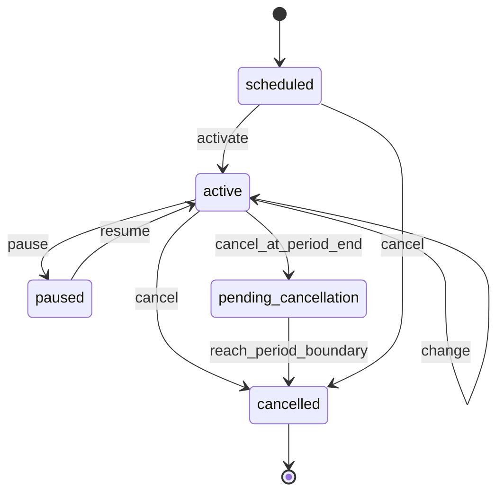
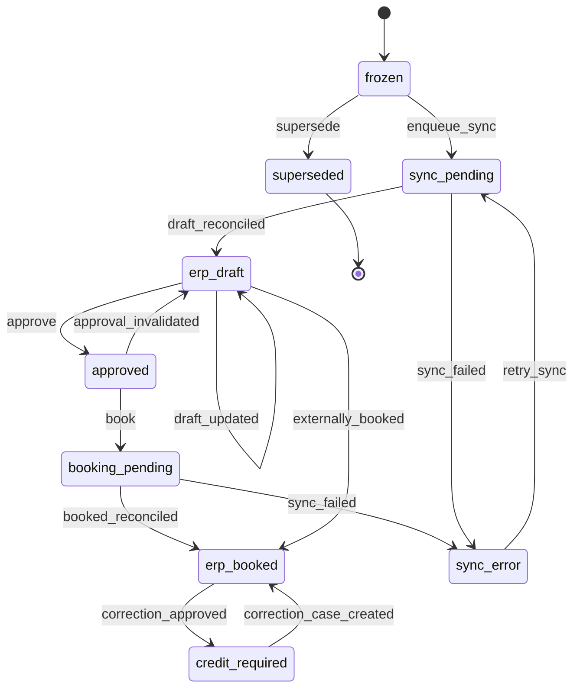
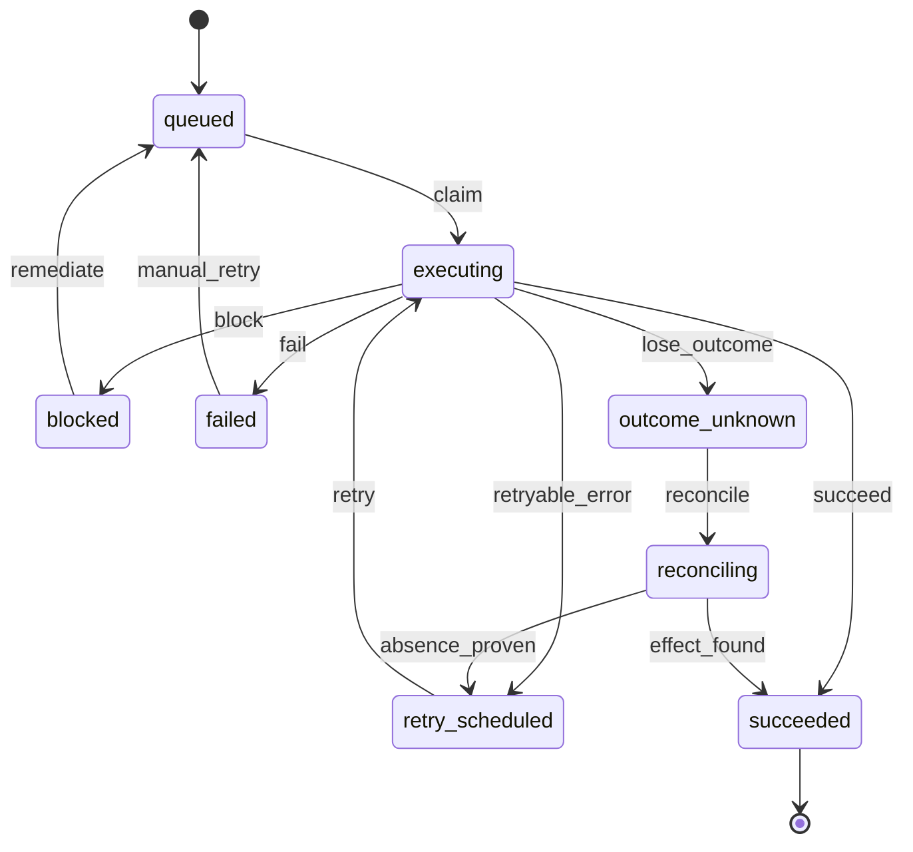
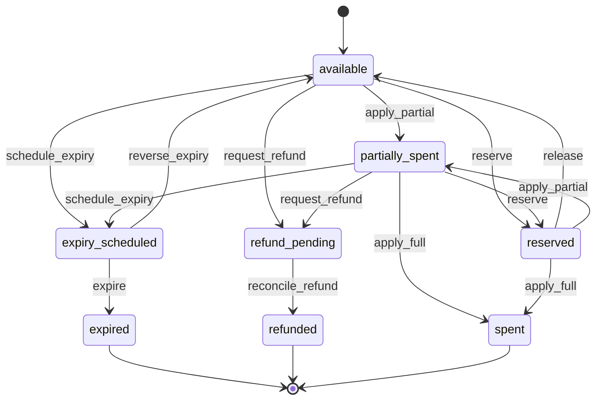
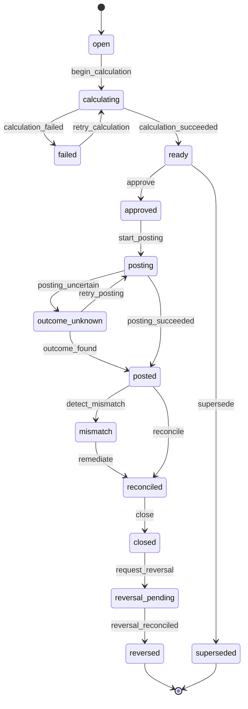

# Domain lifecycle state machines

Generated from `BillingCore.Domain.Lifecycles` — do not edit by hand.
Regenerate with:

    mix run --no-start -e 'File.write!("docs/architecture/state-machines.md", BillingCore.Domain.Lifecycles.to_markdown())'

One executable transition table per lifecycle is the only source of
allowed transitions (BC-US-160, INV-046). Invalid transitions fail
deterministically before external side effects, and PostgreSQL — never
BEAM process lifetime — is authoritative for current state (INV-047).
Changing a table changes this document, which is reviewed as product
behavior.

## Subscription (§11.1)

Enforced by BillingCore.Contracts — commands guard transitions before any write. Initial state `scheduled`;
terminal states: `cancelled`.

## Invoice intent and ERP synchronization (§11.2)

Enforced by BillingCore.Billing / BillingCore.ERP.Sync — persisted per-intent lifecycle rows. Initial state `frozen`;
terminal states: `superseded`.

## Durable operation (§11.3)

Enforced by BillingCore.Operations — every external effect runs inside one operation. Initial state `queued`;
terminal states: `succeeded`.

## Customer-credit grant projection (§11.4)

Enforced by BillingCore.Credits — projection over the append-only subledger. Initial state `available`;
terminal states: `expired`, `refunded`, `spent`.

## Monthly customer-credit close (§11.5, ADR-031)

Enforced by BillingCore.Credits.CloseWorkflow / ClosePosting. Initial state `open`;
terminal states: `reversed`, `superseded`.

