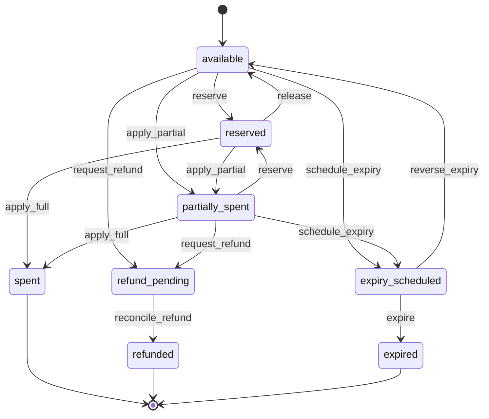

# Customer credit

## Purpose

A money-like customer-credit subledger, distinct from invoice/credit-note
documents (INV-050): an append-only ledger of integer minor-unit
transactions with projections (`available`/`reserved` per account,
`remaining`/`reserved` per grant) that are always recomputable from the
ledger.

## User outcomes

- Finance grants credit (e.g. unused prepaid service value on a downgrade)
  exactly once per idempotency key.
- Billing applies credit to invoices deterministically and never spends the
  same øre twice, even under concurrent billing runs.
- Remaining credit at termination follows an explicit disposition policy —
  retain, refund, or expire after a period — never implicit forfeiture
  (INV-053).

## Actors and permissions

Mutations: `finance_operator` or `billing_admin`; reservation/application/
release, refund completion, expiry runs, and disposition execution also
accept the `:system` actor (billing runs, scheduler). Reads: all team
roles. Credit accounts hang off organization-level commercial accounts,
scoped per `(team, account, currency)`.

## Domain terminology

- **Grant** — funded credit with origin (`unused_prepaid_service`,
  `goodwill`, `external_correction`, `manual`), optional expiry, and the
  disposition policy version in force at grant time.
- **Ledger transaction** — `grant`, `reserve`, `release`, `apply`,
  `refund`, `expire`, `adjust`; each idempotency-keyed; multi-grant
  commands derive per-row keys and carry the caller's key as
  `metadata["batch_key"]`.
- **Headroom** — `remaining_minor - reserved_minor` per grant.

## Workflows

1. `grant_credit` (BC-US-107) — grant row (status `available`), `grant`
   ledger row, and `available_minor` increment in one transaction.
2. `reserve` (BC-US-108) — allocates against eligible, unexpired grants;
   insufficient headroom fails atomically (`:insufficient_credit`).
3. `apply_reservation` — finalizes on intent freeze: `apply` ledger rows,
   grant remainders decremented, statuses per §11.4.
4. `release` — abandoned invoice: reserved amounts return to available.
5. Refund (BC-US-109) — `request_refund` creates a durable `credit.refund`
   operation and moves grants to `refund_pending` (still counted in
   `available_minor` but ineligible for reservation);
   `complete_refund` writes `refund` ledger rows, zeroes remainders, moves
   grants to `refunded`, and succeeds the operation.
6. Expiry (BC-US-109) — `schedule_expiry` (durable `credit.expiry`
   operation, deadline on the grant), `reverse_expiry_schedule` before the
   deadline (restores the original expiry; the operation is closed as
   failed with `expiry_reversed`), `run_expiries` sweeps due grants: one
   transaction each, deterministic ledger key `credit_expiry:<grant>`,
   grant → `expired`.
7. `set_disposition_policy` / `current_disposition_policy` /
   `execute_disposition` — immutable account-scoped policy versions
   (INV-053); execution applies to grants with spendable remainder and
   skips grants tied up in active reservations.
8. `reconcile_account` — recomputes both projections from the ledger and
   fails loudly on divergence.
9. Unused-prepaid-service reduction (BC-US-107) —
   `Credits.UnusedService.credit_reduction/3` computes the exact unused
   value of a booked over-time line for a quantity reduction with the same
   §10.1 day-based proration the rating engine uses
   (`amount × unused_days/period_days × Δquantity/quantity`, one
   half-away-from-zero rounding at the final amount) and opens a partial
   credit note through the ordinary correction workflow. When the credit
   note becomes authoritative, completing the correction case funds the
   ledger exactly once (case-derived idempotency key, origin references
   recorded); completion is refused — never silently skipped — while the
   customer lacks a linked credit account. The booked original is never
   mutated.

## State transitions

§11.4 grant projection machine (`BillingCore.Credits.grant_machine/0`) —
the ledger, not the projection, is the audit evidence:

## Business rules / invariants

- INV-051: every balance change is an append-only ledger row committed
  atomically with the projection update; the ledger is append-only at the
  database level.
- INV-052: allocation is deterministic — earliest `expires_at` first
  (nulls last), then oldest `granted_at`, then grant id; currency-scoped;
  never below zero (`FOR UPDATE` account lock serializes mutations; the
  database `>= 0` checks are the backstop).
- Idempotence everywhere: replaying a key returns the original result
  without re-emitting evidence; a key reused for a different account/type
  is `:idempotency_conflict`.
- Expiry is grant-aware — only the scheduled grant is forfeited.
- Grants are stamped with the current disposition policy version, if any.

## GraphQL contract

`creditAccounts(teamId, customerId)` exposes team-scoped accounts with
their grants and append-only transactions; `grantCredit` creates a grant
with a typed result union and idempotent replay. Invoice previews expose
`credit` amounts on the preview itself (see invoice-preview-and-freeze).
`creditAccount.dispositionPolicy` and `setCreditDispositionPolicy` manage
the BC-US-109 policy. Receivable settlement (SPEC §9.4.1):
`creditSettlements(teamId, invoiceIntentId, state)` lists the settlement
records opened by credit applications and `recordExternalSettlement`
reconciles one exactly once in `external_reference` mode; the close
posting policy carries `settlementMode` and the clearing/contra accounts.

### Receivable-settlement mode

The currently effective close posting-policy version declares which
system owns open receivables. While it is `none` (or no policy exists),
previews plan no credit and a crafted freeze with credit rolls back —
the system never nets an invoice silently. `erp_customer_settlement`
posts a two-line clearing voucher (debit clearing, credit contra — both
accountant-approved) as a durable operation when the invoice books, with
find-before-create idempotency and read-back reconciliation.
`external_reference` records the authoritative external system's
settlement reference exactly once. Settlement records are immutable
identity-wise at the database level; `pending → reconciled` is the only
transition and it is terminal.

## CLI surface

`revryn credits` — accounts (balances, grants, transactions,
disposition), settlements, grant, set-disposition, settle-external; the
posting policy's settlement mode rides `credit-closes create-policy`.
See `docs/cli/credits.md`.

## MCP surface

Read tools `list_credit_accounts` and `list_credit_settlements`; mutating,
confirm-gated tools `grant_credit`, `set_credit_disposition_policy`, and
`record_external_settlement`. See `clients/revryn/contracts/mcp/tools.md`.

## UI behavior

LiveView surfaces under construction; domain commands available via GraphQL.

## Accounting / ERP effects

Refund and expiry are financially significant durable operations
(`credit.refund`, `credit.expiry`) with ledger rows as accounting
references; the payment rail itself is adapter-driven and outside Billing
Core. Applied credit reduces the invoice's `amountDueMinor` in the frozen
snapshot.

## Async / failure / recovery behavior

Refund/expiry follow the §11.3 operation machine and retry policy; the
expiry sweep re-checks status under lock (a reversed schedule is skipped as
`:not_due`). `reconcile_account!/1` raises on any projection divergence.

## Observability

Audit: `credits.account.created`, `credits.grant.created`,
`credits.reserved/applied/released`, `credits.refund.requested/completed`,
`credits.expiry.scheduled/reversed/executed`,
`credits.disposition_policy.set`. Outbox: `customer_credit.granted/
reserved/applied/released/refund_requested/refunded/expiry_scheduled/
expired.v1`.

## Tests

`test/workflows/customer_credit_test.exs` — machine encoding, grant
idempotency, reservation lifecycle, allocation order, concurrency
double-spend protection, refund/expiry/reversal, policy immutability and
execution, loud reconciliation, database append-only.
`test/workflows/credit_application_test.exs` — credit applied at
preview/freeze exactly once.
`test/workflows/receivable_settlement_test.exs` — SPEC §9.4.1: blocked
application without a certified mode, exactly-once external-reference
reconciliation with database-enforced immutability, and the booked-invoice
clearing voucher posted/reconciled through FakeERP with replay safety.
`test/graphql/credit_settlements_test.exs` — the policy/settlement
surface with typed problems and cross-team denial.

## Security / privacy

Team- and organization-scoped access; actor references on every ledger row;
`:system` writes restricted to billing-run/scheduler call sites.

## Limitations

- No FX policy — credit never crosses currencies (INV-052).
- The e-conomic clearing-voucher account mapping and sign conventions
  await accountant sign-off before production certification (SPEC §26).
