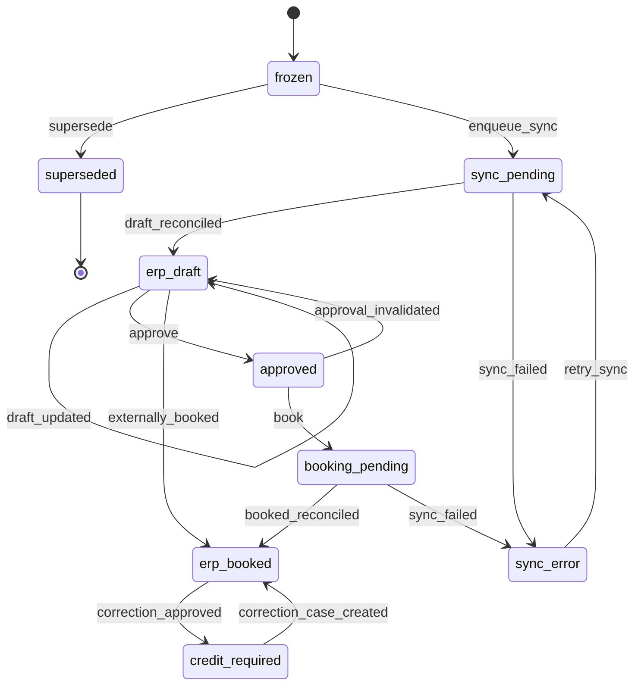

# Invoice preview and freeze

## Purpose

A deterministic, side-effect-free preview of what a subscription would be
billed, frozen on demand into an immutable invoice intent (canonical
snapshot + SHA-256) before any external effect (ADR-015, INV-013).

## User outcomes

- A finance operator previews a subscription for a date and sees
  freeze-ready lines with full calculation traces, gross/net amounts,
  eligible customer credit, and the remaining amount due.
- Blocking conditions are explicit (`blockers`); an empty list means
  freezable.
- Freezing produces an immutable intent whose snapshot and content hash
  never change; a frozen, unsynchronized intent can be superseded by a new
  version in the same chain.

## Actors and permissions

Preview: any read-capable team scope (delegates to contracts/catalog read
roles). Freeze/supersede: `finance_operator` or `billing_admin`.

## Domain terminology

- **Preview fingerprint** — canonical hash of subscription, customer
  version, currency, invoice date, line keys/amounts/quantities, net, and
  blockers. Stable for unchanged inputs; changes when source data changes.
- **Invoice chain** — the identity that survives supersession;
  `current_intent_id` points at the live version.
- **Canonical snapshot** — `schemaVersion 1` map with customer identity
  (internal id, version, external id, legal name), invoice date, currency,
  usage cutoff, lines (with recognition), `netAmountMinor`, and — when
  credit applies — `creditAppliedMinor` and `amountDueMinor`.

## Workflows

1. `Preview.for_subscription/4` — resolves the effective subscription
   version at `as_of`, the pinned published plan version, contract, and
   customer; computes the billing period containing `as_of` and the active
   sub-period; rates each component:
   - fixed recurring — proration policy `prorate` (active period) or
     `full_period`;
   - metered — aggregates frozen usage evidence at the cutoff and rates the
     quantity (no proration); the trace embeds the usage evidence;
   - one-time components are skipped (billed through charge instances).
   Assigned active discounts (contract + subscription) become separate
   negative discount lines. Eligible customer credit is read from the
   customer's projected commercial account (currency-scoped);
   `credit_planned = min(available, max(net, 0))`.
2. `Preview.freeze/3` — refuses when blockers exist; otherwise calls
   `Billing.freeze_invoice_intent/2`: new chain, intent version 1, lines,
   snapshot, hash, lifecycle row starting `frozen` with `preview → frozen`
   transition evidence. Credit reservation and application commit
   atomically inside the freeze transaction, with ledger rows referencing
   the intent (BC-US-108).
3. `Billing.supersede_invoice_intent/3` (BC-US-100) — legal only from
   `frozen`; the old intent transitions to `superseded` (terminal, still
   immutable) and the replacement gets `intent_version + 1` in the same
   chain.

## State transitions

The full §11.2 intent lifecycle (initial state is `frozen` — the spec's
`preview` state is an unpersisted concept):

All mutable workflow state lives in `invoice_intent_lifecycle`
(optimistic-locked) with append-only `invoice_intent_state_transitions`
evidence; intents and lines are database-protected against update/delete
(SPEC §13.5).

## Business rules / invariants

- Preview performs no writes and no external calls.
- Line validation at freeze: integer minor-unit amounts, single currency,
  over-time lines must carry `service_start`/`service_end_exclusive`
  (INV-004); money math uses `BillingCore.Domain.Money` (no floats,
  INV-006).
- Pricing inputs are snapshotted before external effects (INV-013); the
  content hash covers the whole canonical snapshot.
- Credit is spent exactly once per intent (idempotency keys
  `intent:<id>:reserve` / `intent:<id>:apply`) and never exceeds the
  eligible payable amount.

## GraphQL contract

`invoicePreview(teamId, subscriptionId, asOf)`, `invoiceIntent`,
`freezeInvoiceIntent`, `supersedeInvoiceIntent`. `InvoiceIntent.state`
exposes the lifecycle state.

## CLI surface

Not yet implemented (BC-US-157 planned).

## MCP surface

Not yet implemented (BC-US-158 planned).

## UI behavior

LiveView surfaces under construction; domain commands available via GraphQL.

## Accounting / ERP effects

The frozen snapshot is the exact document later synchronized (see
erp-synchronization); over-time lines carry the half-open service period
that becomes the ERP accrual range.

## Async / failure / recovery behavior

Freeze is a single transaction — credit ledger rows, lines, lifecycle, and
outbox commit or roll back together. Supersession is the recovery path for
wrong-but-unsynchronized intents.

## Observability

Audit: `billing.invoice_intent.frozen`. Outbox: `invoice_intent.frozen.v1`,
`invoice_intent.superseded.v1`, plus lifecycle events
(`erp_document.draft_reconciled.v1`, `erp_document.approved.v1`,
`erp_document.booked.v1`) on the corresponding transitions.

## Tests

`test/workflows/annual_prepaid_subscription_test.exs` (preview → freeze →
supersede immutability), `test/workflows/credit_application_test.exs`
(gross/credit/due, exactly-once spend, no-account case),
`test/workflows/metered_billing_test.exs` (usage lines, cutoff, zero
usage).

## Security / privacy

Freeze/supersede require finance roles and team ownership of the intent;
lifecycle transitions record actor type/id.

## Limitations

- Preview rates fixed recurring and metered components; in-arrears billing
  timing is not yet selected by the scheduler boundary logic.
- The GraphQL `freezeInvoiceIntent` freezes a subscription preview; there
  is no ad-hoc line-composition API.
