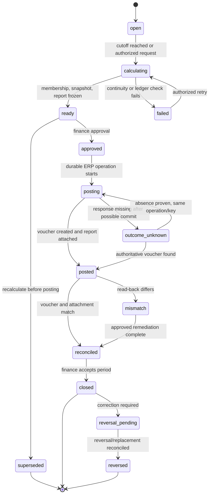

# Monthly customer-credit close

## Purpose

Revryn keeps the detailed, append-only customer-credit subledger. Each
calendar accounting month, it freezes one close per team and currency and
can post its aggregate liability movement to e-conomic as a finance voucher.
The voucher is accounting evidence for the aggregate, not a replacement for
the detailed credit ledger, a customer invoice, a credit note, or a refund.

The generate/approve/post/attach/reconcile slice is implemented and covered by
workflow tests. The feature remains experimental until reversal/replacement,
late/prior-period correction, product surfaces, and e-conomic sandbox
certification satisfy `BC-TASK-103` and `BC-TASK-104`; see `TODO.md`.

## User outcomes

- Finance has a deterministic opening-to-closing bridge for each team,
  currency, and accounting month.
- e-conomic receives one aggregate liability adjustment, with no
  customer-level credit data in any voucher line.
- A posted close, its included transactions, and its report evidence remain
  reproducible forever; a correction is a new compensating workflow.

## Actors and permissions

The domain contract is team-scoped and accepts a `BillingCore.Scope`; only an
authorized finance actor may approve or request posting. The worker acts as
`:system` for the durable ERP operation. A close never crosses a team or
currency boundary.

## Domain terminology

- **Close** — one persisted aggregate for `(team, accounting month,
  currency)` with a frozen cutoff, policy version, balances, state, and
  evidence hashes.
- **Membership** — an immutable link from a close to an included credit-ledger
  transaction, ordered by its ledger ordinal. A transaction belongs to at
  most one close.
- **Liability change** — `closing_minor - opening_minor`; positive means the
  company owes customers more credit.
- **Economic liability line** — the canonical debit-positive amount supplied
  to the ERP liability account: `opening_minor - closing_minor`.
- **Close policy version** — the immutable accountant-approved journal,
  liability account, posting-date rule, balancing strategy, zero-delta
  behavior, and VAT-neutral setting used by a close.

## Lifecycle

The close is a database-backed state machine, not an ad-hoc report query.
Only the domain transition table may change its state.



## Business rules / invariants

- The first close uses zero or an explicitly approved imported opening. Every
  later close uses the preceding accepted close's closing balance exactly.
- `closing_minor` is the detailed subledger's `available_minor +
  reserved_minor` at the frozen cutoff. Reservations and releases do not
  change the total liability.
- Currencies are independent. There is at most one authoritative close for a
  team, currency, and half-open accounting month; concurrent attempts cannot
  create two accepted closes.
- The close freezes its cutoff, ledger memberships, policy version, movement
  totals, opening/closing balances, and snapshot hash before any ERP write.
- Once a voucher has posted, neither the close nor a membership can be
  rewritten. Late or backdated events become a current-period
  prior-period adjustment unless finance uses reversal/replacement.
- The ERP voucher is VAT-neutral. It contains exactly one aggregate liability
  line. Its balancing side is one aggregate offset or accountant-approved
  aggregate movement-class lines; neither side may include a customer,
  customer number, invoice-line detail, or VAT code.

## Accounting / ERP contract

The close arithmetic is exact, using integer minor units:

```text
opening_balance             = preceding accepted closing balance
closing_balance             = available_minor + reserved_minor at cutoff
net_change                  = closing_balance - opening_balance
liability_change            = net_change
economic_liability_line     = opening_balance - closing_balance
```

The stable e-conomic voucher reference is
`REVRYN:CREDIT-CLOSE:<close-id>:<YYYY-MM>:<currency>`. Its date, journal,
accounts, balancing strategy, and zero-delta policy come from the frozen
close-policy version.

Examples (DKK minor units; e-conomic amounts use the debit-positive
convention):

| Case | Opening | Closing | Liability change | Liability-account line | ERP direction |
| --- | ---: | ---: | ---: | ---: | --- |
| Credit liability increases | 100,000 | 120,000 | +20,000 | -20,000 | Credit liability 200.00; debit aggregate offset(s) 200.00 |
| Credit liability decreases | 120,000 | 100,000 | -20,000 | +20,000 | Debit liability 200.00; credit aggregate offset(s) 200.00 |
| No change | 100,000 | 100,000 | 0 | 0 | Retain report; post only if the frozen zero-delta policy requires and e-conomic accepts it |

For example, an opening balance of DKK 1,000.00 plus DKK 500.00 grants,
DKK 250.00 applications, DKK 25.00 refunds, and DKK 25.00 expiries closes
at DKK 1,200.00. The liability change is +DKK 200.00 and the sole
liability-account line is -DKK 200.00 (`1,000 - 1,200`).

The close does not suppress a required customer credit note, receivable
settlement, refund document, or VAT treatment. Those remain separate,
durable workflows.

## Evidence and reconciliation

Before posting, Revryn creates an immutable report bundle:

- PDF summary for attachment to the e-conomic voucher;
- canonical JSON with totals, policy identifiers, hashes, and references;
- CSV of included ledger transactions for audit/export; and
- SHA-256 manifest binding those files, the frozen membership set, and the
  voucher reference.

Read-back reconciliation compares the authoritative voucher's journal,
date, currency, accounts, signs, amounts, and stable reference, then checks
the attachment metadata. The close becomes `reconciled` only after both
voucher and attachment match the frozen evidence.

## Async / failure / recovery behavior

Posting persists a durable `post_customer_credit_close` operation and stable
provider idempotency key before the external write. A timeout after possible
voucher or attachment commit becomes `outcome_unknown`; it is never blindly
retried. Recovery searches by known voucher ID and stable reference, bounded
by journal, accounting year, date, liability account, currency, and exact
amount. Only proven absence permits another write, using the same logical
operation and key.

If read-back finds more than one plausible voucher or finds a differing
voucher, the close is `mismatch`, automation stops for that team/currency,
and finance resolves it. The frozen close, report bundle, hashes,
memberships, operation attempts, and provider references are preserved.

A posted close or voucher is never edited in place. Remediation produces an
approved reversal/replacement close or a current-period prior-period
adjustment, then verifies the replacement voucher, attachment, report hash,
closing balance, and next-period opening continuity.

## Product surfaces

BC-TASK-103 implements the domain and ERP contract described here. The
BC-TASK-104 LiveView slice is now delivered: `/teams/:team_id/credit-closes`
lists closes and hosts posting-policy setup plus deterministic generation,
and the close detail page drives review, exact-hash approval, durable
posting, reconciliation evidence, period acceptance, and remediation via the
operations inbox. Immutable evidence files (canonical JSON, CSV detail, PDF
summary, manifest, ERP voucher/attachment read-back, reconciliation result)
download through an authenticated team-scoped endpoint serving the exact
stored bytes. A permanently failed or mismatched posting is retried from the
operations inbox; a matching re-run remediates the close to `reconciled`
(§11.5 `mismatch → remediate`).

The GraphQL surface exposes the same commands: `creditClose`,
`creditCloses`, and `creditClosePolicies` queries plus
`createCreditClosePolicy`, `generateCreditClose`, `approveCreditClose`,
`requestCreditClosePosting`, `closeCreditPeriod`,
`requestCreditCloseReversal`, and `generateCreditCloseReplacement`
(ADR-031 corrections) mutations with typed
result unions, idempotency keys on generation/posting, and a `report` field
returning any evidence file's exact bytes base64-encoded. `revryn`, MCP,
and Playwright certification surfaces remain future BC-TASK-104 work.

## Observability

The close emits versioned facts for calculation, approval, posting,
reconciliation, mismatch, closure, reversal request, and reversal. Operators
track close state/result, phase duration, mismatch count, oldest unreconciled
close age, report production, and voucher-attachment outcomes without
recording customer-level credit detail in ERP telemetry.

## Tests

The current cross-boundary contract coverage lives in
`test/workflows/customer_credit_close_workflow_test.exs`, with pure
calculation, lifecycle, report, and adapter cases under `test/unit/`. The
remaining task-level certification includes opening continuity,
positive/negative/zero delta, mixed movements, separate currencies, late
events, concurrent attempts, closed periods, attachment recovery, and
reversal/replacement. BC-TASK-104 owns UI, CLI, MCP, GraphQL, and browser
certification.

## Security / privacy

Every close, policy, movement, membership, operation, and report is scoped
to its team. ERP payloads expose aggregate accounting data only; detailed
customer credit remains in Revryn's scoped subledger and report export.

## Limitations

- Accountant approval is still required for the configured journal,
  accounts, sign mapping, posting date, zero-delta policy, refund/expiry
  treatment, first opening balance, and correction policy.
- BC-TASK-104 has delivered the LiveView and GraphQL surfaces; CLI, MCP,
  and Playwright certification surfaces are still open.
