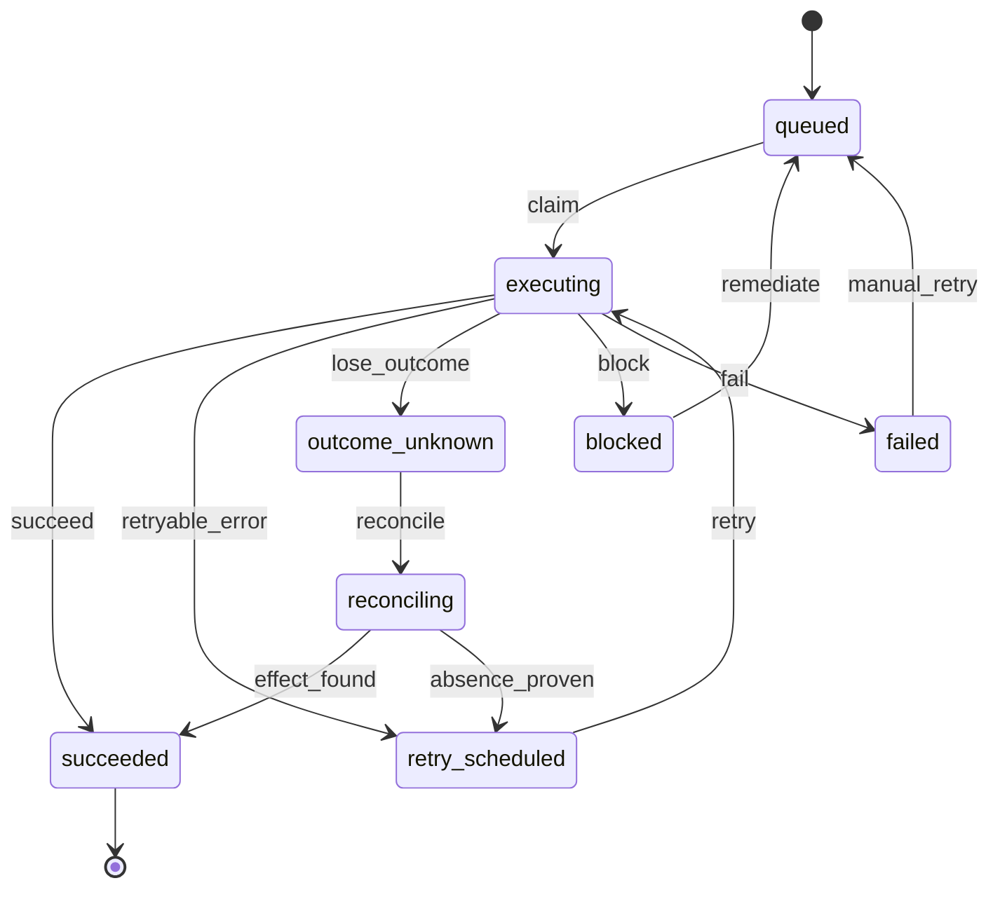

# Operations and failure inbox

## Purpose

Durable operations are the authoritative user-visible state of
asynchronous work (ERP writes, credit refunds/expiries). Transitions are
validated against the §11.3 machine, committed with optimistic locking and
append-only evidence, and failures are routed by a single retry policy —
retries are policy, not reflex (INV-041).

## User outcomes

- Every asynchronous command returns an operation to follow — clients poll
  a stable ID instead of relying on HTTP-202 semantics.
- Failures land in an actionable per-team failure inbox; nothing is lost
  silently — terminal failures dead-letter with an emitted fact.
- Blocked operations name their user-fixable precondition
  (`blocked_reason`); a failed operation supports authorized manual retry.

## Actors and permissions

Operations are created by domain contexts on behalf of the acting scope
(actor type/id recorded). `retryOperation` (GraphQL) and
`ERP.Sync.retry_operation` require `finance_operator`. Workers execute as
`:system`.

## Domain terminology

- **Operation** — `operations` row: type (`erp.create_draft`,
  `erp.book_document`, `credit.refund`, `credit.expiry`), state, attempt
  count, error class, sanitized error fields, `next_attempt_at`,
  correlation ID, target reference, metadata.
- **Failure inbox** — the actionable subset: `blocked`, `failed`,
  `outcome_unknown`, `reconciling` (SPEC §22.9.3).
- **Error class** (§22.9.1) — `transient`, `throttled`,
  `dependency_unavailable`, `validation`, `authorization`, `conflict`,
  `outcome_unknown`, `poison`, `terminal`.

## Workflows

1. `Operations.create!/1` → `queued`; workers `claim` → `executing`.
2. `Operations.record_failure!/3` applies `RetryPolicy.decide/3` so callers
   never hand-roll decisions:
   - `transient`/`dependency_unavailable` → scheduled retry, dead-letter at
     the attempt cap;
   - `throttled` → retry honoring provider `retry_after` when present;
   - `outcome_unknown` → `lose_outcome`; reconcile before any retry;
   - `authorization`/`conflict` → `block` (user-fixable precondition);
   - `validation`/`terminal` → `fail` (dead-letter);
   - `poison` → one bounded retry, then `fail`.
3. Dead-lettering emits `operation.dead_lettered.v1` atomically with the
   `failed` transition.
4. `Operations.runnable/1` — queued, or retry-scheduled with elapsed timer.
5. `Operations.failure_inbox/1` — per-team actionable listing, newest
   first.
6. Manual retry — `failed → queued` (`manual_retry`); the ERP flow also
   requeues the linked sync operation and re-enqueues the worker.

## State transitions

## Business rules / invariants

- Retry schedule (SPEC §21.3): 0 s, 5 s, 30 s, 120 s, 600 s, 1800 s,
  7200 s with up to 20% jitter; maximum 7 automatic attempts.
- An unknown outcome must be reconciled before any retry (INV-008/009):
  retry is legal only after the external effect's absence is proven.
- Every transition writes an `operation_transitions` evidence row in the
  same transaction (from/to state, event, reason).
- Error details are stored as sanitized fields only
  (`safe_error_code`/`safe_error_summary`) — never raw provider payloads.

## GraphQL contract

`operation(teamId, id)` — state, attempt count, error class, sanitized
error fields, blocked reason, `nextAttemptAt`, correlation ID, timestamps.
`retryOperation` for authorized manual retry. Asynchronous mutations
(`synchronizeInvoice`, `bookInvoice`) return the operation to follow.

## CLI surface

Not yet implemented (BC-US-157 planned).

## MCP surface

Not yet implemented (BC-US-158 planned).

## UI behavior

LiveView surfaces under construction; domain commands available via GraphQL.

## Accounting / ERP effects

None directly — operations wrap effects owned by other features; their
evidence chain (operation + transitions + outbox facts) is the audit trail
of external side effects.

## Async / failure / recovery behavior

Execution runs on Oban (queues per domain; `Lifeline` rescues stuck jobs
after 30 minutes; `Pruner` keeps 7 days). Operation state — not Oban job
state — is authoritative for users.

## Observability

Telemetry `[:billing_core, :operation, :transition]` (exported as
`billing_core.operation.transition.count` with type/from/to/event tags via
the Prometheus exporter), Oban job metrics, outbox
`operation.dead_lettered.v1`.

## Tests

`test/workflows/invoice_sync_test.exs` — retry scheduling, blocking,
unknown-outcome reconciliation, manual retry.
`test/workflows/customer_credit_test.exs` — refund/expiry operations and
their evidence.

## Security / privacy

Team-scoped queries; manual retry is finance-role gated; sanitized error
storage keeps provider payloads and secrets out of the database.

## Limitations

- No GraphQL listing for the failure inbox yet (`failure_inbox/1` is
  context-level); no bulk retry.
- `blocked → queued` (`remediate`) has no dedicated command surface beyond
  direct context transitions.
