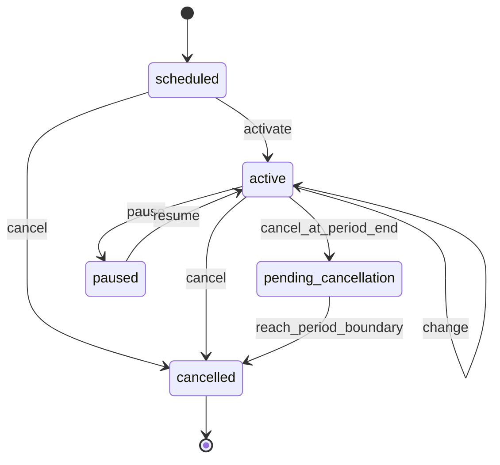

# Subscriptions

## Purpose

The subscription lifecycle per SPEC §11.1: idempotent start, versioned
quantity/plan changes, two cancellation modes, pause/resume, scheduled
activation — plus idempotent one-time charge instances.

## User outcomes

- Starting a subscription with a future date yields `scheduled`; the
  scheduler promotes it on the start date. Retrying the same command by
  external ID returns the existing subscription; a changed payload is a
  conflict.
- Quantity and plan changes never rewrite history: the current version is
  closed at the effective date and a successor version is appended.
- End-of-period cancellation stops renewal and finalizes exactly at the
  boundary; immediate cancellation ends service at the effective date.

## Actors and permissions

Mutations: `billing_admin` or `team_admin`. Reads additionally
`finance_operator`, `auditor`, `integration_client`. Sweeps
(`activate_due_subscriptions`, `finalize_due_cancellations`) run as
`:system`.

## Domain terminology

- **Subscription version** — effective-dated row (plan version, quantity,
  price overrides, cancellation policy); versions never overlap
  (database exclusion constraint).
- **Subscription change** — append-only command record with idempotency
  key, canonical payload, and result.
- **Charge instance** — idempotent one-time charge against a contract
  (optionally one of its subscriptions), billed outside the recurring path.

## Workflows

1. `start_subscription` (BC-US-034/035) — validates the period against the
   contract dates; status `scheduled` iff the start date is after today in
   the subscription's time zone (defaults to the team's); billing anchor
   day defaults to the start date's day.
2. `change_quantity` / `change_plan_version` (BC-US-036/037) — legal only
   in `active`; effective date defaults to today in the subscription's time
   zone; before the current version's start → `:effective_date_in_past`.
3. `cancel_subscription` (BC-US-038) — `:immediate` (effective date
   defaults to today; a `scheduled` subscription cancels before start and
   keeps no end date) or `:end_of_period` (requires an explicit
   `period_end_date` — period math belongs to billing).
4. `pause_subscription` / `resume_subscription` (BC-US-039).
5. `activate_due_subscriptions/1` and `finalize_due_cancellations/1` —
   scheduler sweeps with `FOR UPDATE SKIP LOCKED`.
6. `create_charge_instance` / `cancel_charge_instance` (BC-US-041) —
   cancellation only while `pending`, i.e. before freeze.

## State transitions

`cancelled` is terminal — no further commands are accepted. PostgreSQL
remains the authority for durable state (INV-046/047).

## Business rules / invariants

- Idempotence: start by `(team, external_id)`; every other command by a
  per-subscription idempotency key. An identical canonical payload replay
  returns the current row; a different payload is `{:error, :conflict}`.
- Versions never overlap (exclusion constraint); the close-then-append
  order keeps the per-statement check satisfied.
- Every accepted command appends a `subscription_changes` row, an audit
  entry, and a versioned outbox event in one transaction.
- Charge instances: exactly one pricing source — `price_component_id` with
  quantity > 0, or non-negative `amount_minor` with quantity fixed at 1;
  currency must equal the contract's; `over_time` requires the half-open
  service period, `point_in_time` forbids it.

## GraphQL contract

`subscription`, `subscriptions`; `createSubscription`, `changeSubscription`
(quantity), `cancelSubscription` (`IMMEDIATE`/`END_OF_PERIOD` with
`periodEndDate`), `createChargeInstance`. The aggregate `version` field
supports optimistic concurrency (SPEC §14.3).

## CLI surface

Not yet implemented (BC-US-157 planned).

## MCP surface

Not yet implemented (BC-US-158 planned).

## UI behavior

LiveView surfaces under construction; domain commands available via GraphQL.

## Accounting / ERP effects

None directly; subscriptions feed billing runs and previews. Charge
instances become invoice lines when frozen.

## Async / failure / recovery behavior

`BillingCore.Billing.RunWorker`'s daily tick provides the date context;
activation/finalization sweeps are idempotent and crash-safe (row locks,
skip-locked). Command transactions roll back atomically.

## Observability

Audit: `contracts.subscription.started/quantity_changed/plan_changed/
cancelled/paused/resumed/activated/cancellation_finalized`,
`contracts.charge_instance.*`. Outbox: `subscription.started.v1`,
`subscription.changed.v1`, `subscription.cancelled.v1`,
`charge_instance.created.v1`, `charge_instance.cancelled.v1`.

## Tests

`test/workflows/subscription_lifecycle_test.exs` — machine encoding,
start/activation, version splitting and the exclusion constraint, both
cancellation modes, terminality, pause/resume, isolation/authorization.

## Security / privacy

Team-scoped queries and struct/team cross-checks throughout; actor
references recorded on every change row.

## Limitations

- GraphQL exposes quantity change only; plan-version change, pause/resume,
  and charge-instance cancellation are context-level commands.
- Proration on mid-period quantity changes is handled at preview/rating
  time, not by the subscription context.
